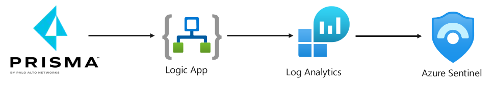

# Introduction

This tech note walks you through how to test Prisma Cloud capabilities on an EKS Cluster with EC2 node groups in AWS. Here are the tasks that we will complete:

> * Create roles that will be used during the deployment of the EKS cluster
> * Create EC2 Key pair
> * Create VPC and subnets for EKS cluster
> * Create EKS cluster
> * Add node group to cluster
> * 



### Create roles that will be used during the deployment of the EKS cluster
> * There are two roles that we need to create an EKS cluster

1. **Control plane IAM role**
* This role will be used by the Kubernetes control plane to create and manage AWS resources.

**`AWS Management Console`** → **`IAM`** → **`Create role`**
    * **Trusted Entity**: **`AWS service`**
    * **Use Case**: **`EKS`** → **`EKS - Cluster`**
    * **Policy Name**: **`AmazonEKSClusterPolicy`**
    * **Role Name**: **`do-eks-cluster-role`**

* [https://docs.aws.amazon.com/eks/latest/userguide/service_IAM_role.html](https://docs.aws.amazon.com/eks/latest/userguide/service_IAM_role.html)

2. **Worker node IAM Role**
* This will be used by "kubelet" running on the worker node to make calls to other APIs. 
* This includes permissions to access container registries where application containers are stored.
* Before you can launch a Node Group, you must create an IAM role for those worker nodes to use when they are launched.

**`AWS Management Console`** → **`IAM`** → **`Create role`**
    * **Trusted Entity**: **`AWS service`**
    * **Use Case**: **`EC2`** → **`AmazonEKSWorkerNodePolicy`** and **`AmazonEC2ContainerRegistryReadOnly`**
    * **Policy Name**: **`AWSServiceRoleForAmazonEKSNodegroup`**
    * **Role Name**: **`do-eks-node-role`**

* [https://docs.aws.amazon.com/eks/latest/userguide/create-node-role.html](https://docs.aws.amazon.com/eks/latest/userguide/create-node-role.html)
* [https://docs.aws.amazon.com/eks/latest/userguide/create-node-role.html#create-worker-node-role](https://docs.aws.amazon.com/eks/latest/userguide/create-node-role.html#create-worker-node-role)


### Create EC2 Key pair
> * This is OPTIONAL for if you want to be able to connect to worker nodes

### Create VPC and subnets for EKS cluster
> * do-eks-vpc (10.1.0.0/16)
> * do-eks-vpc-subnet-az1 (10.1.1.0/24)
> * do-eks-vpc-subnet-az2 (10.1.2.0/24)
> * do-eks-vpc-subnet-az3 (10.1.3.0/24)
> * Add internet gateway and routes to the internet for the subnets (do-eks-vpc-igw)

### Create EKS cluster
> * do-eks-london-cluster

### Add node group to cluster
**`AWS Management Console`** → **`EKS`** → **`Clusters`** → **`Select cluster`** → **`Configuration`** → **`Add node group`**
    * ec2-linux-nodegrp1
    * Amazon Linux 2

### Connect to the EKS cluster
1. **Install AWS CLI on your system**

2. **Install kubectl on your system**
* You must use a kubectl version that is within one minor version difference of your Amazon EKS cluster control plane. For example, a 1.19 kubectl client works with Kubernetes 1.18, 1.19 and 1.20 clusters.

```
curl -o kubectl https://amazon-eks.s3.us-west-2.amazonaws.com/1.20.4/2021-04-12/bin/linux/amd64/kubectl

curl -o kubectl.sha256 https://amazon-eks.s3.us-west-2.amazonaws.com/1.20.4/2021-04-12/bin/linux/amd64/kubectl.sha256

chmod +x ./kubectl

mkdir -p $HOME/bin && cp ./kubectl $HOME/bin/kubectl && export PATH=$PATH:$HOME/bin

kubectl version --short --client
```

3. **Authenticate to cluster API**
```
aws sts get-caller-identity
aws eks --region eu-west-2 update-kubeconfig --name do-eks-london-cluster
kubectl get nodes
kubectl get svc
```

## Next steps


