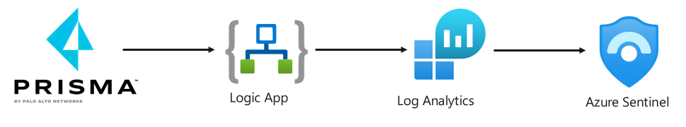
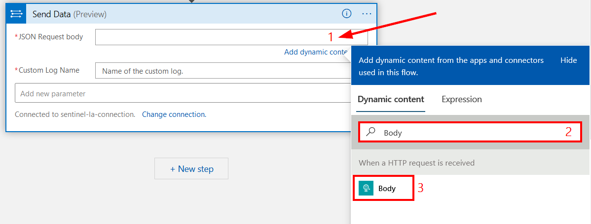
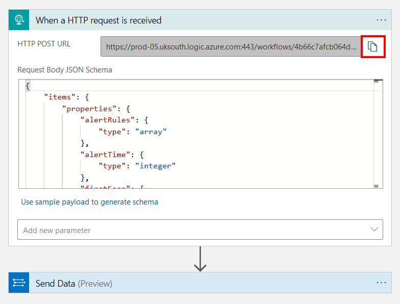
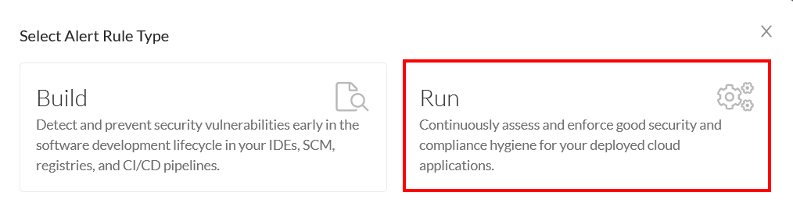
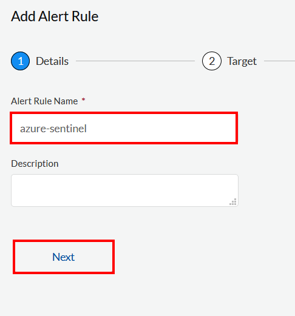
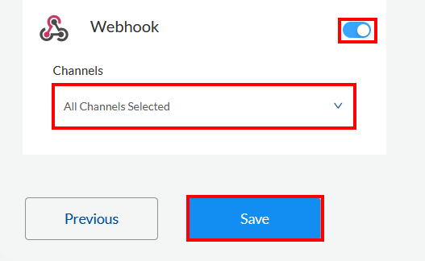
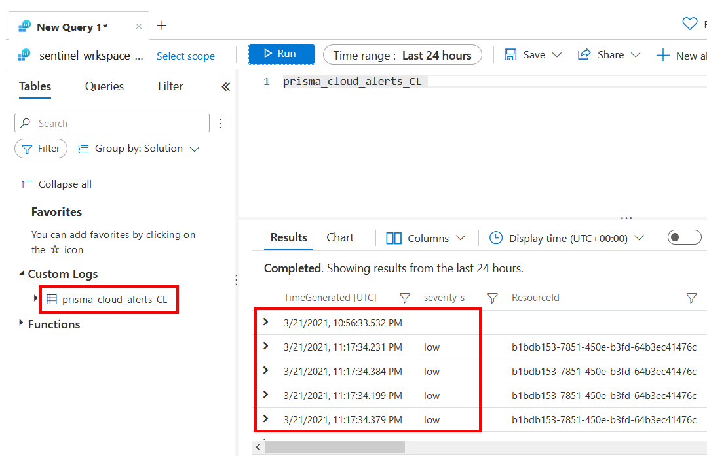
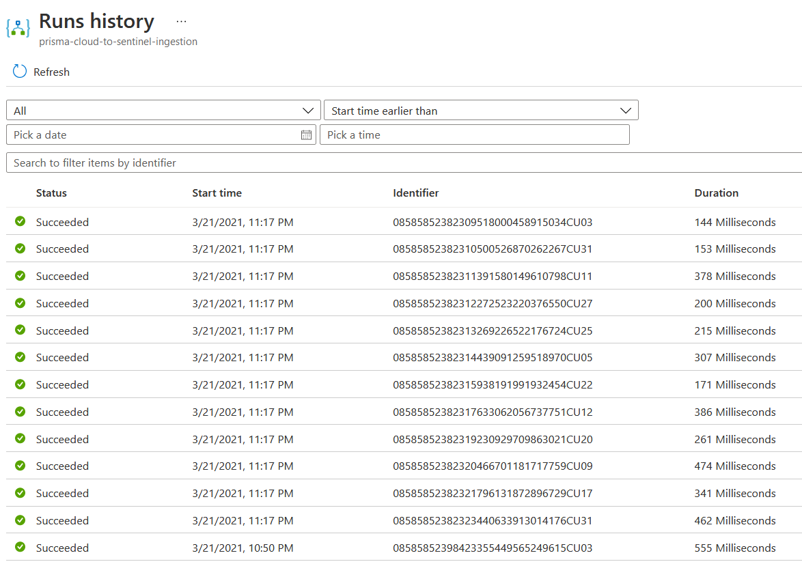

# Introduction

This tech note walks you through how to integrate Prisma Cloud alerts into Azure Sentinel using a Logic App workflow. Here are the tasks that we will complete:

> * Create an access key in Prisma CLoud
> * Create a recurring Logic App workflow to retrieve alerts in Prisma Cloud



## Create service principal with contributor permissions

1. Open a web browser tab and go to the Azure Cloud Shell. Sign in with your Azure credentials. Ensure that you are in the Bash terminal.

2. Create a service principal for Prisma Cloud Compute and assign the reader role to it using the command below:
```
subscription_id=$(az account show --query id | tr -d '"')

az ad sp create-for-rbac -n "logicapp-azure-cred" --role "contributor" --scopes /subscriptions/$subscription_id --sdk-auth
```

3. Make a note of the following values: **`clientId`**, **`clientSecret`**, **`subscriptionId`**, **`tenantId`** as they will be needed in the next section.

### Create an HTTP trigerred Logic App workflow to receive Prisma Cloud alerts
1. Log into the Azure portal with your Azure credentials

2. In the Azure portal search box, enter **logic app**, and select **Logic Apps**.


3. On the Logic Apps page, select **Add**

4. In the **Create Logic App** blade, configure the following:
* **Subscription:** Select your Azure subscription
* **Resource group:** Select or create a resource group
* **Type**: Consumption
* **Logic app name:** prisma-cloud-host-sec-incidence-response
* **Region:** Select an Azure region close to you
* Leave other settings as default
* Click on **Review + create**. Confirm the details that you provided, and select **Create**. Wait for the deployment to complete.


5. On the deployment complete blade, click on **Go to resource**

6. In the **Logic Apps Designer** blade, under **Start with a common trigger**, click on **When a HTTP request is received**.


7. In the **When a HTTP request is received** window, in the **Request Body JSON Schema** section, enter the following schema: 
```
{
    "type": "object",
    "properties": {
        "type": {
            "type": "string"
        },
        "time": {
            "type": "string"
        },
        "container": {
            "type": "string"
        },
        "image": {
            "type": "string"
        },
        "host": {
            "type": "string"
        },
        "fqdn": {
            "type": "string"
        },
        "function": {
            "type": "string"
        },
        "region": {
            "type": "string"
        },
        "runtime": {
            "type": "string"
        },
        "appID": {
            "type": "string"
        },
        "rule": {
            "type": "string"
        },
        "message": {
            "type": "string"
        },
        "aggregated": {
            "type": "string"
        },
        "rest": {
            "type": "string"
        },
        "forensics": {
            "type": "string"
        },
        "accountID": {
            "type": "string"
        },
        "cluster": {
            "type": "string"
        },
        "labels": {
            "type": "object",
            "properties": {}
        }
    }
}
```

8. Click on **+ New Step**:

9. In the Choose an operation window, in the **search box**, enter **Power off virtual machine**. From the **Actions** list, select **Power off virtual machine**.


10. In the **Azure VM** window, Click on **Connect with service principal**


11. In the **Azure VM** window, configure the following:
* **Connection name**: Logic App Azure Connection
* **Client ID**: The value of the **`clientId`** from earlier
* **Client Secret**: The value of the **`clientSecret`** from earlier
* **Tenant**: The value of the **`tenantId`** from earlier
* Click on **`Create`**

12. In the **Power off virtual machine** window, configure the following:
* **Subscription Id**: Select your subscription
* **Resource Group**: Select the resource group
* **Virtual Machine**: Custom value -> host


* **JSON Request body**: Click inside the box so that the dynamic content list appears. In the dynamic content list, search for **Body** and select **Body**.



* **Custom Log Name**: prisma_cloud_alerts

12. In the top left corner, click on **Save**. You can rename each step to describe them further as I've done in the screenshot below.


13. Click on **When a HTTP request is received** and copy and make a note of the webhook URL.



### Configure Web Hook Integration in Prisma Cloud
1. Log into the Prisma Cloud console and go to **`Manage`** → **`Alerts`** → **`Manage`** → **`Add profile`**. In the **`Create new profile`** window, configure the following:
* **`Name`**: custom-webhook
* **`Provider`**: webhook
* **`Incoming webhook URL`**: Enter your webhook URL
* **`Alert Triggers`**: Select **`Host runtime`** 
* Click **`Save`**


2. Click on **Test** to test the integration. Then click on **Save**.


3. Create Alert rule in Prisma Cloud. Go to **Alerts** → **Alert Rules** → **+ Add New**. In the **Select Alert Rule Type** window, click on **Run**




4. In the **Add Alert Rule** window, configure the following:
* **Alert Rule Name**: azure-sentinel
* Click **Next**



* **Account Groups**: Default Account Group
* Click **Next**


* Select all policies
* Click **Next**


* Enable Webhook
* Select the webhook channel
* Click **Save**



5. Verify that the alerts are shown in Log Analytics, under **Custom Logs**



You can also review the new alerts being processed by Logic Apps



6. Verify that the alerts are shown in Azure Sentinel


## Next steps
