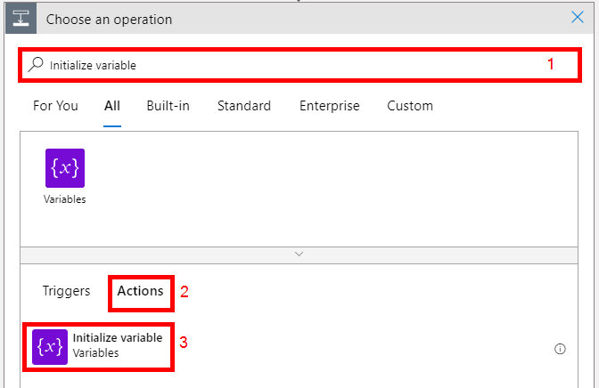

# Introduction

This tech note walks you through how to integrate Prisma Cloud alerts with Logic App for cloud incident response. Here are the tasks that we will complete:

> * Create service principal with contributor permissions
> * Create an HTTP trigerred Logic App workflow to receive Prisma Cloud alerts
> * Configure Web Hook Integration in Prisma Cloud
> * Test and verify


## Create service principal with contributor permissions

1. Open a web browser tab and go to the Azure Cloud Shell. Sign in with your Azure credentials. Ensure that you are in the Bash terminal.

2. Create a service principal for Prisma Cloud Compute and assign the reader role to it using the command below:
```
subscription_id=$(az account show --query id | tr -d '"')

az ad sp create-for-rbac -n "logicapp-azure-cred" --role "contributor" --scopes /subscriptions/$subscription_id --sdk-auth
```

3. Make a note of the following values: **`clientId`**, **`clientSecret`**, **`subscriptionId`**, **`tenantId`** as they will be needed in the next section.

### Create an HTTP trigerred Logic App workflow to receive Prisma Cloud alerts
1. Log into the Azure portal with your Azure credentials

2. In the Azure portal search box, enter **logic app**, and select **Logic Apps**.


3. On the Logic Apps page, select **Add**

4. In the **`Create Logic App`** blade, configure the following:
* **`Subscription:`** Select your Azure subscription
* **`Resource group:`** Select or create a resource group
* **`Type:`** Consumption
* **`Logic app name:`** prisma-cloud-host-sec-incidence-response
* **`Region:`** Select an Azure region close to you
* **`Enable log analytics:`** No
* Click on **`Review + create`**. Confirm the details that you provided, and select **`Create`**. Wait for the deployment to complete.


5. On the deployment complete blade, click on **`Go to resource`**


6. In the **`Logic Apps Designer`** blade, under **`Start with a common trigger`**, click on **`When a HTTP request is received`**.


7. In the **When a HTTP request is received** window, in the **`Request Body JSON Schema`** section, replace the text with the following schema (this is the schema for a prisma cloud compute alert): 
```
{
    "type": "object",
    "properties": {
        "type": {
            "type": "string"
        },
        "time": {
            "type": "string"
        },
        "container": {
            "type": "string"
        },
        "image": {
            "type": "string"
        },
        "host": {
            "type": "string"
        },
        "fqdn": {
            "type": "string"
        },
        "function": {
            "type": "string"
        },
        "region": {
            "type": "string"
        },
        "runtime": {
            "type": "string"
        },
        "appID": {
            "type": "string"
        },
        "rule": {
            "type": "string"
        },
        "message": {
            "type": "string"
        },
        "aggregated": {
            "type": "string"
        },
        "rest": {
            "type": "string"
        },
        "forensics": {
            "type": "string"
        },
        "accountID": {
            "type": "string"
        },
        "cluster": {
            "type": "string"
        },
        "labels": {
            "type": "object",
            "properties": {}
        }
    }
}
```

8. Click on **`+ New Step`**


9. In the **`Choose an operation`** window, in the **`search box`**, enter **`Initialize variable`**. From the **`Actions`** list, select **`Initialize variable`**



10. In the **`Initialize variable`** window, configure the following:
* **Name**: **`host`**
* **Type**: **`String`**
* **Value**: **`Dynamic content`** → **`host`**


11. Click on **`+ New Step`**

12. In the **`Choose an operation`** window, in the **`search box`**, enter **`Initialize variable`**. From the **`Actions`** list, select **`Initialize variable`**


13. In the **`Initialize variable`** window, configure the following:
* **Name**: **`vmname`**
* **Type**: **`String`**
* **Value**: **`Expression`** → **`split(variables('host'),'.')[0]`**


14. Click on **`+ New Step`**

15. In the **`Choose an operation`** window, in the **`search box`**, enter **`Condition`**. From the **`Actions`** list, select **`Condition`**


16. In the **`Condition`** window, configure the following: **`host`** (Dynamic content) is not equal to **`null`**


17. In the **`True`** section, click on **`Add an action`**


18. In the **`Choose an operation`** window, in the **`search box`**, enter **`Power off virtual machine`**. From the **`Actions`** list, select **`Power off virtual machine`**.


19. In the **Azure VM** window, Click on **Connect with service principal**


20. In the **Azure VM** window, configure the following:
* **Connection name**: Logic App Azure Connection
* **Client ID**: The value of the **`clientId`** from earlier
* **Client Secret**: The value of the **`clientSecret`** from earlier
* **Tenant**: The value of the **`tenantId`** from earlier
* Click on **`Create`**


21. In the **Power off virtual machine** window, configure the following:
* **Subscription Id**: Select your subscription
* **Resource Group**: Select the resource group
* **Virtual Machine**: **`Custom value`** → **`Dynamic content`** → **`vmname`**


22. Click on **`Save`** in the top left corner


23. Your workflow should look similar to this:


24. Click on **When a HTTP request is received**. Copy and make a note of the webhook URL. YOu will need this when configuring the integration in Prisma Cloud.


### Configure Web Hook Integration in Prisma Cloud
1. Log into the Prisma Cloud console and go to **`Manage`** → **`Alerts`** → **`Manage`** → **`Add profile`**. 


2. In the **`Create new profile`** window, configure the following:
* **`Name`**: IR-webhook
* **`Provider`**: webhook
* **`Incoming webhook URL`**: Enter your webhook URL
* **`Alert Triggers`**: Select **`Host runtime`** 
* Click **`Save`**


### Test and verify

1. To test, initiate an incident on a protected Azure host in the subscription. In the example below, I'm running a process from a temporary location which I have a policy to prevent that. After a few seconds, my connection closed because the incident triggered the logic app which powered off the VM.


2. In Azure - in the **`Overview`** pane of the logic app, you should see a successful workflow run as shown below:


3. Click on the successful run and review the details of the actions that happened.


4. You can review the actions in the Azure activity logs


