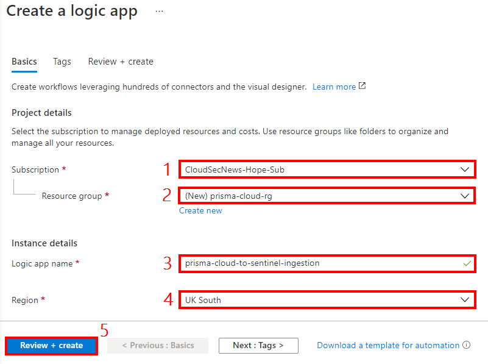
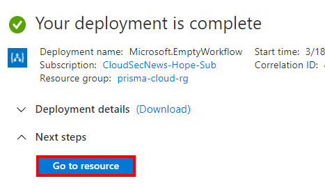

# Introduction

This tech note walks you through how to integrate Prisma Cloud alerts into Azure Sentinel using a Logic App workflow. Here are the tasks that we will complete:

> * Create an access key in Prisma CLoud
> * Create a recurring Logic App workflow to retrieve alerts in Prisma Cloud


### Create an HTTP trigerred Logic App workflow to receive Prisma Cloud alerts
1. Log into the Azure portal with your Azure credentials

2. In the Azure portal search box, enter **logic app**, and select **Logic Apps**.


3. On the Logic Apps page, select **Add** → **Consumption**


4. In the **Create a logic app** blade, configure the following:
* **Subscription:** Select your Azure subscription
* **Resource group:** Select or create a resource group
* **Logic app name:** prisma-cloud-to-sentinel-ingestion
* **Region:** Select an Azure region close to you
* Leave other settings as default
* Click on **Review + create**. Confirm the details that you provided, and select **Create**. Wait for the deployment to complete.



5. On the deployment complete blade, click on **Go to resource**



6. In the **Logic Apps Designer** blade, under **Start with a common trigger**, click on **When a HTTP request is received**.


7. In the **When a HTTP request is received** window, in the **Request Body JSON Schema** section, enter the following schema: 
```
{
    "type": "array",
    "items": {
        "type": "object",
        "properties": {
            "id": {
                "type": "string"
            },
            "status": {
                "type": "string"
            },
            "firstSeen": {
                "type": "integer"
            },
            "lastSeen": {
                "type": "integer"
            },
            "alertTime": {
                "type": "integer"
            },
            "policy": {
                "type": "object",
                "properties": {
                    "policyId": {
                        "type": "string"
                    },
                    "policyType": {
                        "type": "string"
                    },
                    "systemDefault": {
                        "type": "boolean"
                    },
                    "remediation": {
                        "type": "object",
                        "properties": {
                            "description": {
                                "type": "string"
                            },
                            "impact": {
                                "type": "string"
                            },
                            "cliScriptTemplate": {
                                "type": "string"
                            }
                        }
                    },
                    "remediable": {
                        "type": "boolean"
                    }
                }
            },
            "alertRules": {
                "type": "array"
            },
            "history": {
                "type": "array",
                "items": {
                    "type": "object",
                    "properties": {
                        "modifiedBy": {
                            "type": "string"
                        },
                        "modifiedOn": {
                            "type": "integer"
                        },
                        "status": {
                            "type": "string"
                        },
                        "reason": {
                            "type": "string"
                        }
                    },
                    "required": [
                        "modifiedBy",
                        "modifiedOn",
                        "status"
                    ]
                }
            },
            "riskDetail": {
                "type": "object",
                "properties": {
                    "riskScore": {
                        "type": "object",
                        "properties": {
                            "score": {
                                "type": "integer"
                            },
                            "maxScore": {
                                "type": "integer"
                            }
                        }
                    },
                    "rating": {
                        "type": "string"
                    },
                    "score": {
                        "type": "string"
                    }
                }
            },
            "resource": {
                "type": "object",
                "properties": {
                    "rrn": {
                        "type": "string"
                    },
                    "id": {
                        "type": "string"
                    },
                    "name": {
                        "type": "string"
                    },
                    "account": {
                        "type": "string"
                    },
                    "accountId": {
                        "type": "string"
                    },
                    "cloudAccountGroups": {
                        "type": "array"
                    },
                    "region": {
                        "type": "string"
                    },
                    "regionId": {
                        "type": "string"
                    },
                    "resourceType": {
                        "type": "string"
                    },
                    "resourceApiName": {
                        "type": "string"
                    },
                    "url": {
                        "type": "string"
                    },
                    "data": {
                        "type": "object",
                        "properties": {
                            "pricings": {
                                "type": "array",
                                "items": {
                                    "type": "object",
                                    "properties": {
                                        "id": {
                                            "type": "string"
                                        },
                                        "name": {
                                            "type": "string"
                                        },
                                        "type": {
                                            "type": "string"
                                        },
                                        "properties": {
                                            "type": "object",
                                            "properties": {
                                                "pricingTier": {
                                                    "type": "string"
                                                }
                                            }
                                        }
                                    },
                                    "required": [
                                        "id",
                                        "name",
                                        "type",
                                        "properties"
                                    ]
                                }
                            },
                            "settings": {
                                "type": "array",
                                "items": {
                                    "type": "object",
                                    "properties": {
                                        "id": {
                                            "type": "string"
                                        },
                                        "kind": {
                                            "type": "string"
                                        },
                                        "name": {
                                            "type": "string"
                                        },
                                        "type": {
                                            "type": "string"
                                        },
                                        "properties": {
                                            "type": "object",
                                            "properties": {
                                                "enabled": {
                                                    "type": "boolean"
                                                }
                                            }
                                        }
                                    },
                                    "required": [
                                        "id",
                                        "kind",
                                        "name",
                                        "type",
                                        "properties"
                                    ]
                                }
                            },
                            "securityContacts": {
                                "type": "array",
                                "items": {
                                    "type": "object",
                                    "properties": {
                                        "id": {
                                            "type": "string"
                                        },
                                        "name": {
                                            "type": "string"
                                        },
                                        "type": {
                                            "type": "string"
                                        },
                                        "location": {
                                            "type": "string"
                                        },
                                        "properties": {
                                            "type": "object",
                                            "properties": {
                                                "email": {
                                                    "type": "string"
                                                },
                                                "phone": {
                                                    "type": "string"
                                                },
                                                "alertsToAdmins": {
                                                    "type": "string"
                                                },
                                                "alertNotifications": {
                                                    "type": "string"
                                                }
                                            }
                                        }
                                    },
                                    "required": [
                                        "id",
                                        "name",
                                        "type",
                                        "location",
                                        "properties"
                                    ]
                                }
                            },
                            "autoProvisioningSettings": {
                                "type": "array",
                                "items": {
                                    "type": "object",
                                    "properties": {
                                        "id": {
                                            "type": "string"
                                        },
                                        "name": {
                                            "type": "string"
                                        },
                                        "type": {
                                            "type": "string"
                                        },
                                        "properties": {
                                            "type": "object",
                                            "properties": {
                                                "autoProvision": {
                                                    "type": "string"
                                                }
                                            }
                                        }
                                    },
                                    "required": [
                                        "id",
                                        "name",
                                        "type",
                                        "properties"
                                    ]
                                }
                            }
                        }
                    },
                    "cloudType": {
                        "type": "string"
                    },
                    "resourceTs": {
                        "type": "integer"
                    }
                }
            },
            "reason": {
                "type": "string"
            }
        },
        "required": [
            "id",
            "status",
            "firstSeen",
            "lastSeen",
            "alertTime",
            "policy",
            "alertRules",
            "history",
            "riskDetail",
            "resource"
        ]
    }
}
```

8. Click on **+ New Step**:


9. In the Choose an operation window, in the **search box**, enter **Azure Log Analytics data collector**. From the **Actions** list, select **Send Data**.


10. In the **Azure Log Analytics Data Collector** window, configure the following:
* **Connection name**: sentinel-la-connection
* **Workspace ID**: The log analytics workspace of your Azure Sentinel resource. You can obtain this information from the Log Analytics resource under Log Analytics Workspace → Agents management.
* **Workspace Key**: The log analytics workspace key of your Azure Sentinel resource. You can obtain this information from the Log Analytics resource under Log Analytics Workspace → Agents management.
* Click on **Create**


11. In the **Send Data (Preview)** window, configure the following:
* **JSON Request body**: Click inside the box so that the dynamic content list appears. In the dynamic content list, search for **Body** and select **Body**.


* **Custom Log Name**: prisma_cloud_alerts

12. In the top left corner, click on **Save**. You can rename each step to describe them further as I've done in the screenshot below.


13. Click on **When a HTTP request is received** and copy and make a note of the webhook URL.


### Configure Web Hook Integration in Prisma Cloud
1. Log into the Prisma Cloud console and go to **Settings** → **Integrations** → **+ Add New**. In the **Add Integration** window, configure the following:
* **Integration Type**: Webhook
* **Integration Name**: azure-sentinel-integration
* **Web Hook URL**: The Logic App webhook URL that you made note of earlier
* Click **Next**


2. Click on **Test** to test the integration. Then click on **Save**.


3. Create Alert rule in Prisma Cloud. Go to **Alerts** → **Alert Rules** → **+ Add New**. In the **Select Alert Rule Type** window, click on **Run**


4. In the **Add Alert Rule** window, configure the following:
* **Alert Rule Name**: azure-sentinel
* Click **Next**


* **Account Groups**: Default Account Group
* Click **Next**


* Select all policies
* Click **Next**


* Enable Webhook
* Select the webhook channel
* Click **Save**


5. Verify that the logs are shown in Log Analytics, under **Custom Logs**


You can also review the new alerts being processed by Logic Apps


6. Verify that the logs are shown in Azure Sentinel


## Next steps
