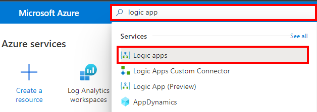
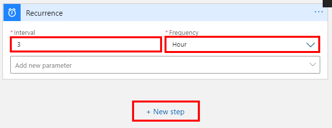

# Introduction

This tech note walks you through how to integrate Prisma Cloud alerts into Azure Sentinel using a Logic App workflow. Here are the tasks that we will complete:

> * Create an access key in Prisma CLoud
> * Create a recurring Logic App workflow to retrieve alerts in Prisma Cloud


### Create an access key in Prisma Cloud
1. Log into the Prisma Cloud console and go to **Settings** → **Access Keys** → **+Add New** 


2. In the open window, configure the following:
* **Name:** logic-app-access-key
* **Key Expiry:** Select an expiry date for the key
* Click **Create**


3. Make a note of the **Access Key ID** and the **Secret Key** as they will be needed in the next task. You can also download the information as CSV file.


### Create a recurring Logic App workflow to retrieve alerts in Prisma Cloud
1. Log into the Azure portal with your Azure credentials

2. In the Azure portal search box, enter **logic app**, and select **Logic Apps**.


3. On the Logic Apps page, select **Add** → **Consumption**


4. In the **Create a logic app** blade, configure the following:
* **Subscription:** Select your Azure subscription
* **Resource group:** Select or create a resource group
* **Logic app name:** prisma-cloud-to-sentinel-ingestion
* **Region:** Select an Azure region close to you
* Leave other settings as default
* Click on **Review + create**. Confirm the details that you provided, and select **Create**. Wait for the deployment to complete.


5. On the deployment complete blade, click on **Go to resource**


6. In the **Logic Apps Designer** blade, under **Templates**, click on **Blank Logic App**.


7. In the **search box**, enter **recurrence**. From the **Triggers** list, select the **Recurrence Schedule**.


8. Configure the following:
* **Interval:** 1
* **Frequency:** Hour
* Click on **+ New step**



9. In the Choose an operation window, in the **search box**, enter **HTTP**. Select **HTTP**.


10. From the **Actions** list, select **HTTP**.


11. In the **HTTP** window, configure the following:
* **Method**: POST
* **URI**: https://api2.eu.prismacloud.io/login (Enter the appropriate URL endpoint for your Prisma cloud tenant location. You can get the information here: https://api.docs.prismacloud.io/reference)
* **Headers**:
	* **Key**: Content-Type
	* **Value**: application/json
* **Body**:
```
{
	"password": "<ACCESS_KEY_ID>",
	"username": "<SECRET_KEY>"
}
```
* Click on **New step**


12. In the Choose an operation window, in the **search box**, enter **Parse JSON**. From the **Actions** list, select **Parse JSON**.


13. In the **Parse JSON** window, configure the following:
* **Content**: Click inside the box so that the dynamic content list appears. In the dynamic content list, in the HTTP section, select Body, 


* **Schema**: 
```
{
    "type": "object",
    "properties": {
        "token": {
            "type": "string"
        },
        "message": {
            "type": "string"
        },
        "customerNames": {
            "type": "array",
            "items": {
                "type": "object",
                "properties": {
                    "customerName": {
                        "type": "string"
                    },
                    "tosAccepted": {
                        "type": "boolean"
                    }
                },
                "required": [
                    "customerName",
                    "tosAccepted"
                ]
            }
        }
    }
}
```
* Click on **New step**


14. In the Choose an operation window, in the **search box**, enter **HTTP**. Select **HTTP**.


15. From the **Actions** list, select **HTTP**.


16. In the **HTTP** window, configure the following:
* **Method**: GET
* **URI**: https://api2.eu.prismacloud.io/alert?timeType=relative&timeAmount=1&timeUnit=month&detailed=false
 (Enter the appropriate URL endpoint for your Prisma cloud tenant location. Also customize the "timeUnit" - day, month, hour, minute AND "timeAount" values)
* **Headers**:
	* **Key**: Accept
		* **Value**: */*
	* **Key**: x-redlock-auth
		* **Value**: Click inside the box so that the dynamic content list appears. In the dynamic content list, in the Parse JSON section, select **token**.


17. Click on **New step**. In the Choose an operation window, in the **search box**, enter **Azure Log Analytics data collector**. From the **Actions** list, select **Send Data**.


18. In the **Azure Log Analytics Data Collector** window, configure the following:
* **Connection name**: sentinel-la-connection
* **Workspace ID**: The log analytics workspace of your Azure Sentinel resource. You can obtain this information from the Log Analytics resource under Log Analytics Workspace → Agents management.
* **Workspace Key**: The log analytics workspace key of your Azure Sentinel resource. You can obtain this information from the Log Analytics resource under Log Analytics Workspace → Agents management.
* Click on **Create**


19. In the **Send Data (Preview)** window, configure the following:
* **JSON Request body**: Click inside the box so that the dynamic content list appears. In the dynamic content list, in the **HTTP 2** section, click on **See more** link. Proceed to click on **Body**.


* **Custom Log Name**: prisma_cloud_alerts

20. In the top left corner, click on **Save**. You can rename each step to describe them further as I've done in the screenshot below.


21. Click on **Run** to test the workflow.


22. All the steps should show as being successful. You can also click on each step to see the output. If there's a failure, review the above instructions and ensure you've followed them.


23. Verify that the logs are shown in Log Analytics, under **Custom Logs**


24. Verify that the logs are shown in Azure Sentinel


## Next steps
For efficiency, you could do the following:
* Modify the step that retrieves the alert to retrieve only open issues and not resolved ones.
* Parse the body of the alerts that was retrieved using the **Parse JSON** action and then format values like the alertTime and firstSeen time
