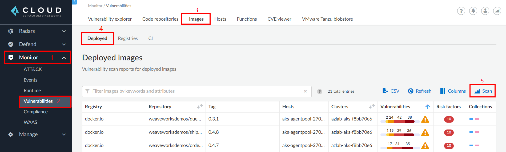
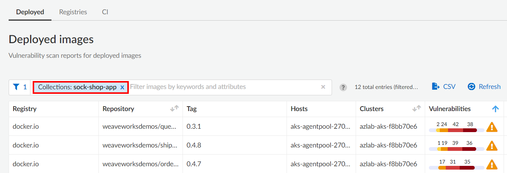

## Module 10 - Introduction - Protect Azure Kubernetes Service (AKS) Workloads

In this module, we will implement protection for AKS workloads. Here's what we'll be completing:

> * Assess Linux and Windows images in the registry for vulnerabilities, malware (static and dymanic) and compliance
> * Assess images in ACR instances with access limited with a firewall, service endpoint, or private endpoints such as Azure Private Link
> * Prevent vulnerable, compromised or non-compliant images from being committed by scanning in your pipelines
> * Prevent untrusted images from being deployed to AKS
> * [Prisma Cloud Windows Containers features](https://docs.paloaltonetworks.com/prisma/prisma-cloud/prisma-cloud-admin-compute/install/install_windows.html)

## Module 10 - Exercises

In this module, we will begin to walk through some of the protection capabilities that Prisma Cloud supports for container registries in Azure. Here are the exercises that we will complete:

> * Deploy Sample App to AKS
> * Deploy the Prisma Cloud Compute Defender to AKS
> * Create namespace based collection for workload in Prisma Cloud
> * Implement Prisma Cloud Container Runtime Vulnerability Rules
> * Implement Prisma Cloud Container Runtime Compliance Rules
> * Implement Runtime Protection

## Exercise 1 - Deploy Sample App to AKS

1. Open the Cloud Shell

2. If you have more than one Azure subscription, ensure you are in the right one that you deployed the lab resources into
```
az account show
az account list -o table
az account set -s <subscription_name>
```

3. Configure kubectl to connect to your Kubernetes cluster, use the az aks get-credentials command. Kubectl is pre-installed in the Azure cloud shell. 
```
az aks get-credentials --resource-group azlab-rg --name azlab-aks
```

4. To verify the connection to your cluster, run the kubectl get nodes command to return a list of the cluster nodes.
```
kubectl get nodes
```

5. Create namespace
```
kubectl create namespace sock-shop
```

6. Clone the microservices-demo repository
```
git clone https://github.com/davidokeyode/microservices-demo.git
```

7. Go to the deploy/kubernetes folder
```
cd microservices-demo/deploy/kubernetes
```

8. Review file
```
code aks-complete-demo.yaml
```

9. Deploy app
```
kubectl apply -f aks-complete-demo.yaml
```

10. Get public IP of front-end
```
kubectl get services --selector=name=front-end -n sock-shop -o wide
kubectl get services -n sock-shop
```

11. Browse to it
```
http://<EXTERNAL-IP>
```

## Exercise 2 - Deploy the Prisma Cloud Compute Defender to AKS
> * The defender was previously deployed in Module 2

## Exercise 3 - Create namespace based collection for workload in Prisma Cloud

1. Configure a container image vulnerability assessment rule by going to the following location: 
* **`Compute`** → **`Manage`** → **`Collections and Tags`** → **`+ Add Collection`** → **`CI`** → **`Add Rule`**
	* **Name**: sock-shop-app
	* **Description**: Prisma cloud collection for the sock-shop namespace
	* **Namespaces**: sock-shop
	* Leave other settings at default value
	* Click on **`Save`**

## Exercise 4 - Implement Prisma Cloud Container Runtime Vulnerability Rules

1. Configure a container image vulnerability assessment rule by going to the following location: 
* **`Compute`** → **`Defend`** → **`Vulnerabilities`** → **`Images`** → **`Deployed`** → **`Add Rule`**
	* **Rule Name**: Org Baseline Container Runtime Vulnerability Policy
	* **Scope**: sock-shop-app
	* **Alert Threshold**: Low
	* **Block Threshold**: Medium
	* **Expand Advanced Settings**
		* **Apply rule only when vendor fixes are available**: On
	* Leave other settings at default value
	* Click on **`Save`**

2. Trigger a runtime vulnerability scan 



3. After the scan has completed, filter for the **`sock-shop-app`** collection that was created earlier



4. Review the filtered results for the following tabs
	* **`Monitor`** → **`Vulnerabilities`** → **`Vulnerability Explorer`** 
	* **`Radars`** → **`Containers`** 

## Exercise 5 - Implement Prisma Cloud Container Runtime Compliance Rules
1. Configure a container image compliance assessment rule by going to the following location: 
* **`Compute`** → **`Defend`** → **`Compliance`** → **`Containers and Images`** → **`Deployed`** → **`Add Rule`**
	* **Rule Name**: Org Baseline Container Runtime Compliance Policy
	* **Compliance Template**: NIST SP 800-190
	* **Scope**: sock-shop-app
	* **Set the following policies to block**
		* Sensitive information provided in environment variables
		* Private keys stored in image
		* Image contains malware
	* Leave other settings at default value
	* Click on **`Save`**

## Exercise 6 - Implement Runtime Protection
1. In the Cloudshell, run the following commands to deploy 
```
wget https://raw.githubusercontent.com/davidokeyode/prismacloud-workshops-labs/main/templates/shellinabox-deployment.yaml

kubectl apply -f shellinabox-deployment.yaml
```

2. Connect to the newly deployed pod using the commands below
```
kubectl get deployment shellinabox-deployment
kubectl get pod
kubectl exec --stdin --tty shellinabox-deployment-xxxxxxxxxx-xxxxx -- /bin/bash
```

3. In the Prisma Cloud console, go to **`Compute`** → **`Monitor`** → **`Runtime`** → **`Container models`**
* Click on three dots in the Actions column of the **`docker.io/sspreitzer/shellinabox:latest`** image and choose **`Manual Relearning`**. Click on the three dots in the Actions column again, and choose **`Manual Relearning`** to stop the learning. The state should now be shown as **`Active`**.

4. In the shell connection to the pod (in Cloud Shell), run the following commands while monitoring **`Monitor`** → **`Events`** → **`Container audits`**

```
top
```
* Use **`q`** to exit from **`top`**
* Review runtime events
	* **`Monitor`** → **`Events`** → **`Container audits`**
	* **`Monitor`** → **`Runtime`** → **`Container models`** → **`Select image`** → **`History`**

5. Configure a runtime rule
* **`Monitor`** → **`Runtime`** → **`Container models`** → Click the three dots in front of the **`docker.io/sspreitzer/shellinabox:latest`** image, then click on **`Copy into rule`** 
	* **Rule name**: Container app runtime rule
	* In the **`General`** tab, enable **`Kubernetes attacks`** and **`Suspicious queries to cloud provider APIs`**
	* Review the **`Processes`** tab. 
		* Add  **`/bin/ping`** to the list of allowed processes. 
		* In the **`Denied & Fallback`** section, select **`Prevent`**. 
	* Review the **`Networking`** tab. 
		* In the **`Denied & Fallback`** section, enter **`1.1.1.1`** to the **`Outbound IPs`** section.
		* Scroll down. In the DNS Section, click to enable the DNS monitoring. Add **`*.google.com`** to the list of allowed domains, and change the **`Denied & Fallback`** effect to **`Prevent`**.
	* Review the **`File system`** tab. Configure File System Monitoring by changing the effect to **`Prevent`**
	* Click **`Save`**. Click **`Don't relearn`** when prompted.

6. Verify container runtime rule
* Go back to the **`shellinabox`** container shell prompt and run the **`top`** command again. 
* Observe the results with the rule applied.
* Observe results in **`Monitor`** → **`Events`** → **`Container Audits`**
* Observe results in **`Monitor`** → **`ATT&CK`** → **`Native Binary Execution`**

7. Verify process block rule
* Go to the **`Defend`** → **`Runtime`** → **`Container app runtime rule`** to change the existing Runtime Rule
* Change the **`Processes`** effect to **`Block`** and **`Save`**. Click **`Don't relearn`** when prompted. 
* Go back to the shellinabox container. Run the **`top`** command again and observe. Note the result on the shell prompt. The container was stopped completely because of the Block effect. Hence you are being kicked out of the shellinabox container and back to the system prompt.
* Observe results in **`Monitor`** → **`Events`** → **`Container Audits`**
* The deployment will create a replacement instance
```
kubectl get pods
```
* Change the container app runtime rule process effect to **`Alert`** for process monitoring and click **`Save`**. Click **`Don't relearn`** when prompted. 

8. Verify network monitoring
* In Cloud Shell, connect to the new pod instcne usingt the commands below:
```
kubectl get deployment shellinabox-deployment
kubectl get pod
kubectl exec --stdin --tty shellinabox-deployment-xxxxxxxxxx-xxxxx -- /bin/bash
```
* Run **`curl www.google.com`** - Successfully resolves the domain

* Run **`curl www.yahoo.com`** - Unable to resolve the domain

* Run **`curl 1.1.1.1`** -  Command runs successfully but will be alerted in the events. **`Monitor`** → **`Events`** → **`Container Audits`**

9. Verify file system monitoring
* Go back to the **`shellinabox`** container shell prompt and run the following commands:

```
cd /
curl www.google.com -o webfile
exit
```

* Observe the alerts in **`Monitor`** → **`Events`** → **`Container Audits`**

10. Review incidents in Prisma Cloud
* Go to **`Radars`** > **`Containers`**
	* The shellinabox image is now surrounded by a pink outline, which indicates it has been involved in an incident.
* Go to Monitor → Runtime → Incident Explorer
	* Review forensic data

9. Review forensics information

```
wget https://raw.githubusercontent.com/davidokeyode/prismacloud-workshops-labs/main/workshops/azure-cloud-protection/template/monero_cpu_minergate.yaml

kubectl apply -f monitor_cpu_minergate.yaml
```
* Wait for a few minutes for the incident to show in **`Monitor`** → **`Runtime`** → **`Incident Explorer`**

* Review host forensics in **`Monitor`** → **`Runtime`** → **`Host Observations`** → **`Forensics`**
	* Filter for **`/usr/bin/docker`** to see when the container was started and who started it

## Learn more
* [Prisma Cloud App Embedded Defender](https://docs.paloaltonetworks.com/prisma/prisma-cloud/21-04/prisma-cloud-compute-edition-admin/install/install_defender/install_rasp_defender.html)
* [Deploying WAAS for App Embedded Defender](https://docs.twistlock.com/docs/compute_edition_21_04/waas/deploy_waas.html#deploying-waas-for-containers-protected-by-app-embedded-defender)

## Next steps

In this lesson, you completed the following:
* Implemented a Prisma Cloud Runtime App-Embedded Policy
* Embedded the Prisma Cloud Defender into a Dockerfile
* Built and deployed the protected container image in ACI
* Verified serverless container workload active protection

In the next lesson, you will implement Prisma Cloud security capabilities to protect serverless containerized workloads. Click here to proceed to the next module:
> [Protect Serverless Container Workloads](11-protect-serverless-container-workloads.md)

