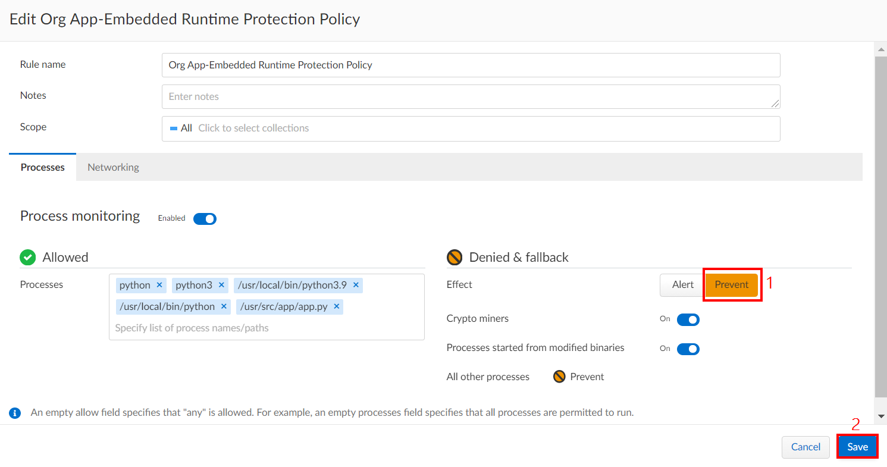

## Module 11 - Introduction - Protect Serverless Container Workloads
In this module, we will begin to walk through some of the protection capabilities that Prisma Cloud supports for serverless container services in Azure. Here are the exercises that we will complete:

> * Implement Prisma Cloud Runtime App-Embedded Policy
> * Embed Prisma Cloud Defender into Dockerfile
> * Build and deploy the protected container image in ACI
> * Verify serverless container workloads active protection

## Exercise 1 - Implement Prisma Cloud Runtime App-Embedded Policy

1. In the Prisma Cloud console, configure an app-embedded runtime protection policy by going to the following location: 
* **`Defend`** → **`Runtime`** → **`App-Embedded Policy`** → **`Add Rule`**
	* **Rule Name**: Org App-Embedded Runtime Protection Policy
	* **Scope**: All
	* **Processes tab**
		* **Process monitoring**: Enabled
		* **Allowed processes**: python, python3, /usr/local/bin/python3.9, /usr/local/bin/python, /usr/src/app/app.py
		* Leave other settings at default values
	* **Networking tab**
		* **IP connectivity**: Enabled
		* **Listening ports**: 5000
		* **DNS**: Enabled
		* Leave other settings at default values
	* Click on **`Save`**


## Exercise 2 - Embed Prisma Cloud Defender into Dockerfile

1. Open a web browser tab and go to the [Azure Cloud Shell](https://shell.azure.com). Sign in with your Azure credentials. Ensure that you are in the **`Bash`** terminal.

2. Configure needed variables. Use the values from **`Module 3 - Exercise 3`**. Replace **`<ACR_NAME>`** with the value of **`ACR Name`** from the output in Module 1.
```
TWISTLOCK_CONSOLE=<PRISMA_CLOUD_CONSOLE_URL>
TWISTLOCK_USER=<PRISMA_CLOUD_ACCESS_KEY_ID>
TWISTLOCK_PASSWORD=<PRISMA_CLOUD_SECRET_KEY>
ACR_NAME=<ACR_NAME>
```

3. Run the following commands to embed the Prisma Cloud defender into a Docker file. 

```
wget https://github.com/davidokeyode/prismacloud-workshops-labs/raw/main/workshops/azure-cloud-protection-pcce/template/pwnpythonapp/pwn_python.zip

unzip pwn_python.zip

# Embed the dockerfile with the app embedded defender
cd pwn_python

~/twistcli app-embedded embed -u $TWISTLOCK_USER -p $TWISTLOCK_PASSWORD --address $TWISTLOCK_CONSOLE --app-id "webadmin-aci" --data-folder "/tmp" Dockerfile

$HOME/pcce/linux/twistcli app-embedded embed -u $TWISTLOCK_USER -p $TWISTLOCK_PASSWORD --address $TWISTLOCK_CONSOLE --app-id "webadmin-aci" --data-folder "/tmp" Dockerfile
```


4. Replace the existing dockerfile with the new one that has Prisma Cloud defender embedded by using the commands below:

```
cp Dockerfile Dockerfile.old
rm Dockerfile
unzip app_embedded_embed_webadmin-aci.zip
rm app_embedded_embed_webadmin-aci.zip
rm Dockerfile.old
```

## Exercise 3 - Build and deploy the protected container image in ACI

1. Build the container image in the container registry using the commands below.  

```
az acr build --registry $ACR_NAME --image businessapp/webadmin:protected .
```


2. Deploy the container image into ACI with new protected image

```
az acr update -n $ACR_NAME --admin-enabled true

ACR_LOGIN_SERVER=$(az acr show --name $ACR_NAME --resource-group azlab-rg --query "loginServer" --output tsv)
ACR_USER=$(az acr credential show -n $ACR_NAME --query username --output tsv)
ACR_PASS=$(az acr credential show -n $ACR_NAME --query passwords[0].value --output tsv)

az container create --name azlab-aci --resource-group azlab-rg --image $ACR_LOGIN_SERVER/businessapp/webadmin:protected --registry-login-server $ACR_LOGIN_SERVER --registry-username $ACR_USER --registry-password $ACR_PASS --dns-name-label aci-demo-$RANDOM --ports 5000 --query ipAddress.fqdn
```

3. Make a note of the FQDN output from the previous command.


4. Verify the defender in the Prisma Cloud console: **`Manage`** → **`Defenders`** → **`Manage`** → **`Defenders`**


## Exercise 4 - Verify serverless container workloads active protection

1. Run the following commands to trigger unallowed processes on the app (this is to simulate a zero day exploit at runtime). Replace **`<ACI_FQDN>`** with the value of the FQDN from **`Exercise 3 - Step 3`** of this module.

```
ACIFQDN=<ACI_FQDN>
http --session=logged-in -a antitree:password http://$ACIFQDN:5000/?cmd=ls
http --session=logged-in -a antitree:password http://$ACIFQDN:5000/?cmd=env
```


2. In the Prisma Cloud console, verify that an alert was raised: **`Monitor`** → **`Events`** → **`App-Embedded Audits`**. You should see the alerts that were raised as a result of the runtime violations. The response should be **`Alert`**.


3. In the Prisma Cloud console, verify the attack on the **ATT&CK Explorer** dashboard: **`Monitor`** → **`ATT&CK`** → **`Execution`**. You should see the violation mapped to the **`MITRE ATT&CK framework`**.


4. In the Prisma Cloud console, modify the protection rule to prevent unallowed processes: **`Defend`** → **`Runtime`** → **`App-Embedded Policy`** → **`Org App-Embedded Runtime Protection`**
	* **Denied & fallback**
		* **Prevent**: Prevent
	* Click **`Save`**



5. In the opened Linux SSH session, run the following commands to trigger unallowed processes again (this is to simulate a zero day exploit at runtime). Replace **`<ACI_FQDN>`** with the value of the FQDN from **`Exercise 3 - Step 3`** of this module. 

```
ACIFQDN=<ACI_FQDN>
http --session=logged-in -a antitree:password http://$ACIFQDN:5000/?cmd=ls
http --session=logged-in -a antitree:password http://$ACIFQDN:5000/?cmd=env
```

The commands should not be successful this time.


6. In the Prisma Cloud console, verify that an alert was raised: **`Monitor`** → **`Events`** → **`App-Embedded Audits`**. You should see the alerts that were raised as a result of the runtime violations. The response should be **`Prevent`**.


## Learn more
* [Prisma Cloud App Embedded Defender](https://docs.paloaltonetworks.com/prisma/prisma-cloud/21-04/prisma-cloud-compute-edition-admin/install/install_defender/install_rasp_defender.html)
* [Deploying WAAS for App Embedded Defender](https://docs.twistlock.com/docs/compute_edition_21_04/waas/deploy_waas.html#deploying-waas-for-containers-protected-by-app-embedded-defender)

## Next steps

In this lesson, you completed the following:
* Implemented a Prisma Cloud Runtime App-Embedded Policy
* Embedded the Prisma Cloud Defender into a Dockerfile
* Built and deployed the protected container image in ACI
* Verified serverless container workload active protection

In the next lesson, you will implement shift-left security with Prisma Cloud and Azure DevOps. Click here to proceed to the next lesson:
> [Implement Shift-Left Security](13-implement-shift-left-security.md)