# Module 11: Implement Shift Left Security in Azure DevOps

Here are the tasks that we will be completing in this module:

> * Grant permissions to the AKS instance to pull images from ACR
> * Create Azure DevOps project and service connection
> * Create Prisma Cloud credentials for Shift Left
> * Import code and pipeline into Azure DevOps
> * Configure pipeline (complete variables)
> * Run pipeline and review results
## Exercise 1 - Grant permissions to the AKS instance to pull images from ACR
1. Open a web browser tab and go to the [Azure Cloud Shell](https://shell.azure.com). Sign in with your Azure credentials. Ensure that you are in the **`Bash`** terminal.

2. Run the following command to grant AKS the permission to pull images from the container registry. Replace **`<ACR_NAME>`** with the **`ACR Name`** value from the output in module 1.
```
 az aks update -n azlab-aks -g azlab-rg --attach-acr <ACR_NAME>
```

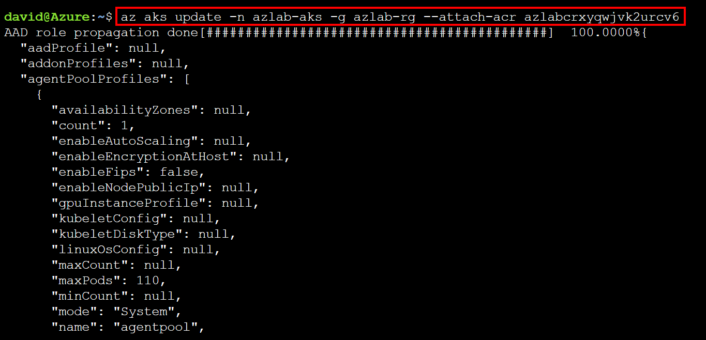

## Exercise 2 - Create an Azure DevOps project and service connection
1. Open a web browser tab and browse to your [Azure DevOps](https://dev.azure.com) organization. Sign in with your credentials. 

2. Go to **`Organization Settings`** → **`Billing`** → **`Set up billing`**  → **`Select your subscription`** → **`Save`**. This will link your Azure subscription to your DevOps organization for billing

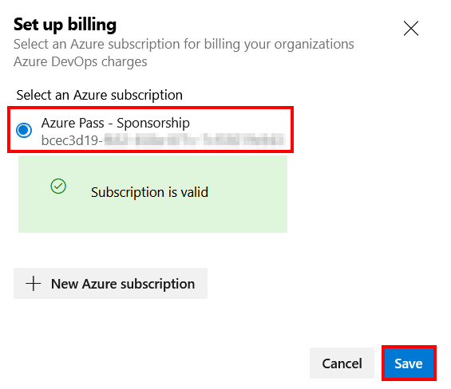

3. Still in the Billing blade, configure the following:
* **MS Hosted CI/CD**: **`Paid parallel jobs`** → **`2`**
* **Self-Hosted CI/CD**: **`Paid parallel jobs`** → **`2`**
* Click on **`Save`**

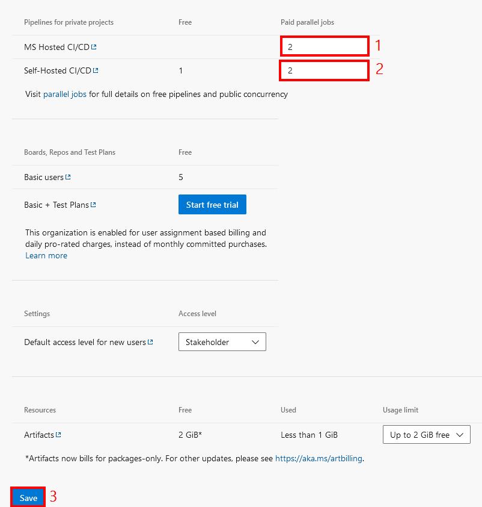

4. In the left hand pane, click on **`Projects`** (In the **`General`** section) → **`New project`**. In the Create new project blade, configure the following:
* **Project name**: prisma-cloud-shiftleft
* **Description**: Prisma Cloud Shift-Left Workshop
* **Visibility**: Private
* Click on **`Create`**

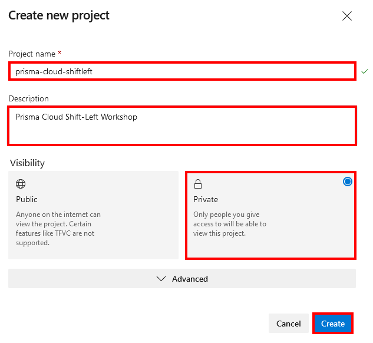

5. Select the project that you just created to open it. In the **`Project Settings`** blade, click on **`Service connections`** (in the **`Pipelines`** section) → **`Create service connection`**. 

6. In the **`New service connection`** blade, click on **`Azure Resource Manager`**, then click on **`Next`**.

7. In the **`New Azure service connection`** blade, select **`Service principal (automatic)`**, then click on **`Next`**.

8. In the **`New Azure service connection`** blade, configure the following:
* **Scope level**: Subscription
* **Subscription**: Select your Azure subscription
* **Service connection name**: pc-shiftleft-azure-connection
* **Description**: Azure Subscription Connection
* **Grant access permission to all pipelines**: Selected
* Click on **`Save`**

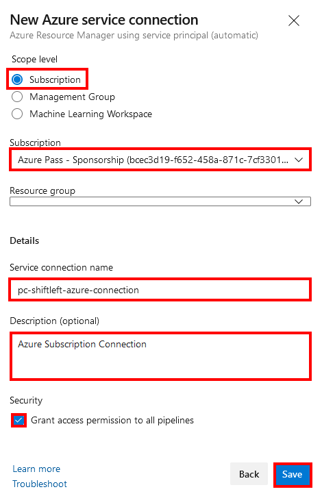


## Exercise 3 - Import code and pipeline into Azure DevOps

1. In the left plane of the Azure DevOps console, click on the **`Azure Repos`** icon to open it.

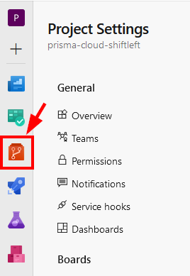

2. In the Azure Repos blade, click on the **`prisma-cloud-shiftleft`** dropdown and select **`Import repository`**

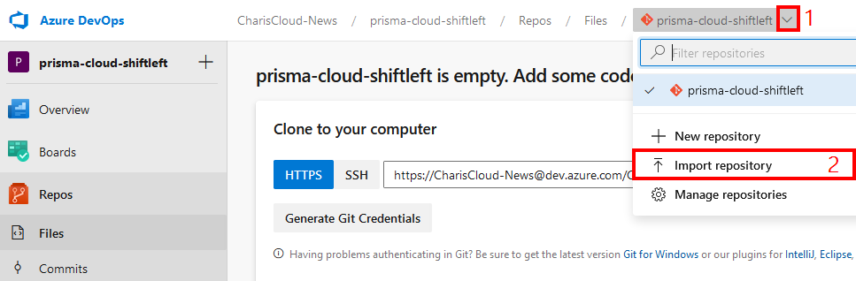

3. In the **`Import a Git repository`** blade, configure the following:
* **Repository type**: Git
* **Clone URL**: https://github.com/davidokeyode/prismacloud-shiftleft-exported
* **Name**: prismacloud-shiftleft-imported
* Click on **`Import`**

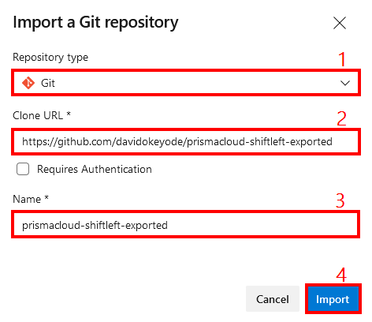

4. In the left plane of the Azure DevOps console, click on the **`Pipelines`** icon to open it.

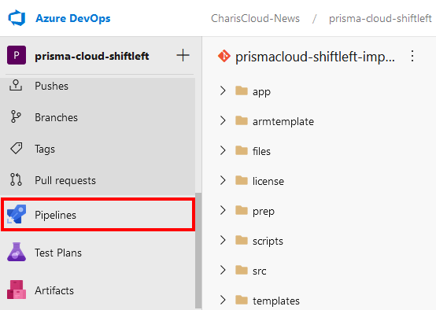

5. In the pipeline blade, click on **`Create Pipeline`**. 
* **Where us your code?**: Azure Repos Git - YAML
* **Select a repository**: prismacloud-shiftleft-imported
* **Configure your pipeline**: Existing Azure Pipelines YAML file
   * **Select an existing YAML file**
      * **Branch**: main
      * **Path**: /azure-pipelines-plain.yml
      * Click on **Continue**

Leave this window open as we will need to configure some variables before we can run the pipeline. For now, let us go to prepare the credentials that we will need for the pipeline.
## Exercise 4 - Create Prisma Cloud credentials for Shift Left

>* You will use credentials from **`Module 6 - Exercise 3 - Step 2 or Step 3`**. If you are yet to complete that step, make sure you do so.

## Exercise 5 - Configure pipeline (complete variables)
1. In the variables section, configure the following:
* **PCUSER**: This will be the **`Access Key ID`** if you are using the Enterprise (SaaS) platform and the **`Username`** if you are using the Compute (Self-Hosted) edition of Prisma Cloud.
* **PCPASS**: This will be the **`Secret Key`** if you are using the Enterprise (SaaS) platform and the **`Password`** if you are using the Compute (Self-Hosted) edition
* **PC_CONSOLE**: This will be **`Path to Console`** URL if you are using the Enterprise (SaaS) platform and the reachable **`console URL`** if you are using the Compute (Self-Hosted) edition. 
* **ACR_NAME**: Enter the **`ACR Name`** value from the output of the template deployment in Module 1.
* **ACR_FQDN**: Enter the **`ACR FQDN`** value from the output of the template deployment in Module 1.
* **SUB_ID**: Enter the **`Subscription ID`** value from the output of the template deployment in Module 1.

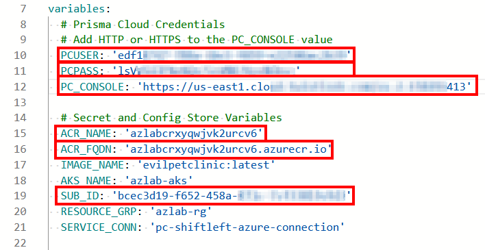

2. To run the pipeline, configure the flags as discussed in **`Exercises 6 to 10`** of this module, then click on **`Save and run`** → **`Save and run`**.

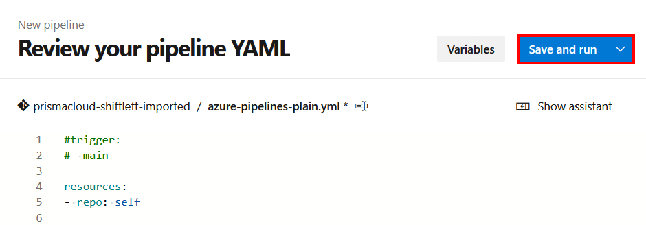

## Exercise 6 - Run the Git repository scan task
1. In Prisma Cloud, configure the policy that will be enforced:
* **a. Create code repo vulnerability scan policy**
   * **`Defend`** → **`Vulnerabilities`** → **`Code repositories`** → **`CI`** → **`Add Rule`**
      * **Rule Name**: Org Baseline - Code Dependencies Vulnerability Policy
      * **Alert threshold**: Low
      * **Failure threshold**: Medium
      * **Advanced Settings**
         * **Apply rule only when vendor fixes are available**: On
         * **Terminal output verbosity for failed scans**: Detailed
      * Click on **`Save`**
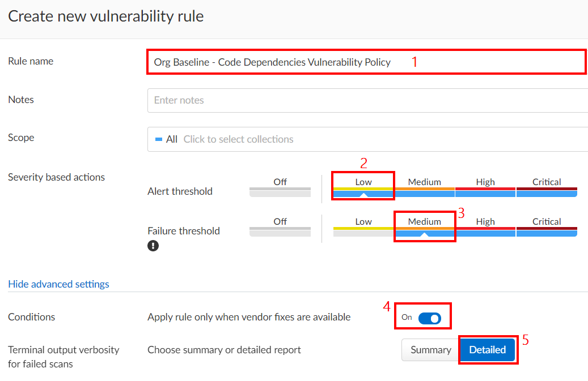

* **b. Create code repo compliance scan policy**
   * **`Defend`** → **`Compliance`** → **`Code repositories`** → **`CI`** → **`Add Rule`**
      * **Rule Name**: Org Baseline - Code Dependencies Compliance Policy
      *  **Alert threshold**: Low
      *  **Failure threshold**: Medium
      *  **Licenses severity**:
         * **High**: MIT, MIT-0
      * Click on **`Save`**

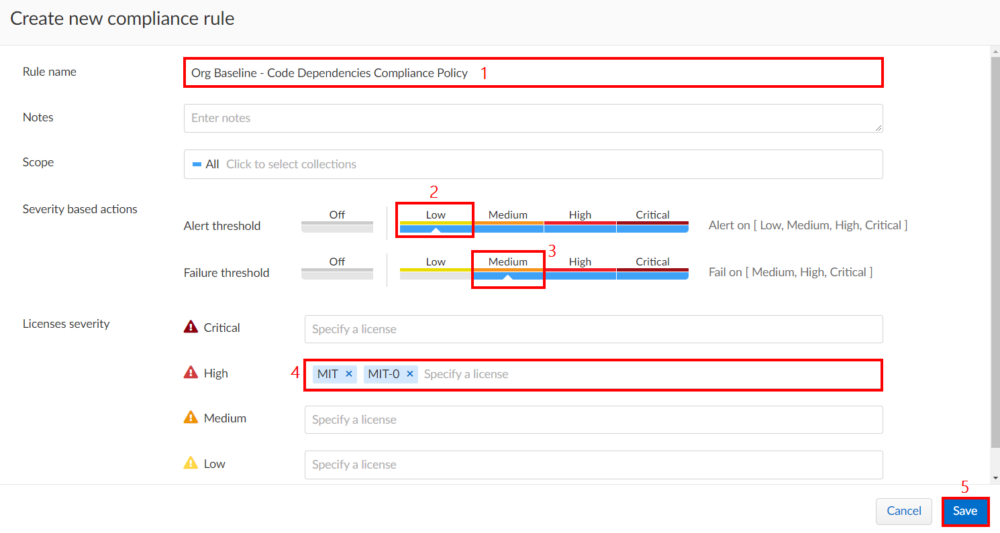


2. In the pipeline, the following flags controls the behaviour of this task:

* **PRE_BUILD_GIT_SCAN_FLAG**:
   * **`'true'`** - exit on failed security checks
   * **`'false'`** - ignore failed security checks

* **Prisma Cloud - Scan Code Repo Task**
   * **`enabled: 'true'`** - execute git repo scan task
   * **`enabled: 'false'`** - disable git repo scan task

3. Results can be verified right in the pipeline

4. Results can also be monitored in Prisma Cloud
* **a. Verify vulnerability scan results**
   * **`Monitor`** → **`Vulnerabilities`** → **`Code repositories`** → **`CI`**

* **b. Verify compliance scan results**
   * **`Monitor`** → **`Compliance`** → **`Code repositories`** → **`CI`**

## Exercise 7 - Run the Dockerfile scan task
1. In the pipeline, the following flags controls the behaviour of this task:

* **PRE_BUILD_DOCKERFILE_SCAN_FLAG**:
   * **`''`** - exit on failed security checks
   * **`'--soft-fail'`** - ignore failed security checks

* **Prisma Cloud - Scan Dockerfile**
   * **`enabled: 'true'`** - execute dockerfile scan task
   * **`enabled: 'false'`** - disable dockerfile scan task

2. Results can be verified right in the pipeline

## Exercise 8 - Run the Pre-Registry Image scan task
1. In Prisma Cloud, configure the policy that will be enforced:
* **a. Create CI Image vulnerability scan policy**
   * **`Defend`** → **`Vulnerabilities`** → **`Images`** → **`CI`** → **`Add Rule`**
      * **Rule Name**: Org Baseline - CI Image Vulnerability Policy
      * **Alert threshold**: Low
      * **Failure threshold**: Medium
      * **Advanced Settings**
         * **Apply rule only when vendor fixes are available**: On
         * **Terminal output verbosity for failed scans**: Detailed
      * Click on **`Save`**

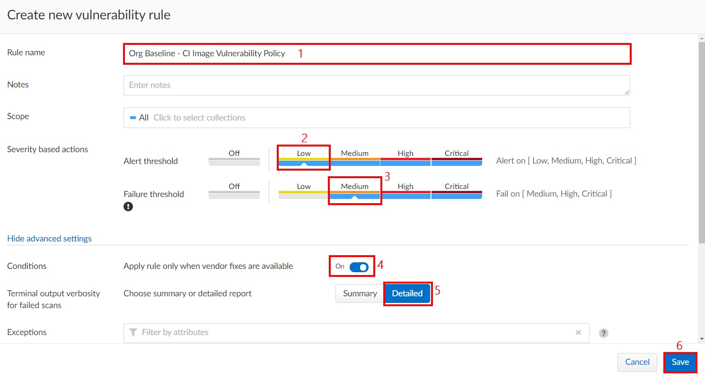

* **b. Create CI Image compliance scan policy**
   * **`Defend`** → **`Compliance`** → **`Containers and Images`** → **`CI`** → **`Add Rule`**
      * **Rule Name**: Org Baseline - CI Image Compliance Policy
      * **Compliance Template**: NIST SP 800-190
      * **Compliance actions**: 
         * **422** - Image contains malware - **`Fail`**
         * **424** - Sensitive information provided in environment variables - **`Fail`**
         * **425** - Private keys stored in image - **`Fail`**
      * **Terminal output verbosity for failed builds**: Detailed
      * Click on **`Save`**

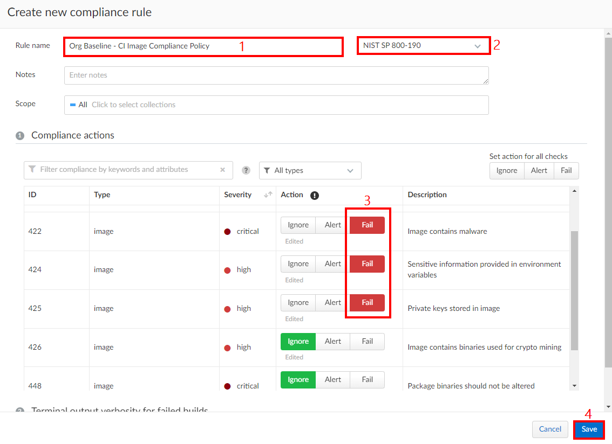

* **c. Enhance malware checks with wildfire**
   * **`Manage`** → **`System`** → **`Wildfire`**
      * **WildFire malware detection**: Enable
      * **WildFire cloud region**: Europe (Netherlands)
      * **Use WildFire for runtime protection**: On
      * **Use WildFire for CI compliance checks**: On
      * **Upload files with unknown verdicts to WildFire**: On
      * **Treat grayware as malware**: Off
      * Click on **`Save`**

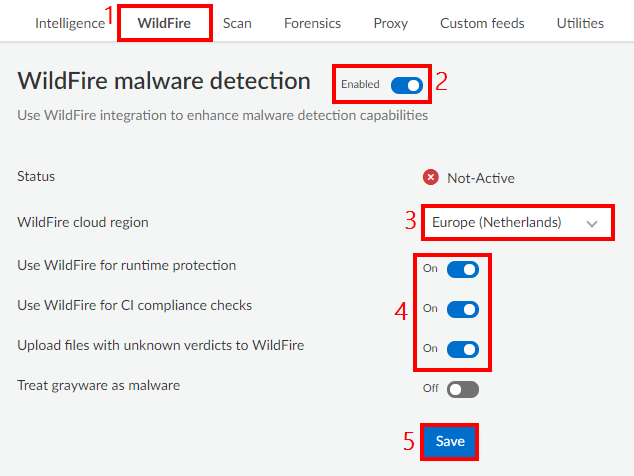


2. In the pipeline, the following flags controls the behaviour of this task:
* **BUILD_IMAGE_SCAN_FLAG**:
   * **`'true'`** - exit on failed security checks
   * **`'false'`** - ignore failed security checks

* **Prisma Cloud - Scan Container Image**
   * **`enabled: 'true'`** - execute pre-registry commit container image scan task
   * **`enabled: 'false'`** - disable pre-registry commit container image scan task

3. Results can be verified right in the pipeline

4. Results can also be monitored in Prisma Cloud
* **a. Verify vulnerability scan results**
   * **`Monitor`** → **`Vulnerabilities`** → **`Images`** → **`CI`**

* **b. Verify compliance scan results**
   * **`Monitor`** → **`Compliance`** → **`Images`** → **`CI`**

* **c. Verify malware scan results**
   * **`Monitor`** → **`Compliance`** → **`Images`** → **`CI`**


## Exercise 9 - Run the Infrastructure-as-Code template scan tasks
1. In the pipeline, the following flags controls the behaviour of the terraform template scan task:

* **PRE_DEPLOY_TERRAFORM_SCAN_FLAG**:
   * **`''`** - exit on failed security checks
   * **`'--soft-fail'`** - ignore failed security checks

* **Prisma Cloud - Terraform Template Analysis**
   * **`enabled: 'true'`** - execute terraform iac scan task
   * **`enabled: 'false'`** - disable terraform iac scan task

2. In the pipeline, the following flags controls the behaviour of the ARM template scan task:

* **PRE_DEPLOY_ARM_SCAN_FLAG**:
   * **`''`** - exit on failed security checks
   * **`'--soft-fail'`** - ignore failed security checks

* **Prisma Cloud - ARM Template Analysis Task**
   * **`enabled: 'true'`** - execute arm iac scan task
   * **`enabled: 'false'`** - disable arm iac scan task

3. Results can be verified right in the pipeline

## Exercise 10 - Run the Registry Image scan check task
>* This task requires Module 8 to be completed first

1. In the pipeline, the following flags controls the behaviour of the registry scan check task:

* **PRE_DEPLOY_REG_SCAN_FLAG**:
   * **`'1'`** - exit on failed security checks
   * **`'0'`** - ignore failed security checks

* **Prisma Cloud - Registry Image Scan Check**
   * **`enabled: 'true'`** - execute the registry scan check task
   * **`enabled: 'false'`** - execute the registry scan check task

2. Results can be verified right in the pipeline

## Next steps
In this lesson, you completed the following:
* Granted permissions to the AKS instance to pull images from ACR
* Created Azure DevOps project and service connection
* Created Prisma Cloud credentials for Shift Left
* Imported code and pipeline into Azure DevOps
* Configured pipeline (complete variables)
* Ran pipeline and review results
