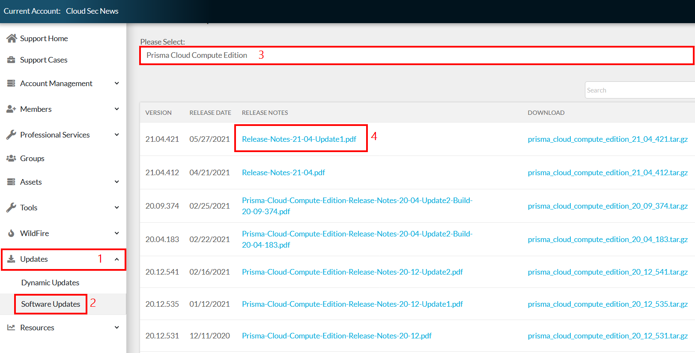
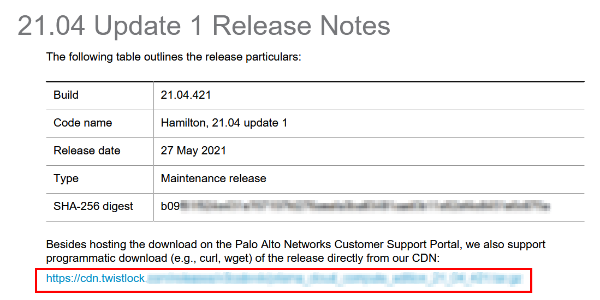
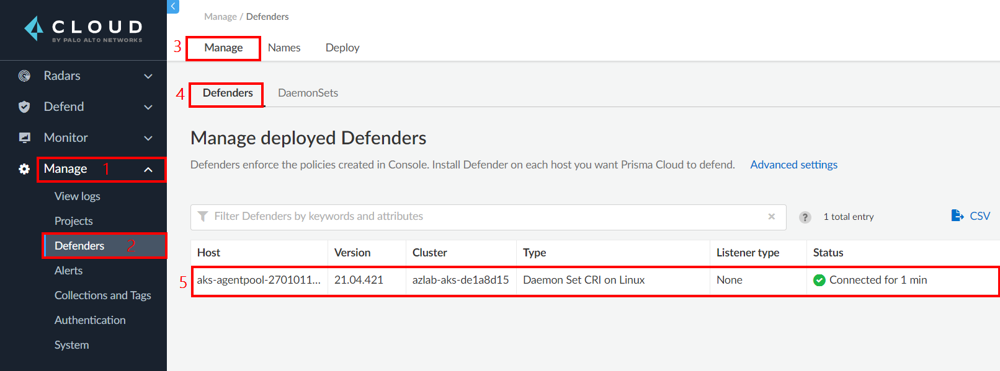

# Module 2: Prisma Cloud - Deploy Prisma Cloud Compute Edition (PCCE) on AKS

In this workshop module, we will be deploying PCCE on the AKS cluster that was deployed using the ARM template in the last module. Here are the exercises that we will complete in this lesson:

> * Obtain the download URL of Prisma Cloud Compute Edition (PCCE)
> * Prepare the console installation manifest file
> * Connect to the AKS cluster and deploy the console to it
> * Deploy the defender daemonset on the AKS cluster

## Pre-Requisites
> * A valid Prisma Cloud Compute Edition (PCCE) license. The Prisma Cloud Compute Edition license information contains two main pieces of information. The **`Access token`** and the **`License key`**. Make a note of these as they will be needed in the exercises of this module. 

## Exercise 1: Obtain the download URL of Prisma Cloud Compute Edition (PCCE)
> * The latest version of the Prisma Cloud Compute software can be downloaded programmatically directly from the CDN. To do this, we need to obtain the download URL to use. We will obtain that URL in this exercise. 

1. Open a web browser and go to the [Palo Alto Networks Customer Support portal](https://support.paloaltonetworks.com/). In the top right corner, click on **`Sign in`** and authenticate with your credentials

2. In the left hand menu, click on **`Updates`** → **`Software Updates`** → Select **`Prisma Cloud Compute Edition`** from the drop down list → Click to open the release note for the latest version.



3. In the opened PDF document, scroll down and copy the download URL as shown below. Make a note of this URL as it will be needed in the next exercise.




## Exercise 2: Prepare the console installation manifest file

1. Open a web browser tab and go to the [Azure Cloud Shell](https://shell.azure.com). Sign in with your Azure credentials. Ensure that you are in the **`Bash`** terminal.

2. In the cloud shell environment, run the following commands to download the PCCE software installer. Replace **`<DOWNLOAD_URL>`** with the URL that you copied in the first exercise of this module. Wait for the download to complete.

```
curl -o /tmp/archive.tar.gz <DOWNLOAD_URL>
```

3. Create a directory and unpack the Prisma Cloud Compute software into it using the following commands.

```
mkdir pcce
cd pcce
tar xvf /tmp/archive.tar.gz
```

4. Configure the access token (obtained from your PCCE license file) as an environment variable. Replace **`<ACCESS_TOKEN>`** with the value of the access token from your license file.

```
PRISMACLOUD_ACCESS=<ACCESS_TOKEN>
```

5. Generate the YAML manifest that will be used to deploy the console, using the twistcli tool. The unpacked tar file contains the twistcli tool. This will generate a file called **`twistlock_console.yaml`** in your current working directory which will be used to deploy the console on Kubernetes.

```
linux/twistcli console export kubernetes --registry-token "$PRISMACLOUD_ACCESS" --service-type LoadBalancer
```

6. Edit the **`twistlock_console.yaml`** file in the code editor using the following command.

```
code twistlock_console.yaml
```

7. Add the line **`nodePort: 30443`** to the **`management-port-https`** settings. This should be around line 26. The modified service should be the same as the settings below. Use **`CNTRL + S`** to save and **`CNTRL + Q`** to exit.

```
spec:
  ports:
  - name: communication-port
    port: 8084
  - name: management-port-https
    port: 8083
    nodePort: 30443
```

## Exercise 3: Connect to the AKS cluster and deploy the console to it

1. In the Cloud shell environment, connect to the AKS cluster using the command below.

```
az aks get-credentials -g azlab-rg -n azlab-aks
```

2. Run the following command to begin installation

```
kubectl create -f $HOME/pcce/twistlock_console.yaml
```

3. You can check that Prisma Cloud Console is correctly installed by using the command below. Make sure the pods are in a Running state. This might take a couple of minutes. 

```
watch kubectl get all -n twistlock
```

4. Copy the **`EXTERNAL-IP`** value of the **`twistlock-console`** service.


5. Open a web browser and go to **`https://<EXTERNAL-IP>:8083`**. Replace **`<EXTERNAL-IP>`** with the value of the **`EXTERNAL-IP`** that was copied earlier.

6. On the console, configure the following username and password:
* **`Username`**: prismaadmin
* **`Password`**: Specify a complex password
* Click on **Create account**

7. In the Prisma Cloud license blade, enter the **`License key`** value from your Prisma Cloud license file and click **`Register`**.


## Exercise 4: Deploy the defender daemonset on the AKS cluster

1. In the Cloud shell environment, configure the following variables. 
* Replace **`<EXTERNAL-IP>`** with the value of the **`EXTERNAL-IP`** that was copied earlier.
* Replace **`<USERNAME>`** with the value of the username that you configured for the console earlier.
* Replace **`<PASSWORD>`** with the value of the password that you configured for the console earlier.

```
console=https://<EXTERNAL-IP>:8083
user=<USERNAME>
password=<PASSWORD>
```

2. Generate the YAML manifest that will be used to deploy the defender, using the twistcli tool. This will generate a file called **`defender.yaml`** in your current working directory which will be used to deploy the defender daemonset on Kubernetes.

```
$HOME/pcce/linux/twistcli defender export kubernetes --address $console --cluster-address twistlock-console --user $user --password $password --cri
```

3. Run the following command to install the defender daemonset

```
kubectl create -f defender.yaml
```

4. Back in the Prisma Cloud console, go to **`Manage`** → **`Defenders`** → **`Manage`** → **`Defenders`** to verify that the defender is connected to the console.




## Summary

In this lesson, you completed the following:
> * Obtained the download URL of Prisma Cloud Compute Edition (PCCE)
> * Prepared the console installation manifest file
> * Connected to the AKS cluster and deployed the console to it
> * Deployed the defender daemonset on the AKS cluster

## Learn More

> * [Prisma Cloud twistCLI](https://docs.paloaltonetworks.com/prisma/prisma-cloud/prisma-cloud-admin-compute/tools/twistcli.html)


## Proceed to the next lesson:
> [Configure Custom Domain for Prisma Cloud Compute Edition (PCCE)](2b-pcce-custom-domain.md) 
