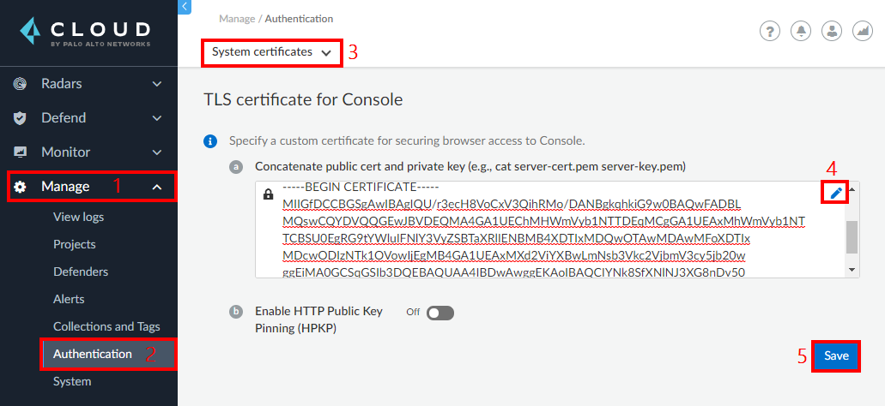
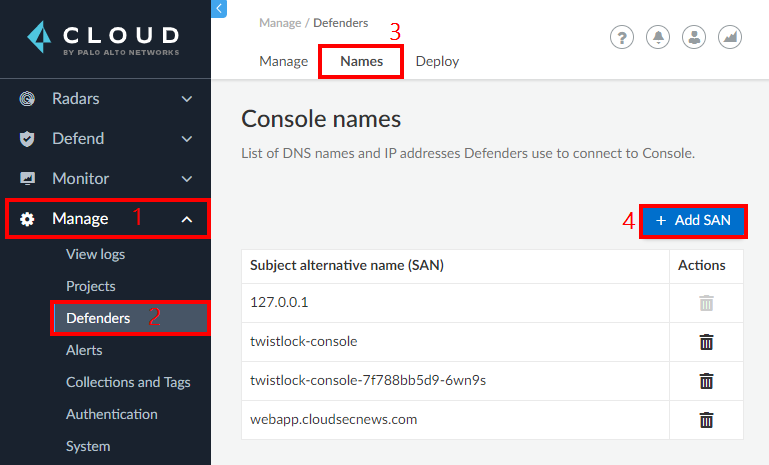

# Module 2: Prisma Cloud - Configure Custom Domain for Prisma Cloud Compute Edition (PCCE)

In this workshop module, we will be configure a custom domain name for PCCE. Here are the exercises that we will complete in this lesson:

> * Register a domain name with a DNS registrar
> * Generate a trusted certificate for the DNS name
> * Upload PEM certificate to the Prisma cloud console
> * Create Prisma Cloud Credentials

## Exercise 1: Register a domain name with a DNS registrar
1. If you are exposing the console publicly. You could use providers like [Name Cheap](https://www.namecheap.com/) or [GoDaddy](https://uk.godaddy.com/)

> * Top level domains like **`.xyz`** are a lot cheaper 

2. Create a DNS A record to point to the Load balancer's IP address

## Exercise 2: Generate a trusted certificate for the DNS name
1. You can register with a provider like [Zero SSL](https://zerossl.com/) to obtain a free SSL certificate for three months

## Upload PEM certificate to the Prisma cloud console

1. In the Prisma Cloud console, go to **`Manage`** → **`Authentication`** → **`System certificates`**. Edit the **`TLS certificate for console section`** to add a concatenated public certificate and private key in PEM format. Click **`Save`**.

2. In the Prisma Cloud console, go to **`Manage`** → **`Defenders`** → **`Names`** → **`Add SAN`**. Enter the DNS name that you are using for the console, then click **`Add`**.

## Exercise 3 - Create Prisma Cloud Credentials
To use the capabilities of Prisma Cloud, we need two main pieces of information. First the console address of our Prisma Cloud console and second, credentials that can be used for authenticating requests. We'll obtain both of these information in this exercise.

1. The Prisma Cloud console address is the reachable URL of the console. If you are using a public or private DNS name, this will be the address to use.

2. Generate credentials for scanning by doing the following:
* **`Manage`** → **`Authentication`** → **`Users`** → **`Add User`** 
	* **`Username`**: DevSecOps-Scan
	* **`Password`**: Specify a complex password and make a note of it
	* **`Role`**: DevSecOps User
	* **`Permissions`**: All
	* Click on **`Create`**
	* Make a note of both the **Username** and the **Password**

## Learn More

> * [Custom certs for Console access](https://docs.paloaltonetworks.com/prisma/prisma-cloud/21-04/prisma-cloud-compute-edition-admin/configure/subject_alternative_names.html)

> * [Prisma Cloud Subject Alternative Names](https://docs.paloaltonetworks.com/prisma/prisma-cloud/21-04/prisma-cloud-compute-edition-admin/configure/subject_alternative_names.html)

## Proceed to the next lesson:
> [Prepare Azure DevOps Services](4-jira-integration-cwpp.md) 
