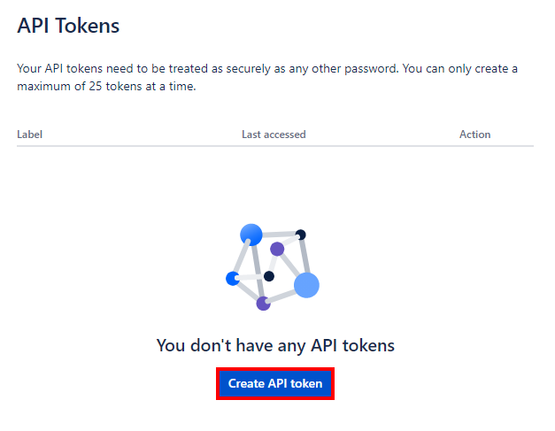
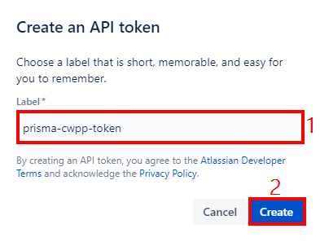
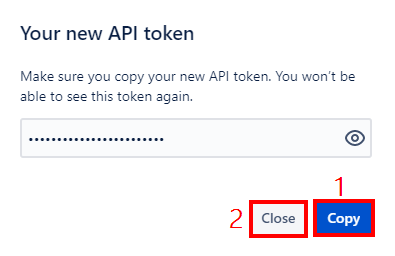
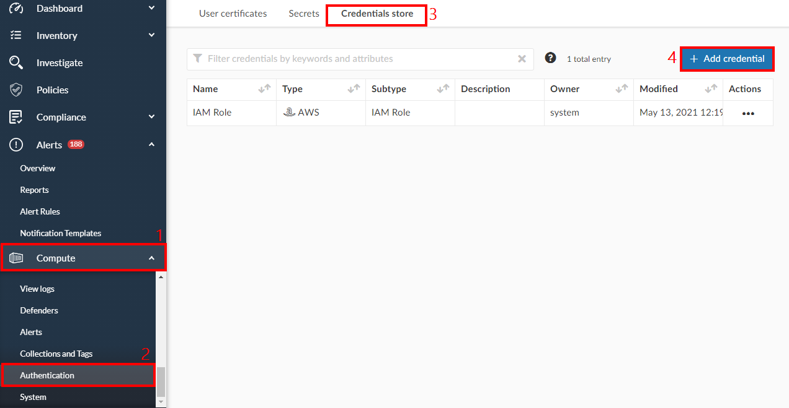
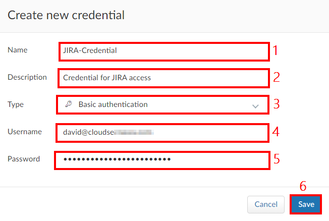
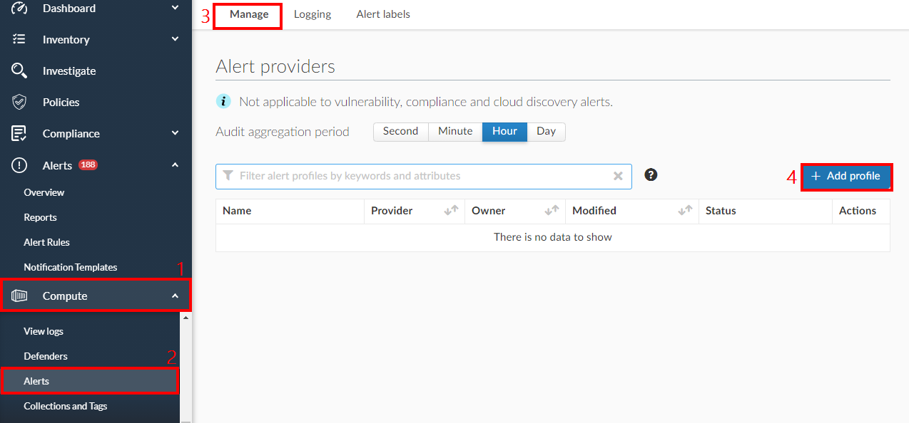
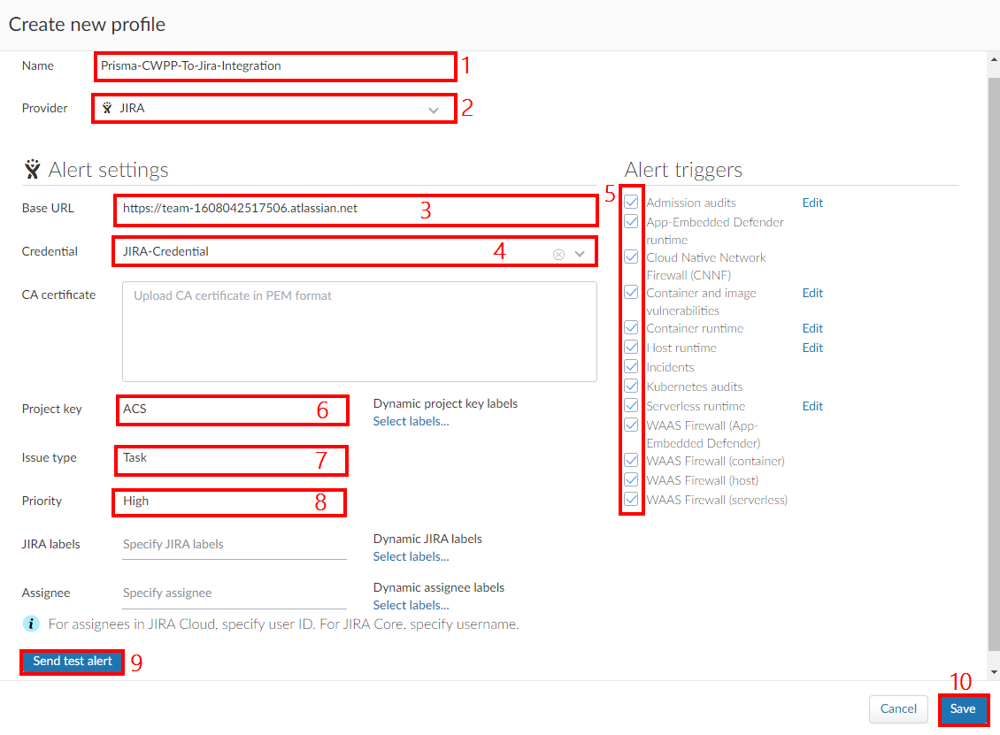

# Module 4b - Introduction - Configure JIRA integration in Prisma Cloud (Compute)

In the previous module, you integrated your JIRA project with Prisma Cloud (CSPM). This allows Prisma Cloud to generate tickets in JIRA for security risks and incidents for protected subscriptions, services and workloads. In this exercise, we will do the same for Prisma Cloud (Compute). Here are the exercises that we will be completing:

>* Generate a JIRA API token
>* Add JIRA credential in Prisma Cloud
>* Add JIRA alert profile in Prisma Cloud

## Exercise 1 - Generate a JIRA API token
>* In order to integrate Prisma Cloud (Compute) with JIRA, we need to create an API token in JIRA. This process requires an account that has administrative privileges in JIRA.

1. Open a web browser and browse to [https://id.atlassian.com/manage-profile/security/api-tokens](https://id.atlassian.com/manage-profile/security/api-tokens)

2. In the API Tokens window, click on **`Create API token`**

3. In the Create an API token window, configure the following:
* **Label**: prisma-cwpp-token
* Click **`Create`**

4. In the **`Your new API token window`**, Click **`Copy`** to copy the token value. Paste it into notepad to make a note of it, then click **`Close`** to close the window.

## Exercise 2 - Add JIRA credential in Prisma Cloud
>* In order to complete the JIRA integration process with Prisma Cloud (Compute), we need to setup the token that we created earlier.

1. Open a web browser and go to your Prisma Cloud console 
2. In the left hand menu, click on **`Compute`** → **`Authentication`** → **`Credentials store`** → **`+ Add credential`**

3. In the Create new credential window, configure the following: 
* **Name**: JIRA-Credential
* **Description**: Credential for JIRA access
* **Type**: Basic authentication
* **Username**: Enter the your JIRA email address
* **Password**: Enter the value of the token that you made a note of in Exercise 1
* Click on **Save**

## Exercise 3 - Add JIRA alert profile in Prisma Cloud
>* In this exercise, we will configure the JIRA integration, using the components that we setup earlier.

1. Open a web browser and go to your Prisma Cloud console 
2. In the left hand menu, click on **`Compute`** → **`Alerts`** → **`Manage`** → **`+ Add profile`**

3. In the **`Create new profile`** window, configure the following:
* **Name**: Prisma-CWPP-To-Jira-Integration
* **Provider**: JIRA
* **Base URL**: Enter your JIRA account URL
* **Credential**: JIRA-Credential
* **CA certificate**: Leave empty
* **Alert Triggers**: Select all options
* **Project key**: ACS (or the key you used for your JIRA project)
* **Issue type**: Task
* **Priority**: High
* **JIRA labels**: Leave empty
* **Assignee**: Leave empty
* Click on **`Send test alert`**. This will send a test alert that you can verify in JIRA. Ensure that you got a **Sent** message.
* Click on **`Save`**

## Learn more
* [Integrate Prisma Cloud (Compute) with Jira](https://docs.paloaltonetworks.com/prisma/prisma-cloud/prisma-cloud-admin-compute/alerts/jira.html)

## Next steps
In this module, you completed the following:
>* Generated a JIRA API token
>* Added JIRA credential in Prisma Cloud
>* Added JIRA alert profile in Prisma Cloud

In the next module, you will review and remediate security risks and compliance violations with Prisma Cloud. Click here to proceed to the next module:
> [Review and remediate issues with Prisma Cloud](5-respond-and-remediate.md)
