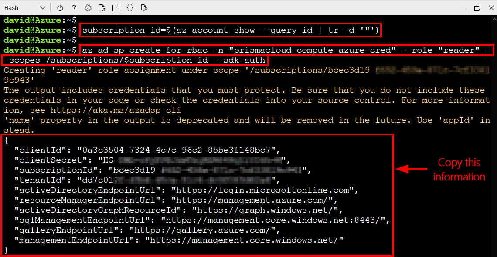
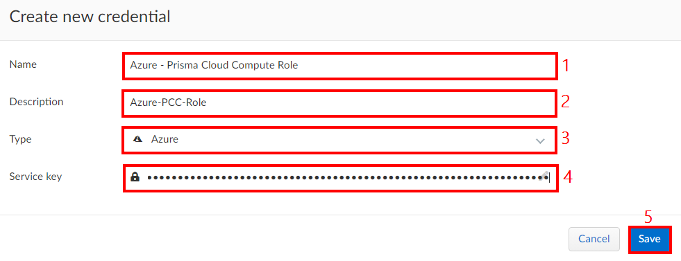
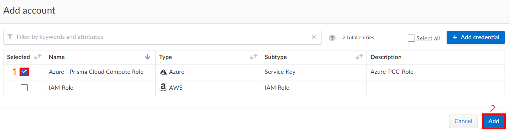
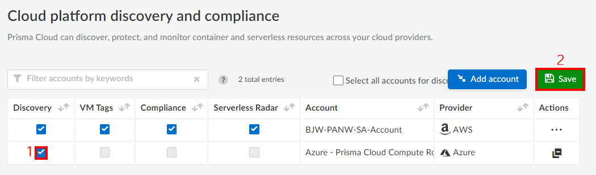
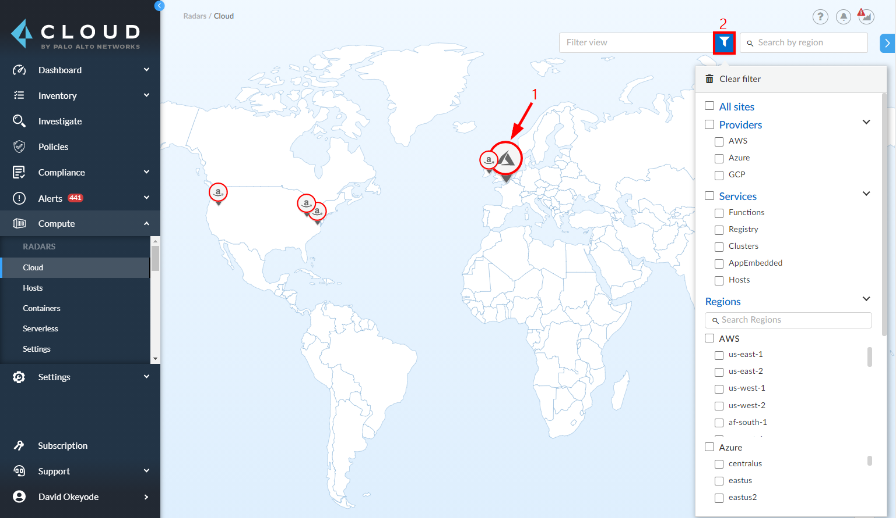
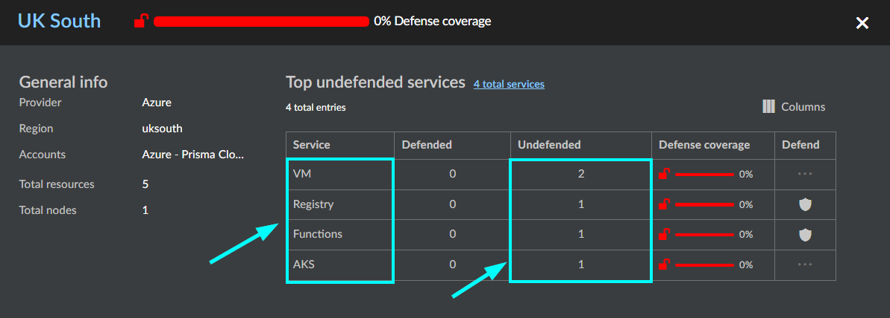

## Module 6 - Introduction - Implement Service Discovery
Prisma Cloud platform discovery helps us to identify cloud-native services that are used in our Azure subscriptions, across all regions, and across all accounts. It continuously monitors our Azure subscriptions to detects when new services are added, and reports which services are unprotected. This can help to mitigate our exposure to rogue deployments, abandoned environments, and sprawl.

## Module 6 - Exercises
In this module, we will begin to walk through some of the protection capabilities that Prisma Cloud supports for container registries in Azure. Here are the exercises that we will complete:

> * Create Azure credential for cloud discovery
> * Add cloud discovery credential in Prisma Cloud
> * Configure cloud discovery in Prisma Cloud
> * Review results in the Prisma Cloud radar
> * Review troubleshooting and alerting information for cloud discovery

## Pre-Requisites

## Exercise 1: Create Azure credential for cloud discovery

In this exercise, we will create the credential that Prisma Cloud will use for cloud discovery scans.

1. Open a web browser tab and go to the [Azure Cloud Shell](https://shell.azure.com). Sign in with your Azure credentials. Ensure that you are in the **`Bash`** terminal.


2. Create a service principal for Prisma Cloud Compute and assign the reader role to it using the command below:

```
subscription_id=$(az account show --query id | tr -d '"')

az ad sp create-for-rbac -n "prismacloud-compute-azure-cred" --role "contributor" --scopes /subscriptions/$subscription_id --sdk-auth
```

3. Copy the output of the command (the entire output including the curly brackets) as it will be needed in the next exercise.



## Exercise 2: Add cloud discovery credential in Prisma Cloud

In this exercise, we will add the credential that was created to Prisma Cloud.

1. Open the Prisma Cloud console and go to  **`Manage`** → **`Authentication`** → **`Credentials Store`**

2. Click **`Add Credential`** and configure the following:
* **Name**: Azure - Prisma Cloud Compute Role
* **Description**: Azure-PCC-Role
* **Type**: Azure
* **Service key**: Paste the output that was copied earlier
* Click on **Save**



## Exercise 3: Configure cloud discovery in Prisma Cloud

1. Open the Prisma Cloud console and go to **`Defend`** → **`Compliance`** → **`Cloud platforms`** → **`Add account`** → Select **`Azure - Prisma Cloud Compute Role`** → Click **`Add`**



2. In the **`Cloud platform discovery and compliance`** window, select **`Discovery`** for the new account that was just added and click **`Save`**




## Exercise 4: Review results in the Prisma Cloud radar

In this exercise, we will review the results of cloud discovery in Prisma Cloud

1. In the Prisma Cloud console, go to **`Radars`** → **`Cloud`**. You will see a map interface that you can use to explore the services that you have running, the cloud platform that hosts the services and the datacenter regions that they are. You can also filter for areas that you will like to focus on.



2. You can drill down to see the services, whether they are protected by Prisma Cloud, and their security posture.  



> * You can see the services we deployed in Module 1 and that they are currently unprotected. In the remaining modules of this workshop, we will walk through protection scenarios for the identified services and the applications that run on them.


## Exercise 5 - Troubleshooting and Alerting Cloud Discovery
1. In the Prisma Cloud console, go to **`Manage`** → **`View Logs`** → **`Console`** → Filter for **`scanner.go`** and/or **`client_aws.go`**

2. An alert profile can also be configured to notify when new cloud native resources are discovered in your Azure subscriptions so that you can inspect and secure them with Prisma Cloud. Cloud discovery alerts are available on the email channel only.
* **`Manage`** → **`Alerts`** → **`Manage`** → **`Add profile`**
	* **Name**: email-notification-secops
	* **Provider**: Email
	* **Alert triggers**: Cloud discovery
* You can read more about this here: [https://docs.paloaltonetworks.com/prisma/prisma-cloud/prisma-cloud-admin-compute/alerts/alert_mechanism.html](https://docs.paloaltonetworks.com/prisma/prisma-cloud/prisma-cloud-admin-compute/alerts/alert_mechanism.html)
## Summary
In this lesson, you completed the following exercises:
* Created an Azure credential for cloud discovery
* Added a cloud discovery credential in Prisma Cloud
* Configured cloud discovery in Prisma Cloud
* Reviewed results in the Prisma Cloud radar
* Reviewed troubleshooting information for cloud discovery

## Next steps
In the next lesson, you will implement protection for Linux hosts and containers in Azure. Click here to proceed to the next lesson:
> [Protect Linux Hosts and Containers](7-protect-linux-hosts-and-containers.md)

## Learn more
* [Prisma Cloud Cloud Discovery](https://docs.prismacloudcompute.com/docs/enterprise_edition/compliance/cloud_discovery.html)
* [Prisma Cloud - Cloud Radar](https://docs.prismacloudcompute.com/docs/enterprise_edition/technology_overviews/radar.html#cloud-pivot)