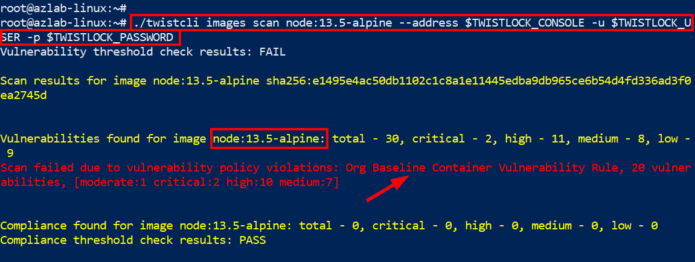

# Module 7 - Introduction and Exercises - Protect Linux Hosts and Containers in Azure

In the previous lessons, you implemented some of the Cloud Security Posture Management capabilities of Prisma Cloud. From this lesson, we will begin to implement workload protection capabilities particularly in relation to containerized workloads in Azure. Here are the tasks that we will be completing in this module:

> * Download and install twistCLI
> * Scan the vulnerability and compliance of container images using twistCLI
> * Implement custom compliance scan for container images 
> * Install the Prisma Cloud Defender on a Linux host
> * Implement container runtime defense 
> * Implement host runtime defense 

## Exercise 1 - Obtain the twistCLI Download URL

1. Log into the Prisma Cloud Console and obtain the twistCLI download URL from the following location: **`Manage`** → **`System`** → **`Downloads`** → Copy the URL for the twistcli tool (Linux platform)
* Make a note of the copied download command


## Exercise 2 - Scan Linux Container Images Using twistCLI

1. Obtain the **`Linux VM SSH Command`** from the output of the template deployment in **`Module 1`** and use it to SSH into the Linux VM

2. Enter **`yes`** and press **`Enter`** when prompted with a certificate warning. When prompted to enter a password, enter the password that you used for the template deployment and press **`Enter`**. 


3. Switch to the root user using the command below:
```
sudo su -
```

4. In the SSH session to the Linux VM, download sample container images using the commands below:
```
docker pull node:13.5-alpine
docker pull node:current-alpine
docker image ls
```

5. Download the twistCLI tool using the command that you made a note of in Exercise 1. The command will be in the following format:
```
curl --progress-bar -L -k --header "authorization: Bearer <PRISMA_CONSOLE_TOKEN>" <PRISMA_CONSOLE_URL> > twistcli; chmod a+x twistcli;
```
## Exercise 3 - Configure Prisma Cloud Host and Container Vulnerability Scanning Rules
1. Configure a container image vulnerability assessment rule by going to the following location: 
* **`Defend`** → **`Vulnerabilities`** → **`Images`** → **`CI`** → **`Add Rule`**
	* **Rule Name**: Org Baseline Container Vulnerability Rule
	* **Alert Threshold**: Low
	* **Failure Threshold**: Medium
	* **Expand Advanced Settings**
		* **Apply rule only when vendor fixes are available**: On
	* Leave other settings at default value
	* Click on **`Save`**

2. Configure a host vulnerability assessment rule by going to the following location: 
* **`Defend`** → **`Vulnerabilities`** → **`Hosts`** → **`Running Hosts`** → **`Add Rule`**
	* **Rule Name**: Org Baseline Host Vulnerability Rule
	* **Alert Threshold**: Low
	* **Expand Advanced Settings**
		* **Apply rule only when vendor fixes are available**: On
	* Leave other settings at default value
	* Click on **`Save`**

## Exercise 4 - Configure Prisma Cloud Host and Container Compliance Rules
1. Configure a container image compliance assessment rule by going to the following location: 
* **`Defend`** → **`Compliance`** → **`Containers and Images`** → **`CI`** → **`Add Rule`**
	* **Rule Name**: Org Baseline Container Compliance Rule
	* **Compliance Template**: NIST SP 800-190
	* **Set the following policies to fail**
		* Sensitive information provided in environment variables
		* Private keys stored in image
		* Image contains malware
	* Leave other settings at default value
	* Click on **`Save`**

2. Configure a host compliance assessment rule by going to the following location: 
* **`Defend`** → **`Compliance`** → **`Hosts`** → **`Running Hosts`** → **`Add Rule`**
	* **Rule Name**: Org Baseline Host Compliance Rule
	* **Compliance Template**: GDPR
	* Leave other settings at default value
	* Click on **`Save`**

## Exercise 5 - Scan Images Using twistCLI
1. Go back to the SSH session of the Linux VM and configure the following environment variables. Replace the placeholder values with the values that you made note of in **`Module 3 - Exercise 3`**.
```
TWISTLOCK_CONSOLE=<PRISMA_CLOUD_CONSOLE_URL>
TWISTLOCK_USER=<PRISMA_CLOUD_USER>
TWISTLOCK_PASSWORD=<PRISMA_CLOUD_USER_PASSWORD>
```

2. Review twistCLI commands using the commands below:
```
./twistcli -h
./twistcli images -h
```

3. Perform both vulnerability and compliance assessments of the two container images using twistCLI
```
./twistcli images scan node:13.5-alpine --address $TWISTLOCK_CONSOLE -u $TWISTLOCK_USER -p $TWISTLOCK_PASSWORD
```



```
./twistcli images scan node:current-alpine --address $TWISTLOCK_CONSOLE -u $TWISTLOCK_USER -p $TWISTLOCK_PASSWORD
```


* From the above result, we can see that using **`node:current-alpine`** as a base image is a better choice than using **`node:13.5-alpine`**

4. Get details of container scans (vulnerability and compliance)
```
./twistcli images scan node:13.5-alpine --address $TWISTLOCK_CONSOLE -u $TWISTLOCK_USER -p $TWISTLOCK_PASSWORD --details 
```

```
./twistcli images scan node:current-alpine --address $TWISTLOCK_CONSOLE -u $TWISTLOCK_USER -p $TWISTLOCK_PASSWORD --details 
```

* The criteria for passing or failing a scan can be refined with any of the following parameters: **`--compliance-threshold`**, **`--vulnerability-threshold`**, and **`--only-fixed`**.

5. View results in the Prisma Cloud console. This is useful to track adoption of shift-left scans by developers.
* **`Monitor`** → **`Vulnerabilities`** → **`Images`** → **`CI`**

6. Specify if twistCLI scans will be saved in the console.
* **`System`** → **`Scan`** → **`CI scan results`**

7. Define collections and tags that can be used for filtering and policy assignment.
* **`Manage`** → **`Collections and Tags`**

8. Customize threat feeds and information
* **`Manage`** → **`System`** → **`Custom feeds`** → **`Custom vulnerabilities`**
* **`Manage`** → **`System`** → **`Custom feeds`** → **`Malware signatures`**

## Exercise 6 - Implement custom compliance scan 
1. In the Prisma Cloud console, go to **`Defend`** → **`Compliance`** → **`Custom`** → **`Add check`**
* **`Name`**: Sensitive File Check
* **`Description`**: Checks for sensitive file on container image
* **`Severity`**: high
* Check
```
if [ -f /tmp/sensitive.txt ]; then
    echo "File not found!"
    exit 1
```
* Click on **`Save`**

2. In the Prisma Cloud console, go to **`Defend`** → **`Compliance`** → **`Containers and images`** → **`CI`** → Click the **`Org Baseline Container Compliance Rule`**
* Set the new custom compliance to fail if violated
* Click on **`Save`**


3. Build a non-compliant image
```
mkdir nodeapp
echo "super sensitive" > nodeapp/sensitive.txt

wget -P nodeapp/ https://raw.githubusercontent.com/davidokeyode/prismacloud-workshops-labs/main/workshops/azure-cloud-protection/template/nodeapp/Dockerfile

docker build -t nodeapp:v1 nodeapp/.
```

4. Scan a non-compliant image with Prisma Cloud
```
./twistcli images scan nodeapp:v1 --address $TWISTLOCK_CONSOLE -u $TWISTLOCK_USER -p $TWISTLOCK_PASSWORD

./twistcli images scan nodeapp:v1 --address $TWISTLOCK_CONSOLE -u $TWISTLOCK_USER -p $TWISTLOCK_PASSWORD --details
```

* The scan should identify two compliance issues for the image.


5. Fix the compliance issues and scan again
* Edit the dockerfile using the command below:

```
vim nodeapp/Dockerfile
```

* Remove the following lines and save:

```
COPY    sensitive.txt /tmp/sensitive.txt
ENV     CLIENT_ID="9aadafc1-bd59-4575-847a-21f0f0a517ea"
ENV     SECRET_KEY="~DUUvI~gbnZ_~~zrj3J4i83q69vuJGczn0"
```

* Build a new version of the image using the following command:

```
docker build -t nodeapp:v2 nodeapp/.
```

* Scan the new version of the image:

```
./twistcli images scan nodeapp:v2 --address $TWISTLOCK_CONSOLE -u $TWISTLOCK_USER -p $TWISTLOCK_PASSWORD

./twistcli images scan nodeapp:v2 --address $TWISTLOCK_CONSOLE -u $TWISTLOCK_USER -p $TWISTLOCK_PASSWORD --details
```

## Exercise 7 - Install Prisma Cloud Defender 
1. In the Prisma Cloud console, go to **`Manage`** → **`Defenders`** → **`Deploy`** → **`Defenders`** 
* **`Deployment method`**: Single Defender
* **`Choose the Defender type`**: Container Defender - Linux
* Leave other settings at default values
* Copy the install command in **`Step 7`**


2. Go to the SSH session of the Linux VM, paste the command that you copied in the previous step to install the Prisma Cloud defender. The command will have the following format.

```
curl -sSL -k --header "authorization: Bearer <TOKEN>" -X POST https://<CONSOLE_URL>/api/v1/scripts/defender.sh  | sudo bash -s -- -c "<CONSOLE_ADDRESS>" -d "none"   
```

3. Verify the installation
* On the Linux VM:

```
docker container ls
```

* In Prisma Cloud:
	* **`Manage`** → **`Defenders`** → **`Manage`** → **`Defenders`** 


4. Review Container vulnerability and compliance information
* **`Monitor`** → **`Vulnerabilities`** → **`Images`** → **`Deployed`** → **`Select image`** 
	* Review the different tabs
	* The **`Layers`** tab will show which layer of the image introduced the vulnerability
	* We can exclude base image vulnerabilities by first adding our base images in **`Defend`** → **`Vulnerabilities`** → **`Images`** → **`Base images`**

5. Review Host vulnerability and compliance information
* **`Monitor`** → **`Vulnerabilities`** → **`Hosts`** → **`Running Hosts`** → **`Select host`** 
	* Review the different tabs
	* The **`Package Info`** tab will show the installed packages on the host

## Exercise 8 - Implement Container Runtime Defense 
1. In the Prisma Cloud console, go to **`Monitor`** → **`Runtime`** → **`Container models`**
* Click on three dots in the Actions column of the **`sspreitzer/shellinabox:latest`** image and choose **`Manual Relearning`**. Click on the three dots in the Actions column again, and choose **`Manual Relearning`** to stop the learning. The state should now be shown as **`Active`**.


2. In the SSH session of the Linux VM, run the following commands:

```
docker container ls | grep shellinabox
```
* Make a note of the container ID


* Connect to the container using the following command:

```
docker exec -it <container_id> bash
```

* Enter the following command while monitoring **`Monitor`** → **`Events`** → **`Container audits`**

```
top
```
* Use **`q`** to exit from **`top`**
* Review runtime events
	* **`Monitor`** → **`Events`** → **`Container audits`**
	* **`Monitor`** → **`Runtime`** → **`Container models`** → **`Select image`** → **`History`**

3. Configure a runtime rule
* **`Monitor`** → **`Runtime`** → **`Container models`** → Click the three dots in front of the **`shellinabox`** image, then click on **`Copy into rule`** 
	* **Rule name**: Container runtime rule
	* In the **`General`** tab, enable **`Kubernetes attacks`** and **`Suspicious queries to cloud provider APIs`**
	* Review the **`Processes`** tab. 
		* Add  **`/bin/ping`** to the list of allowed processes. 
		* In the **`Denied & Fallback`** section, select **`Prevent`**. 
	* Review the **`Networking`** tab. 
		* In the **`Denied & Fallback`** section, enter **`1.1.1.1`** to the **`Outbound IPs`** section.
		* Scroll down. In the DNS Section, click to enable the DNS monitoring. Add **`*.google.com`** to the list of allowed domains, and change the **`Denied & Fallback`** effect to **`Prevent`**.
	* Review the **`File system`** tab. Configure File System Monitoring by changing the effect to **`Prevent`**
	* Click **`Save`**. Click **`Don't relearn`** when prompted.

4. Verify container runtime rule
* Go back to the **`shellinabox`** container shell prompt and run the **`top`** command again. 
* Observe the results with the rule applied.
* Observe results in **`Monitor`** → **`Events`** → **`Container Audits`**

5. Verify process block rule
* Go to the **`Defend`** → **`Runtime`** → **`Container runtime rule`** to change the existing Runtime Rule
* Change the **`Processes`** effect to **`Block`** and **`Save`**. Click **`Don't relearn`** when prompted. 
* Go back to the shellinabox container. Run the **`top`** command again and observe. Note the result on the shell prompt. The container was stopped completely because of the Block effect. Hence you are being kicked out of the shellinabox container and back to the system prompt.
* Observe results in **`Monitor`** → **`Events`** → **`Container Audits`**
* Start a new instance of the container with the following command:
```
docker run -d -p 4200:4200 -e SIAB_PASSWORD=password123 -e SIAB_SUDO=true sspreitzer/shellinabox:latest
```
* Change the container runtime rule process effect to **`Alert`** and **`Save`**. Click **`Don't relearn`** when prompted. 

6. Verify network monitoring
* Go back to the **`shellinabox`** container shell prompt
```
docker container ls | grep shellinabox
* Make a note of the container ID
docker exec -it <container_id> bash
```
* Run **`curl www.google.com`** - Successfully resolves the domain

* Run **`curl www.yahoo.com`** - Unable to resolve the domain

* Run **`curl 1.1.1.1`** -  Command runs successfully but will be alerted in the events. **`Monitor`** → **`Events`** → **`Container Audits`**

7. Verify file system monitoring
* Go back to the **`shellinabox`** container shell prompt and run the following commands:

```
cd /
curl www.google.com -o webfile
exit
```

* Observe the alerts in **`Monitor`** → **`Events`** → **`Container Audits`**

8. Review incidents in Prisma Cloud
* Go to **`Radars`** > **`Containers`**
	* The shellinabox image is now surrounded by a pink outline, which indicates it has been involved in an incident.
* Go to Monitor → Runtime → Incident Explorer
	* Review forensic data

9. Review forensics information

```
docker run --rm -d servethehome/monero_cpu_minergate
```
* Wait for a few minutes for the incident to show in **`Monitor`** → **`Runtime`** → **`Incident Explorer`**

* Review host forensics in **`Monitor`** → **`Runtime`** → **`Host Observations`** → **`Forensics`**
	* Filter for **`/usr/bin/docker`** to see when the container was started and who started it

## Exercise 9 - Implement Host Runtime Defense 
1. In the Prisma Cloud console, go to **`Defend`** → **`Runtime`** → **`Host policy`** → **`Add rule`**
* **`Rule name`**: Host Runtime Protection Policy
* Review the tabs
* Review the **`Processes`** tab
	* Enable the following suggested processes: **`Exploitation tools`**, **`Maintaining access`**, **`Password attacks`**, **`Sniffing and spoofing`**
	* Set the effect to **`Deny`**
* Review the **`Networking`** tab. 
	* In the **`Denied & Fallback`** section, enter **`2.2.2.2`** to the **`Outbound IPs`** section.
	* In DNS Section, click to enable the DNS monitoring. Add **`*.yahoo.com`** to the list of denied domains, and change the **`Denied & Fallback`** effect to **`Prevent`**.
* Click on **`Save`**

2. Verify the rule
* Go to the SSH session of the Linux VM and test the following on the host (not in the container)
* Run **`curl www.google.com`** - Successfully resolves the domain

* Run **`curl www.yahoo.com`** - Unable to resolve the domain
	* Review events in **`Monitor`** → **`Events`** → **`Host Audits`**

* Run **`curl 2.2.2.2`** -  Command will fail. Use **`CNTRL + C`** to break from the attempt. 
	* Review events in **`Monitor`** → **`Events`** → **`Host Audits`**

* Run **`apt install nmap -y`** to install **nmap**
	* Run **`nmap -h`**
	* The operation will not be permitted
	* Review events in **`Monitor`** → **`Events`** → **`Host Audits`**


## Learn more
* [Prisma Cloud Runtime Defense Overview](https://docs.paloaltonetworks.com/prisma/prisma-cloud/prisma-cloud-admin-compute/runtime_defense/runtime_defense_overview.html)
* [Prisma Cloud Runtime Defense For Processes](https://docs.paloaltonetworks.com/prisma/prisma-cloud/prisma-cloud-admin-compute/runtime_defense/runtime_defense_processes.html)
* [Prisma Cloud Runtime Defense For Networking](https://docs.paloaltonetworks.com/prisma/prisma-cloud/prisma-cloud-admin-compute/runtime_defense/runtime_defense_networking.html)
* [Prisma Cloud Runtime Defense For File Systems](https://docs.paloaltonetworks.com/prisma/prisma-cloud/prisma-cloud-admin-compute/runtime_defense/runtime_defense_fs.html)
* [Prisma Cloud Block Container Effect](https://docs.paloaltonetworks.com/prisma/prisma-cloud/prisma-cloud-admin-compute/runtime_defense/blocked_containers.html)
* [Prisma Cloud Runtime Defense Custom Rules](https://docs.paloaltonetworks.com/prisma/prisma-cloud/prisma-cloud-admin-compute/runtime_defense/custom_runtime_rules.html)
* [Prisma Cloud Advanced Threat Protection](https://docs.paloaltonetworks.com/prisma/prisma-cloud/20-04/prisma-cloud-compute-edition-admin/technology_overviews/twistlock_advanced_threat_protection.html)
* [Prisma Cloud Host Protection Overview](https://blog.paloaltonetworks.com/prisma-cloud/runtime-protection-prisma-cloud/)

## Next steps

In this lesson, you completed the following:
* Downloaded and installed twistCLI
* Scanned the vulnerability and compliance of Linux container images using twistCLI
* Implemented custom compliance scan for container images 
* Installed the Prisma Cloud Defender on a Linux host
* Implemented container runtime defense 
* Implemented host runtime defense 

In the next lesson, you will configure security Windows hosts and containers. Click here to proceed to the next lesson:
> [Protect Windows Hosts and Containers in Azure](8-protect-windows-hosts-and-containers.md)
