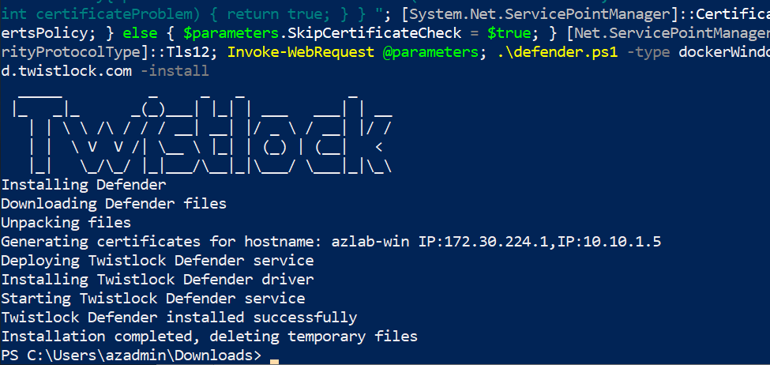
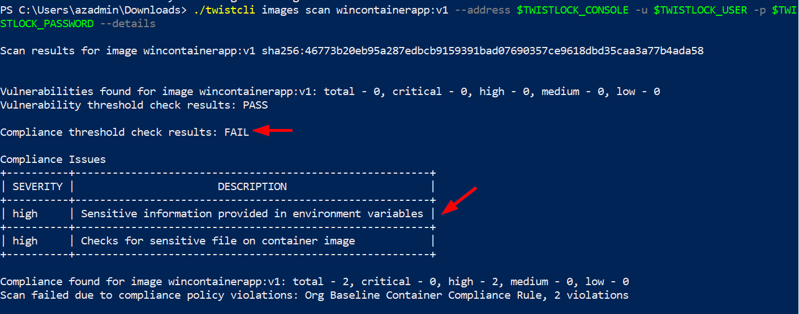
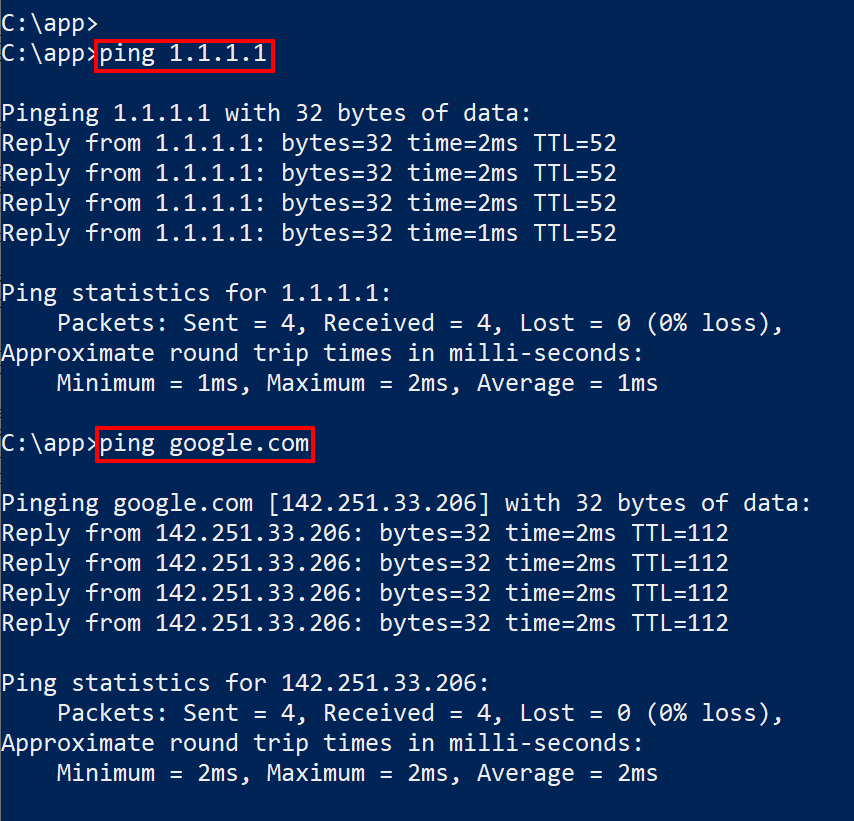
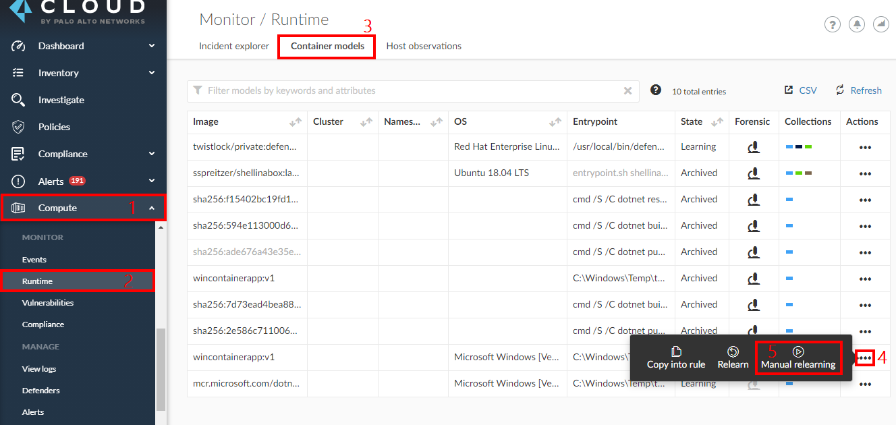
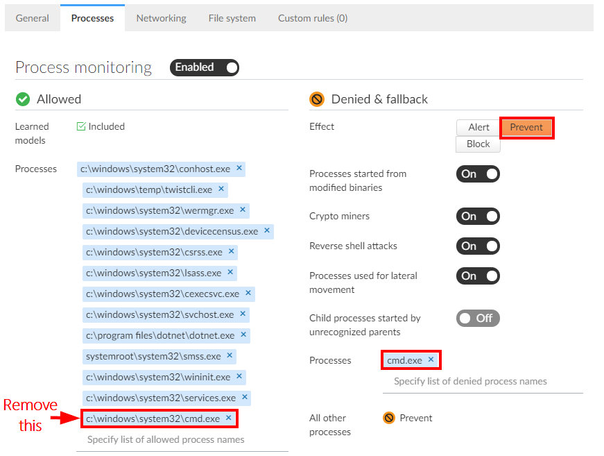
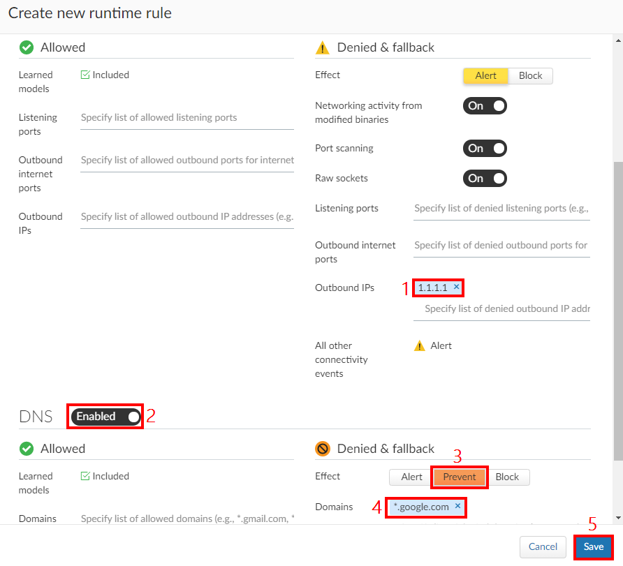

## Module 8 -  Introduction - Protect Windows Hosts and Containers in Azure
Prisma Cloud can secure Windows containers running on Windows Server 2016 and Windows Server 2019 hosts anywhere including in Azure. Prisma Cloud’s Intelligence Stream includes vulnerability data from Microsoft, so as new CVEs are reported, Prisma Cloud can detect them in your Windows images, containers and hosts. Here are the security capabilities that Prisma cloud offers for Windows images, containers and hosts.

* Windows container vulnerability scan (Built-in and customer added intelligence feeds)
* Windows container compliance scan (Built-in and custom compliance checks)
* Windows host vulnerability scan (Built-in and customer added intelligence feeds)
* Windows host compliance scan (Built-in and custom compliance checks)
* Runtime defense for Windows containers (Process and network protection) 
* [Prisma Cloud Windows Containers features](https://docs.paloaltonetworks.com/prisma/prisma-cloud/prisma-cloud-admin-compute/install/install_windows.html)

## Module 8 - Exercises
In this module, we will begin to walk through some of these protection capabilities using a Windows container host in Azure. Here are the exercises that we will complete:

> * Switch Docker to use Windows containers and configure environment variables
> * Download and install twistCLI
> * Deploy Prisma Cloud Defender on a Windows VM
> * Build a non-compliant Windows image and assess its vulnerability and compliance
> * Implement and Test Windows Container Runtime Defense

## Exercise 1 - Switch Docker to use Windows containers and configure environment variables

1. Obtain the **`windows VM Hostname`** from the output of the template deployment in **`Module 1`** and connect to it using RDP

2. When prompted, authenticate with the username value obtained from the output of the template - **`windows VM Username`**. Enter the password that you used for the template deployment and press **`Enter`**.

3. When prompted with a certificate warning, select the option **`Don't ask me again for connections to this computer`** and click **`Yes`**. 

4. In the task bar, right click the docker icon and switch to Windows containers as shown below:


5. Set environment variables for scanning. Replace the placeholder values with the values that you made note of **`Module 3 - Exercise 3`**. Ensure that the values are placed in quotes.
```
$TWISTLOCK_CONSOLE="<PRISMA_CLOUD_CONSOLE_URL>"
$TWISTLOCK_USER="<PRISMA_CLOUD_ACCESS_KEY_ID>"
$TWISTLOCK_PASSWORD="<PRISMA_CLOUD_SECRET_KEY>"
```

## Exercise 2 - Download and install twistCLI

1. Log into the Prisma Cloud Console and obtain the twistCLI download URL from the following location: **`Manage`** → **`System`** → **`Downloads`** → Click to download the twistcli tool (Windows platform). 


2. Copy the downloaded tool into the Windows VM.

## Exercise 3 - Deploy Prisma Cloud Defender on a Windows VM

1. In the Prisma Cloud console, go to **`Manage`** → **`Defenders`** → **`Deploy`** → **`Defenders`** 
* **`Deployment method`**: Single Defender
* **`Choose the Defender type`**: Container Defender - Windows
* Leave other settings at default values
* Copy the install command in **`Step 7`**

```
NOTE: The Defender type "Container Defender - Windows" means that Defender is capable of securing your containers, not that it’s deployed as a container.
```


2. Go to the PowerShell session in the Windows VM, paste the command that you copied in the previous step and press enter to install the Prisma Cloud defender. The output will be similar to the screenshot below.



3. Verify the installation
* On the Windows VM:

```
Get-Service -Name twistlockDefender
```

* In Prisma Cloud:
	* **`Manage`** → **`Defenders`** → **`Manage`** → **`Defenders`** 


## Exercise 4 - Build a non-compliant Windows image and assess its vulnerability and compliance

1. Use the commands below to build a non-compliant windows image

```
dotnet new mvc -o wincontainerapp

Invoke-WebRequest -Uri "https://raw.githubusercontent.com/davidokeyode/prismacloud-workshops-labs/main/workshops/azure-cloud-protection-pcce/template/windowscontainerapp/Dockerfile" -OutFile "./wincontainerapp/Dockerfile"

Invoke-WebRequest -Uri "https://github.com/InQuest/malware-samples/raw/powershell-japan/2019-03-PowerShell-Obfuscation-Encryption-Steganography/15.b.%20pe.bin" -OutFile "./wincontainerapp/15.b.%20pe.bin"

docker build -t wincontainerapp:v1 wincontainerapp/.
```

2. Assess the security and compliance of the image using twistCLI

```
./twistcli images scan wincontainerapp:v1 --address $TWISTLOCK_CONSOLE -u $TWISTLOCK_USER -p $TWISTLOCK_PASSWORD --details
```

3. Review scan results. Notice that the scan failed due to compliance violations but no vulnerability was detected
* On the Windows VM



* In the Prisma Cloud console
	* **`Monitor`** → **`Compliance`** → **`Images`** → **`CI`** → **`Select image`** 
	* Review the different tabs

## Exercise 5 - Implement and Test Windows Container Runtime Defense 
1. Run the image that you built in the previous exercise and verify that it is running using the commands below:

```
docker run -d -p 80:80 wincontainerapp:v1

docker container ls
```

2. In the PowerShell session of the Windows VM, run the following commands:

```
docker container ls
```

* Make a note of the windowscontainerapp container ID


3. Open an interactive session to the container using the following command:

```
docker exec -it <container_id> cmd.exe
```


4. Verify that you can run commands successfully in the image:

```
ping 1.1.1.1

ping google.com
```



5. In the Prisma Cloud console, go to **`Monitor`** → **`Runtime`** → **`Container models`**
* Click on three dots in the Actions column of the **`windowscontainerapp:v1`** image and choose **`Manual Relearning`**. Click on the three dots in the Actions column again, and choose **`Manual Relearning`** to stop the learning. The state should now be shown as **`Active`**.



6. Click the three dots in front of the **`windowscontainerapp:v1`** image, then click on **`Copy into rule`**. Configure the following for the rule:
	* **Rule name**: Windows container runtime rule
	* In the **`General`** tab, leave the default settings
	* Review the **`Processes`** tab. 
		* Remove  **`c:\windows\system32\cmd.exe`** from the list of allowed processes. 
		* In the **`Denied & Fallback`** section, select **`Prevent`**. Add **`cmd.exe`** to the list of denied processes.

		

	* Review the **`Networking`** tab. 
		* In the **`Denied & Fallback`** section, enter **`1.1.1.1`** to the **`Outbound IPs`** section.
		* In DNS Section, click to enable the DNS monitoring. Add **`*.google.com`** to the list of allowed domains, and change the **`Denied & Fallback`** effect to **`Prevent`**.
	* Click **`Save`**. Click **`Don't relearn`** when prompted.
	
	

7. Back in the container shell session, type the following commands and verify the results:

```
ping 1.1.1.1

ping google.com

```

* Notice that access is now denied


8. Verify the events in the Prisma Cloud consoole. **`Monitor`** → **`Events`** → **`Container audits`**

9. In the container image interactive shell, use the following commands to exit and then attempt to open the shell session again.

```
exit

docker exec -it <CONTAINER_ID> cmd.exe

```
* Notice that it failed this time


10. Verify the events in the Prisma Cloud consoole. **`Monitor`** → **`Events`** → **`Container audits`**

## Next steps

In this lesson, you completed the following:
> * Downloaded and installed twistCLI
> * Deployed Prisma Cloud Defender on a Windows VM
> * Built a non-compliant Windows image and assessed its vulnerability and compliance
> * Implemented and Tested Windows Container Runtime Defense

In the next lesson, you will configure security for Azure Container Registry (ACR). Click here to proceed to the next lesson:
> [Protect ACR Images](9-protect-acr-images.md)
