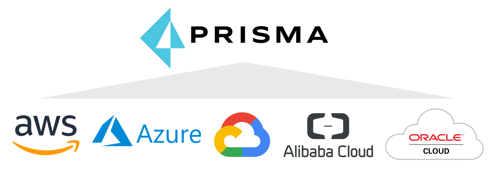

## Welcome

Welcome to the Prisma Cloud Azure workshop! Prisma™ Cloud is the most comprehensive cloud security solution availableon the market today with capabilities ranging from Cloud Security Posture Management (CSPM); Cloud Workload Protection (CWP);  Cloud Infrastructure Entitlement Management (CIEM) and Cloud Network Security (CNS). It provides comprehensive visibility and threat detection across your organization’s hybrid, multi-cloud environment (Azure, AWS, GCP, Alibaba, Oracle Cloud, Kubernetes). 

This workshop was created as a walkthrough for an in person or virtual workshop, however you may feel free to run through at your own pace.

### Pre-requisites

* An Azure Subscription
  * This can be any Azure subscription where you have the owner role assignment. We will also be performing some actions in Azure AD and other services that may require the Application Administrator or Global Administrator level of access on the tenant level.

* A Prisma Cloud Enterprise Account
  * Prisma Cloud will be used to protect your Azure environment and services
* An Azure DevOps Organization
* A JIRA Account
* A GitHub Account

>* The [first module](modules/0-prerequisites.md) contains instructions on setting up the required accounts but you can also use existing accounts that you may have.
### Agenda

The workshop is designed to take approximately 5-6 hours to complete. It can be spread out over a 1 day or 2 days workshop.

|    | Module                   | Format       |
|----|--------------------------|--------------|
| 00 | [Setup Pre-Requisites](modules/0-prerequisites.md)                         | Hands on Lab |
| 01 | [Prepare Your Azure Environment](modules/1-prepare-the-environment.md) | Hands on Lab |
| 02 | [Onboard Azure Subscription to Prisma Cloud](modules/2-onboard-azure-sub.md) | Hands on Lab |
| 03 | [Onboard Azure Active Directory (AAD) Tenant to Prisma Cloud](modules/3-onboard-azure-ad.md)                | Hands on Lab |
| 04 | [Configure JIRA integration in Prisma Cloud (CSPM)](modules/4-jira-integration-cspm.md) | Hands on Lab |
| 05 | [Remediate Security Risks and Compliance Violations with Prisma Cloud](modules/5-respond-and-remediate.md)  | Hands on Lab |
| 06 | [Implement Cloud Discovery in Prisma Cloud Compute](modules/6-implement-cloud-discovery.md) | Hands on Lab |
| 07 | [Protect Linux Hosts and Containers in Azure](modules/7-protect-linux-hosts-and-containers.md) | Hands on Lab |
| 08 | [Protect Windows Hosts and Containers in Azure](modules/8-protect-windows-hosts-and-containers.md) | Hands on Lab |
| 09 | [Protect Azure Container Registry (ACR) Images](modules/9-protect-acr-images.md)    | Hands on Lab |
| 10 | [Protect Azure Kubernetes Service (AKS) Workloads](modules/10-protect-aks-workloads.md) | Hands on Lab |
| 11 | [Protect Serverless Container Workloads](modules/11-protect-serverless-workloads.md)    | Hands on Lab |
| 12 | [Implement Shift-Left Security in Azure DevOps](modules/12-implement-shift-left-security.md)    | Hands on Lab |
| 13 | Wrap / Clean Up     | Hands on Lab |
----

[Next](modules/0-prerequisites.md)