# Module 5: Remediate Security Risks and Compliance Violations with Prisma Cloud

## Exercise 1 - Review the Prisma Cloud Console
>* In order to simulate security and compliance violation detections by Prisma Cloud, we will deploy some sample templates that implements services that are badly configured into our Azure subscription. DO NOT deploy these templates into a production environment!

1. Open a web browser and go to your Prisma Cloud console 
2. In the left hand menu, click on **`Dashboard`** → **`SecOps`**. Review the following sections: 
   * **Top Instances by Role**:  
   * **Alerts by Severity**: 
   * **Policy Violations by Type over Time**: 
   * **Top Policy Violations**: 
   * **Top Internet Connected Resources**:  
   * **Monitored Accounts**: 
   * **Monitored Resources**: 
   * **Open Alerts**:
   * **Connections from Internet**:
   * **Select Mode**: **`Monitor & Protect`**
>* The SecOps dashboard shows an overview of Internet connected resources, the risk rating for all cloud accounts that Prisma Cloud is monitoring, the policy violations over time and a list of the policies that have generated the maximum number of alerts across your cloud resources. To understand the different sections of this dashboard, please refer to this document: [Prisma Cloud SecOps Dashboard](https://docs.paloaltonetworks.com/prisma/prisma-cloud/prisma-cloud-admin/prisma-cloud-dashboards/secops.html).

3. In the left hand menu, click on **`Inventory`** → **`Assets`**. Review the following sections: 
   * **Unique Assets**:  
   * **Asset Trend**: 
   * **Assets By Classification**: 
>* The Asset inventory dashboard provides a snapshot of the current state of all cloud resources or assets that you are monitoring and securing using Prisma Cloud. To understand the different sections of this dashboard, please refer to this document: [Prisma Cloud Asset Inventory Dashboard](https://docs.paloaltonetworks.com/prisma/prisma-cloud/prisma-cloud-admin/prisma-cloud-dashboards/asset-inventory.html).

4. In the left hand menu, click on **`Policies`**. Click on the **`Add Filter`** button, and select **`Cloud Type`**.

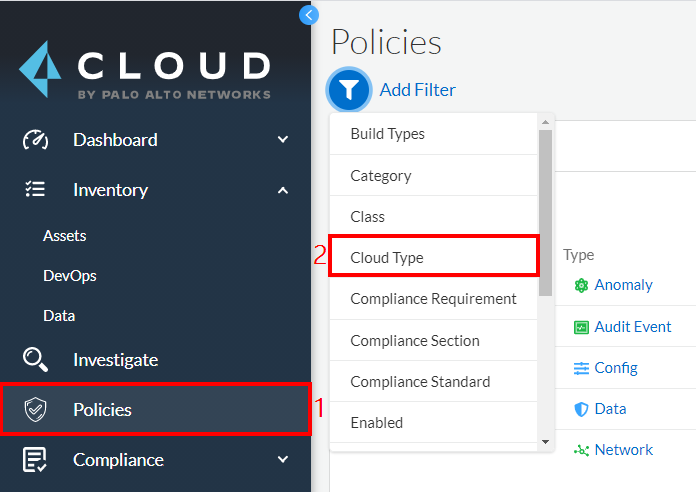

5. In the **`Select Cloud Type`** drop down, select only **`Azure`**. In the Policies Drilldown section, review the **`Top 5 Policies by Alert`**.

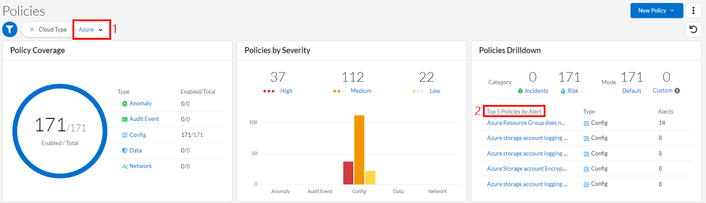

6. At the bottom of the page, review the following columns of the built-in policies. These are the built-in policies that are used to assess your Azure resources. You can filter based on any of these.
   * **Policy Type**:
      * **Config**: Based on cloud resource misconfigurations. They could be aligned with security best practices or compliance frameworks. Examples are misconfigured cloud database or storage services.
      * **Audit event**: Based on suspicious user activities. 
      * **Network**: Based on suspicious network communications. For example, direct traffic from internet IPs or Suspicious IPs to known database server ports OR traffic patterns that matches crypto-mining or Cache DDoS attacks.
      * **Anomaly**: Based on external threat intelligence contextualizations and pre-built anomaly ML detections
   * **Severity**:
      * High
      * Medium
      * Low
   * **Category**:
      * Risk
      * Incident
   * **Class**: Behavioral, Misconfiguration, Privileged Activity Monitoring
   * **Status**: Enabled or Disabled
   * **Remediable**: Auto-remediation is available for alerts based on the policy
>* To understand the the pre-defined Prisma Cloud policies, please refer to this document: [Manage Prisma Cloud Policies](https://docs.paloaltonetworks.com/prisma/prisma-cloud/prisma-cloud-admin/prisma-cloud-policies/manage-prisma-cloud-policies.html).

7. In the left hand menu, click on **`Compliance`** → **`Standards`**. Review the compliance standards that Prisma Cloud supports out of the box. 

8. In the left hand menu, click on **`Compliance`** → **`Overview`**. Review the compliance standards that Prisma Cloud supports out of the box. 
>* The Compliance dashboard provides an overview of your overall compliance posture across various compliance standards. To understand the different sections of this dashboard, please refer to this document: [Prisma Cloud Compliance Dashboard](https://docs.paloaltonetworks.com/prisma/prisma-cloud/prisma-cloud-admin/prisma-cloud-compliance/compliance-dashboard.html).

9. In the left hand menu, click on **`Settings`** → **`Anomaly Settings`**. Review the anomaly settings options. 
>* To understand the different settings, please refer to this document: [Prisma Cloud Anomaly Policy Thresholds](https://docs.paloaltonetworks.com/prisma/prisma-cloud/prisma-cloud-admin/manage-prisma-cloud-administrators/define-prisma-cloud-enterprise-settings.html)

## Exercise 2 - Review and remediate Prisma Cloud Alerts

1. In the left hand menu, click on **`Alerts`** → **`Overview`**. Review the alerts and the filter options.

2. In the search box, type **`Key Vault`** and press **`Enter`**. This shows all alerts related to the Azure Key Vault resource. Click on **`1`** in front of the **`Azure Key Vault audit logging is disabled`**.

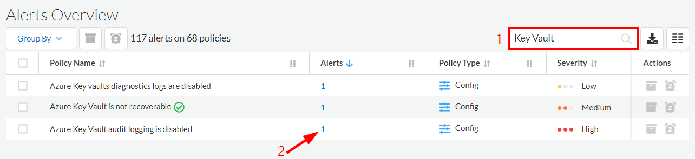

3. Review the violating resources and the remediation steps. In the next step, we will go to the Azure portal to remediate the alert manually.

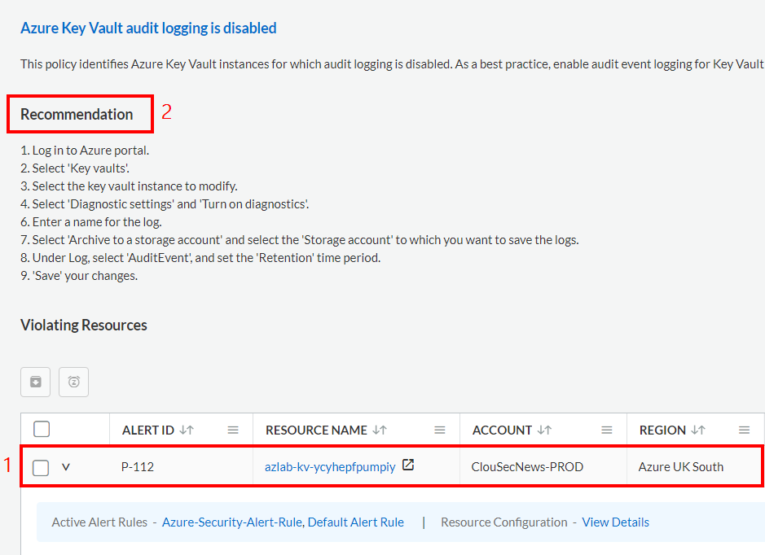

4. Click on the linked asset to go to the resource in the Azure portal. 

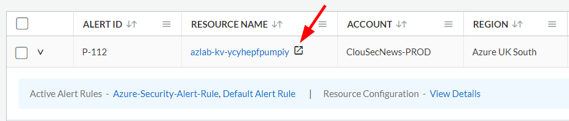

5. In the key vault resource blade in Azure, click on **`Diagnostic settings`** in the **`Monitoring`** section, then click on **`+ Add diagnostic setting`**

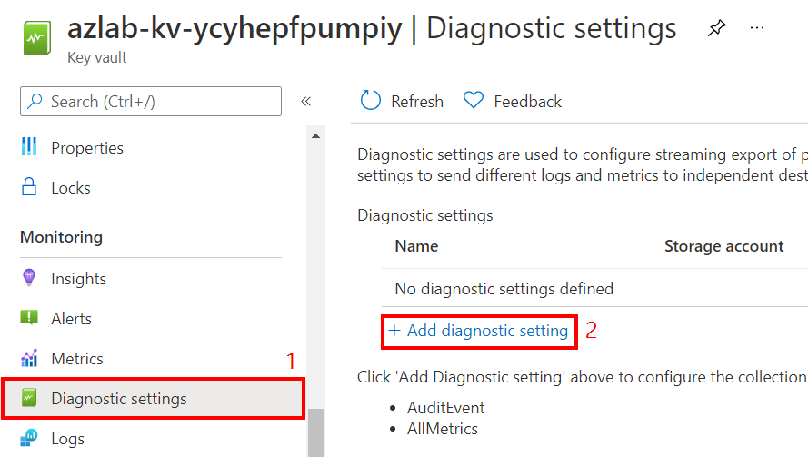

6. In the **Diagnostic setting** blade, configure the following:
* **Diagnostic setting name**: azlab-kv-diag
* **AuditEvent**: Selected 
* **AllMetrics**: Selected
* **Archive to a storage account**: Selected
* **Subscription**: Select your Azure subscription
* **Storage account**: Select the storage account that has a name prefix of **prismaflow** or **azlabs**
* Leave other settings at default values
* Click on **`Save`**

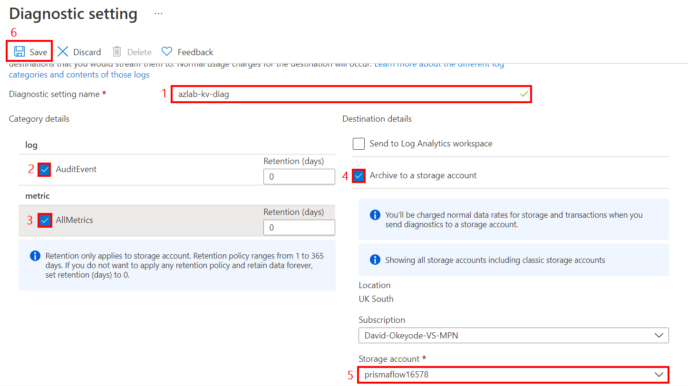

You have now remediated a policy violation manually using the instructions provided by Prisma Cloud. It will take a few minutes for this to be reflected in Prisma Cloud. In the next few steps, we will remediate another violation using a remediation CLI command generated by Prisma Cloud.

7. Back in the Prisma Cloud alerts overview console, in the search box, type **`Key Vault`** and press **`Enter`**. This shows all alerts related to the Azure Key Vault resource. Click on **`1`** in front of the **`Azure Key Vault is not recoverable`**.

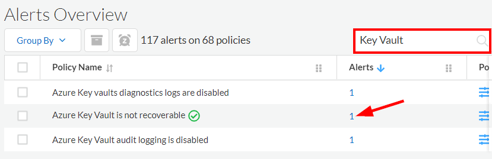

8. Review the violating resources and the remediation steps. Click on the **Remediate** option in front of the resource that had a resource name prefix of  **`azlab-kv`**.

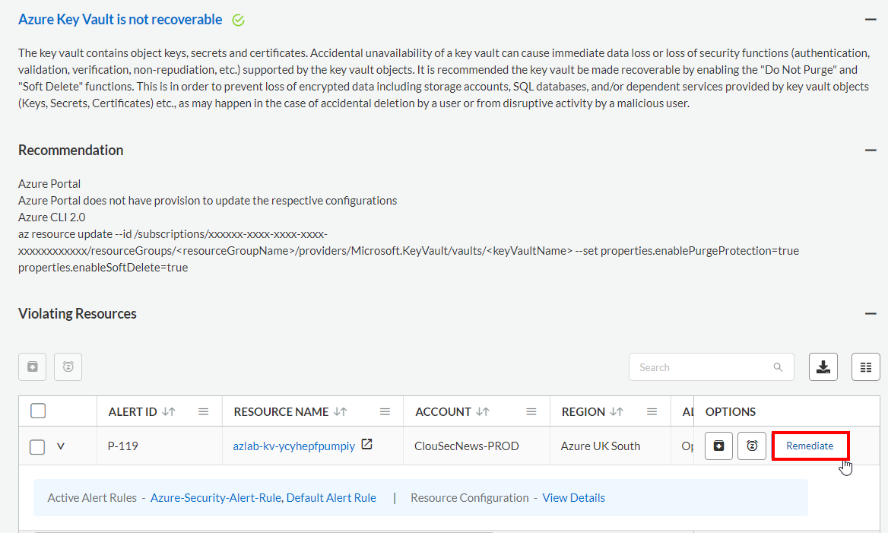

9. Click on **Execute Command**

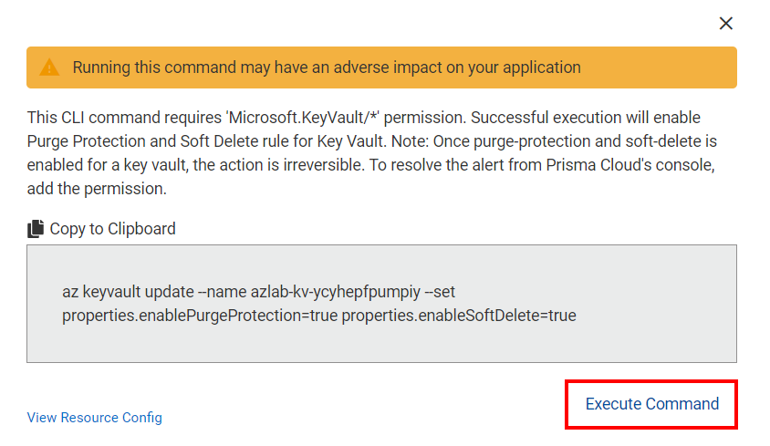

10. Click on **Continue**

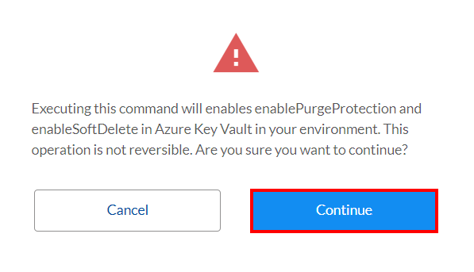

11. You should get a success message in the top right corner

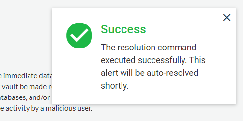

## Exercise 3 - Configure Auto-remediation in Prisma Cloud

1. In the Prisma Cloud console, go to **`Alerts`** → **`Alert Rules`** → **`New Alert Rule`**.

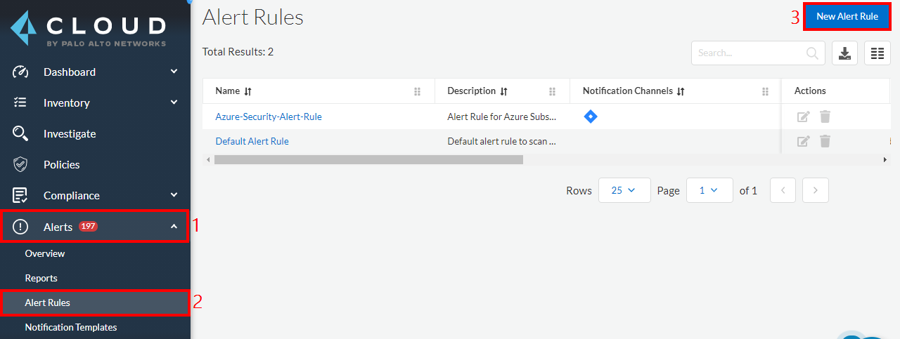

2. In the **Select Alert Rule Type** window, select **`Run`**

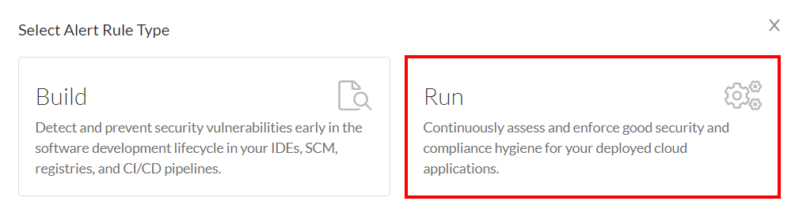

3. In the **Add Alert Rule** window, configure the following:
   * **Alert Rule Name**: Azure-Security-Auto-Remediate-Rule
   * **Description**: Auto-Remediate Rule for Azure Subscriptions
   * Click **`Next`**

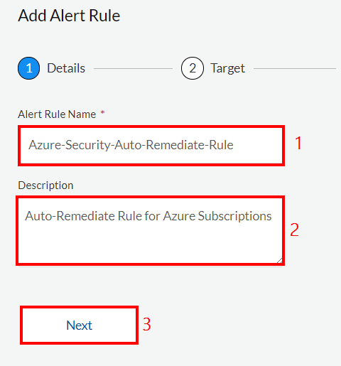

4. In the **Target** section, configure the following:
   * **Account Groups**: Select the **`Default Account Group`** or another account group that includes your Azure subscription
   * Click **`Next`**

5. In the **Select Policies** section, configure the following:
   * **Automated Remediation**: Enabled (Click **Continue** when prompted) 
   * In the search box, type **Storage Accounts without Secure transfer enabled** and select the policy
   * Click **`Next`**

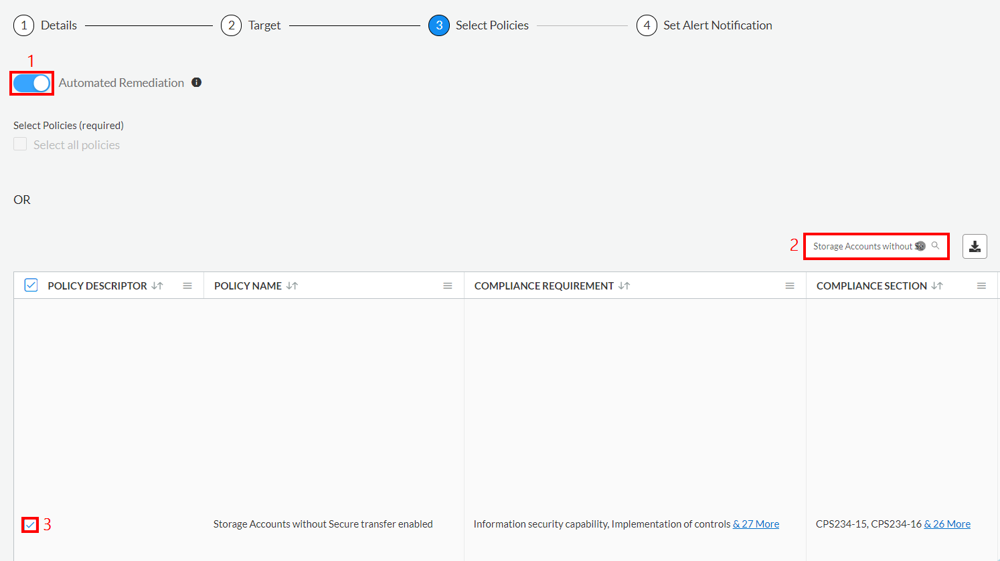

6. In the **Set Alert Notification** section, leave all settings as default and click **`Save`**

## Next steps

In this lesson, you completed the following:
* Reviewed the Prisma Cloud Console
* Reviewed and remediated Prisma Cloud Alerts
* Configured auto-remediation in Prisma Cloud

In the next lesson, you will implement cloud discovery using Prisma Cloud Compute:
> [Implement Cloud Discovery](6-implement-cloud-discovery.md)