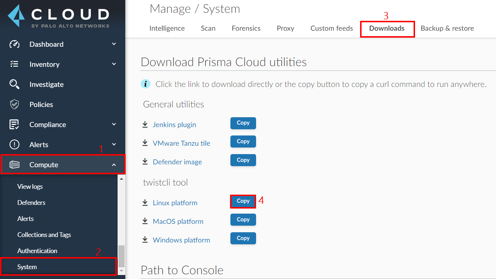
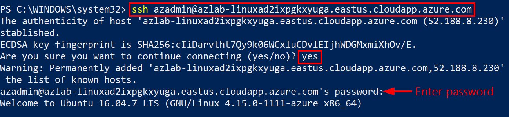
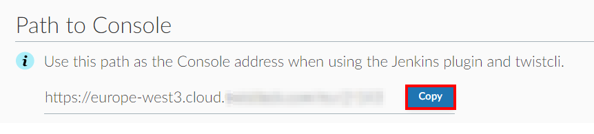
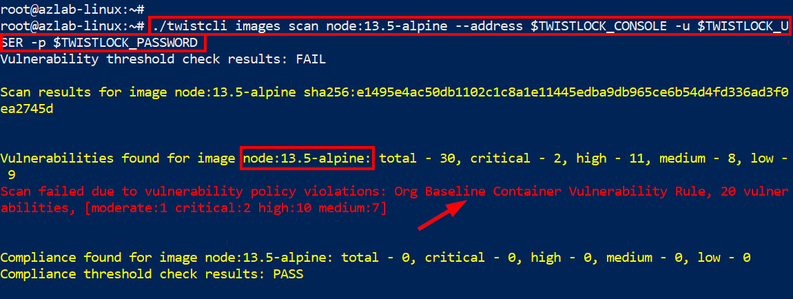
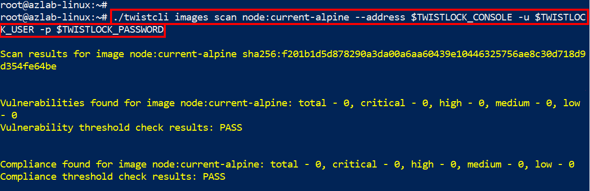

# Module 6: Protect Single Host Linux Containers in Azure

In the previous lesson, an ARO cluster was created. If you have not completed this lesson, you can refer to it [here](1-create-aro-cluster.md).
In this workshop lesson, you will connect to the cluster as the kubeadmin user through the OpenShift web console and the OpenShift CLI. You'll be using this cluster for the rest of the lessons in this workshop. Here's what we'll be completing:

> * Connect to the ARO cluster using the OpenShift web console
> * Connect to the ARO cluster using the OpenShift CLI

## Exercise 1 - Obtain the twistCLI Download URL

1. Log into the Prisma Cloud Console and obtain the twistCLI download URL from the following location: **`Compute`** → **`Manage`** → **`System`** → **`Downloads`** → Copy the URL for the twistcli tool (Linux platform)
* Make a note of the copied download command




## Exercise 2 - Scan Linux Container Images Using twistCLI

1. Obtain the **`Linux VM SSH Command`** from the output of the template deployment in **`Module 1`** and use it to SSH into the Linux VM

2. Enter **`yes`** and press **`Enter`** when prompted with a certificate warning. When prompted to enter a password, enter the password that you used for the template deployment and press **`Enter`**. 



3. Switch to the root user using the command below:
```
sudo su -
```

4. In the SSH session to the Linux VM, download sample container images using the commands below:
```
docker pull node:13.5-alpine
docker pull node:current-alpine
docker image ls
```

5. Download the twistCLI tool using the command that you made a note of in Exercise 1. The command will be in the following format:
```
curl --progress-bar -L -k --header "authorization: Bearer <PRISMA_CONSOLE_TOKEN>" <PRISMA_CONSOLE_URL> > twistcli; chmod a+x twistcli;
```

## Exercise 3 - Create Scanning Credentials
To begin scanning, we need two main pieces of information. First the console address of our Prisma Cloud console and second, API credentials that can be used for authenticating the scan request. We'll obtain both of these information in this exercise.

1. Obtain the Prisma Cloud console address by going to the following location: 
* **`Compute`** → **`Manage`** → **`System`** → **`Downloads`** → Copy the **`Path to console`**



2. (Prisma Cloud SaaS) Generate credentials for scanning by doing the following:
* **`Prisma Cloud`** → **`Settings`** → **`Access Keys`** → **`Add New`** 
	* **`Name`**: DevSecOps-Scan
	* **`Key Expiry`**: Select 30 days from current date
	* Click on **`Create`**
	* Make a note of both the **Access Key ID** and the **Secret Key**


## Exercise 4 - Configure Prisma Cloud Vulnerability Scanning Rule
1. Configure a container image vulnerability assessment rule by going to the following location: 
* **`Compute`** → **`Defend`** → **`Vulnerabilities`** → **`Images`** → **`CI`** → **`Add Rule`**
	* **Rule Name**: Org Baseline Container Vulnerability Rule
	* **Alert Threshold**: Low
	* **Failure Threshold**: Medium
	* **Expand Advanced Settings**
		* **Apply rule only when vendor fixes are available**: On
	* Leave other settings at default value
	* Click on **`Save`**

## Exercise 5 - Configure Prisma Cloud Compliance Scanning Rule
1. Configure a container image compliance assessment rule by going to the following location: 
* **`Compute`** → **`Defend`** → **`Compliance`** → **`Containers and Images`** → **`CI`** → **`Add Rule`**
	* **Rule Name**: Org Baseline Container Compliance Rule
	* **Compliance Template**: NIST SP 800-190
	* **Set the following policies to fail**
		* Sensitive information provided in environment variables
		* Private keys stored in image
	* Leave other settings at default value
	* Click on **`Save`**

## Exercise 6 - Scan Images Using twistCLI
1. Go back to the SSH session of the Linux VM and configure the following environment variables. Replace the placeholder values with the values that you made note of in Exercise 3.
```
TWISTLOCK_CONSOLE=<PRISMA_CLOUD_CONSOLE_URL>
TWISTLOCK_USER=<PRISMA_CLOUD_ACCESS_KEY_ID>
TWISTLOCK_PASSWORD=<PRISMA_CLOUD_SECRET_KEY>
```

2. Review twistCLI commands using the commands below:
```
./twistcli -h
./twistcli images -h
```

3. Perform both vulnerability and compliance assessments of the two container images using twistCLI
```
./twistcli images scan node:13.5-alpine --address $TWISTLOCK_CONSOLE -u $TWISTLOCK_USER -p $TWISTLOCK_PASSWORD
```



```
./twistcli images scan node:current-alpine --address $TWISTLOCK_CONSOLE -u $TWISTLOCK_USER -p $TWISTLOCK_PASSWORD
```



* From the above result, we can see that using **`node:current-alpine`** as a base image is a better choice than using **`node:13.5-alpine`**

4. Get details of container scans (vulnerability and compliance)
```
./twistcli images scan node:13.5-alpine --address $TWISTLOCK_CONSOLE -u $TWISTLOCK_USER -p $TWISTLOCK_PASSWORD --details 
```

```
./twistcli images scan node:current-alpine --address $TWISTLOCK_CONSOLE -u $TWISTLOCK_USER -p $TWISTLOCK_PASSWORD --details 
```

* The criteria for passing or failing a scan can be refined with any of the following parameters: **`--compliance-threshold`**, **`--vulnerability-threshold`**, and **`--only-fixed`**.

5. View results in the Prisma Cloud console. This is useful to track adoption of shift-left scans by developers.
* **`Compute`** → **`Monitor`** → **`Vulnerabilities`** → **`Images`** → **`CI`**

6. Specify if twistCLI scans will be saved in the console.
* **`Compute`** → **`System`** → **`Scan`** → **`CI scan results`**

7. Define collections and tags that can be used for filtering and policy assignment.
* **`Compute`** → **`Manage`** → **`Collections and Tags`**

8. Customize threat feeds and information
* **`Compute`** → **`Manage`** → **`System`** → **`Custom feeds`** → **`Custom vulnerabilities`**
* **`Compute`** → **`Manage`** → **`System`** → **`Custom feeds`** → **`Malware signatures`**

## Exercise 7 - Implement custom compliance scan 
1. In the Prisma Cloud console, go to **`Defend`** → **`Compliance`** → **`Custom`** → **`Add check`**
* **`Name`**: Sensitive File Check
* **`Description`**: Checks for sensitive file on container image
* **`Severity`**: high
* Check
```
if [ ! -f /tmp/sensitive.txt ]; then
    echo "File not found!"
    exit 1
fi
```
* Click on **`Save`**

2. In the Prisma Cloud console, go to **`Defend`** → **`Compliance`** → **`Containers and images`** → **`CI`** → Click the **`Org Baseline Container Compliance Rule`**
* Set the new custom compliance to fail if violated
* Click on **`Save`**


3. Build a non-compliant image
```
mkdir nodeapp
echo "super sensitive" > nodeapp/sensitive.txt

curl https://github.com/davidokeyode/prismacloud-workshops-labs/blob/main/workshops/azure-cloud-protection/template/nodeapp/Dockerfile -O nodeapp/Dockerfile

docker build -t nodeapp:v1 nodeapp/.
```

4. Scan a non-compliant image with Prisma Cloud


* **`Name`**: Sensitive File Check

Manage → Defenders → Advanced Settings

```
TWISTLOCK_CONSOLE=<PRISMA_CLOUD_CONSOLE_URL>
TWISTLOCK_USER=<PRISMA_CLOUD_ACCESS_KEY_ID>
TWISTLOCK_PASSWORD=<PRISMA_CLOUD_SECRET_KEY>
```


## Next steps

In this lesson, you completed the following:
* 

In the next lesson, you will configure Azure AD authentication for your ARO cluster. Click here to proceed to the next lesson:
> [Configure Azure AD authentication for ARO](3-configure-aro-azuread.md)
