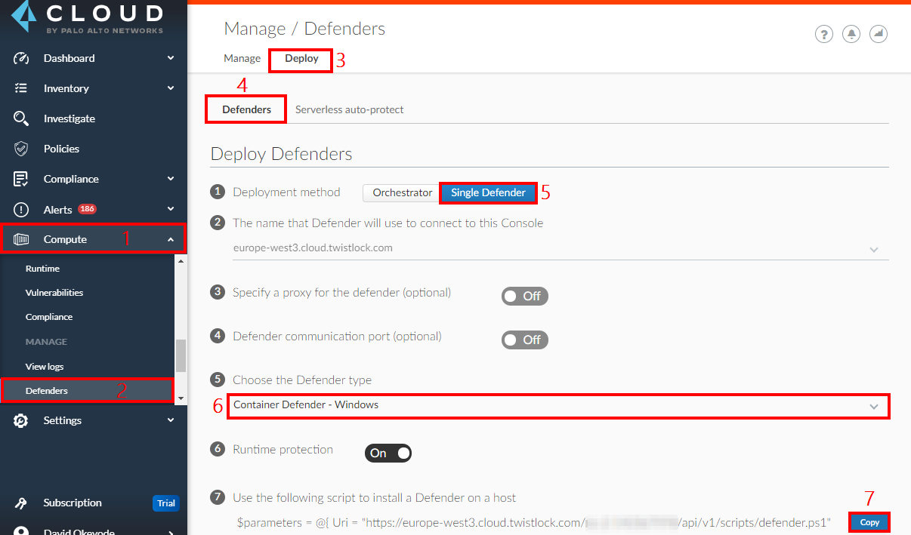
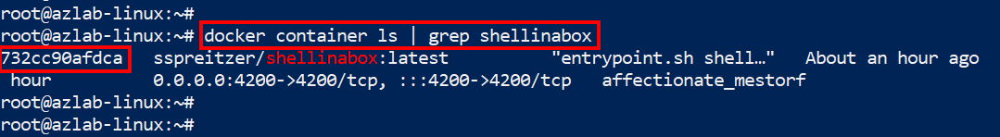

# Module 7: Protect Windows Hosts and Containers in Azure

In the previous lessons, you implemented some of the Cloud Security Posture Management capabilities of Prisma Cloud. From this lesson, we will begin to implement workload protection capabilities particularly in relation to containerized workloads in Azure. Here are the tasks that we will be completing in this module:

> * Switch Docker to Windows Containers
> * Download and install twistCLI
> * Scan the vulnerability and compliance of container images using twistCLI
> * Implement custom compliance scan for container images 
> * Install the Prisma Cloud Defender on a Linux host
> * Implement container runtime defense 
> * Implement host runtime defense 

## Exercise 1 - Switch Docker to Windows Containers
1. Obtain the **`windows VM Hostname`** from the output of the template deployment in **`Module 1`** and connect to it using RDP

2. When prompted, authenticate with the username value obtained from the output of the template - **`windows VM Username`**. Enter the password that you used for the template deployment and press **`Enter`**.

3. When prompted with a certificate warning, select the option **`Don't ask me again for connections to this computer`** and click **`Yes`**. 

4. In the task bar, right click the docker icon and switch to Windows containers as shown below:


5. Set environment variables for scanning. Replace the placeholder values with the values that you made note of Module 6. Place the values in quotes.
```
$TWISTLOCK_CONSOLE="<PRISMA_CLOUD_CONSOLE_URL>"
$TWISTLOCK_USER="<PRISMA_CLOUD_ACCESS_KEY_ID>"
$TWISTLOCK_PASSWORD="<PRISMA_CLOUD_SECRET_KEY>"
```

## Exercise 2 - Download and install twistCLI

1. Log into the Prisma Cloud Console and obtain the twistCLI download URL from the following location: **`Compute`** → **`Manage`** → **`System`** → **`Downloads`** → Click to download the twistcli tool (Windows platform). Copy the downloaded tool into the Windows VM.


2. Open PowerShell as an administrator, download sample container images using the commands below:
```
docker pull mcr.microsoft.com/dotnet/samples:aspnetapp
docker image ls
```

3. Perform both vulnerability and compliance assessments of the container image using twistCLI
```
./twistcli images scan mcr.microsoft.com/dotnet/samples:aspnetapp --address $TWISTLOCK_CONSOLE -u $TWISTLOCK_USER -p $TWISTLOCK_PASSWORD --details
```


4. 

## Exercise 3 - Deploying Prisma Cloud Defender on Windows

1. In the Prisma Cloud console, go to **`Compute`** → **`Manage`** → **`Defenders`** → **`Deploy`** → **`Defenders`** 
* **`Deployment method`**: Single Defender
* **`Choose the Defender type`**: Container Defender - Windows
* Leave other settings at default values
* Copy the install command in **`Step 7`**



2. Go to the PowerShell session in the Windows VM, paste the command that you copied in the previous step and press enter to install the Prisma Cloud defender. The output will be similar to the screenshot below.


3. Verify the installation
* On the Windows VM:

```
Get-Service -Name twistlockDefender
```

* In Prisma Cloud:
	* **`Compute`** → **`Manage`** → **`Defenders`** → **`Manage`** → **`Defenders`** 


4. Build a non-compliant image with the commands below
```
dotnet new mvc -o wincontainerapp

Invoke-WebRequest -Uri "https://raw.githubusercontent.com/davidokeyode/prismacloud-workshops-labs/main/workshops/azure-cloud-protection/template/windowscontainerapp/Dockerfile" -OutFile "./wincontainerapp/Dockerfile"

Invoke-WebRequest -Uri "https://github.com/InQuest/malware-samples/raw/powershell-japan/2019-03-PowerShell-Obfuscation-Encryption-Steganography/15.b.%20pe.bin" -OutFile "./wincontainerapp/15.b.%20pe.bin"

docker build -t wincontainerapp:v1 wincontainerapp/.
```


4. Review Container vulnerability and compliance information
* **`Compute`** → **`Monitor`** → **`Vulnerabilities`** → **`Images`** → **`Deployed`** → **`Select image`** 
	* Review the different tabs
	* The **`Layers`** tab will show which layer of the image introduced the vulnerability
	* We can exclude base image vulnerabilities by first adding our base images in **`Compute`** → **`Defend`** → **`Vulnerabilities`** → **`Images`** → **`Base images`**

5. Review Host vulnerability and compliance information
* **`Compute`** → **`Monitor`** → **`Vulnerabilities`** → **`Hosts`** → **`Running Hosts`** → **`Select host`** 
	* Review the different tabs
	* The **`Package Info`** tab will show the installed packages on the host

## Exercise 9 - Implement Container Runtime Defense 
1. In the Prisma Cloud console, go to **`Compute`** → **`Monitor`** → **`Runtime`** → **`Container models`**
* Click on three dots in the Actions column of the **`sspreitzer/shellinabox:latest`** image and choose **`Manual Relearning`**. Click on the three dots in the Actions column again, and choose **`Manual Relearning`** to stop the learning. The state should now be shown as **`Active`**.


2. In the SSH session of the Linux VM, run the following commands:

```
docker container ls | grep shellinabox
```
* Make a note of the container ID



* Connect to the container using the following command:

```
docker exec -it <container_id> bash
```

* Enter the following command while monitoring **`Monitor`** → **`Events`** → **`Container audits`**

```
top
```
* Use **`q`** to exit from **`top`**
* Review runtime events
	* **`Monitor`** → **`Events`** → **`Container audits`**
	* **`Monitor`** → **`Runtime`** → **`Container models`** → **`Select image`** → **`History`**

3. Configure a runtime rule
* **`Monitor`** → **`Runtime`** → **`Container models`** → Click the three dots in front of the **`shellinabox`** image, then click on **`Copy into rule`** 
	* **Rule name**: Container runtime rule
	* In the **`General`** tab, enable **`Kubernetes attacks`** and **`Suspicious queries to cloud provider APIs`**
	* Review the **`Processes`** tab. 
		* Add  **`/bin/ping`** to the list of allowed processes. 
		* In the **`Denied & Fallback`** section, select **`Prevent`**. 
	* Review the **`Networking`** tab. 
		* In the **`Denied & Fallback`** section, enter **`1.1.1.1`** to the **`Outbound IPs`** section.
	* Review the **`File system`** tab. 
		* In the **`Denied & Fallback`** section, enter **`1.1.1.1`** to the **`Outbound IPs`** section.
		* In DNS Section, click to enable the DNS monitoring. Add **`*.google.com`** to the list of allowed domains, and change the **`Denied & Fallback`** effect to **`Prevent`**.
	* Review the **`File system`** tab. Configure File System Monitoring by changing the effect to **`Prevent`**
	* Click **`Save`**. Click **`Don't relearn`** when prompted.

4. Verify container runtime rule
* Go back to the **`shellinabox`** container shell prompt and run the **`top`** command again. 
* Observe the results with the rule applied.
* Observe results in **`Monitor`** → **`Events`** → **`Container Audits`**

5. Verify process block rule
* Go to the **`Defend`** → **`Runtime`** to change the existing Runtime Rule
* Change the **`Processes`** effect to **`Block`** and **`Save`**
* Go back to the shellinabox container. Run the **`top`** command again and observe. Note the result on the shell prompt. The container was stopped completely because of the Block effect. Hence you are being kicked out of the shellinabox container and back to the system prompt.
* Observe results in **`Monitor`** → **`Events`** → **`Container Audits`**
* Start a new instance of the container with the following command:
```
docker run -d -p 4200:4200 -e SIAB_PASSWORD=password123 -e SIAB_SUDO=true sspreitzer/shellinabox:latest
```
* Change the container runtime rule process effect to **`Alert`**

6. Verify network monitoring
* Run **`curl www.google.com`** - Successfully resolves the domain

* Run **`curl www.yahoo.com`** - Unable to resolve the domain

* Run **`curl 1.1.1.1`** -  Command runs successfully but will be alerted in the events. **`Monitor`** → **`Events`** → **`Container Audits`**

7. Verify file system monitoring
* Go back to the **`shellinabox`** container shell prompt and run the following commands:

```
cd /
curl www.google.com -o webfile
exit
```

* Observe the alerts in **`Monitor`** → **`Events`** → **`Container Audits`**

8. Review incidents in Prisma Cloud
* Go to **`Radars`** > **`Containers`**
	* The shellinabox image is now surrounded by a pink outline, which indicates it has been involved in an incident.
* Go to Monitor → Runtime → Incident Explorer
	* Review forensic data

9. Review forensics information

```
docker run --rm -d servethehome/monero_cpu_minergate
```
* Wait for a few minutes for the incident to show in **`Monitor`** → **`Runtime`** → **`Incident Explorer`**

* Review host forensics in **`Monitor`** → **`Runtime`** → **`Host Observations`** → **`Forensics`**
	* Filter for **`/usr/bin/docker`** to see when the container was started and who started it

## Exercise 10 - Implement Host Runtime Defense 
1. In the Prisma Cloud console, go to **`Compute`** → **`Defend`** → **`Runtime`** → **`Host policy`** → **`Add rule`**
* **`Rule name`**: Host Runtime Protection Policy
* Review the tabs
* Review the **`Processes`** tab
	* Enable the following suggested processes: **`Exploitation tools`**, **`Maintaining access`**, **`Password attacks`**, **`Sniffing and spoofing`**
	* Set the effect to **`Deny`**
* Review the **`Networking`** tab. 
	* In the **`Denied & Fallback`** section, enter **`2.2.2.2`** to the **`Outbound IPs`** section.
	* In DNS Section, click to enable the DNS monitoring. Add **`*.yahoo.com`** to the list of denied domains, and change the **`Denied & Fallback`** effect to **`Prevent`**.
* Click on **`Save`**

2. Verify the rule
* Go to the SSH session of the Linux VM and test the following on the host (not in the container)
* Run **`curl www.google.com`** - Successfully resolves the domain

* Run **`curl www.yahoo.com`** - Unable to resolve the domain
	* Review events in **`Monitor`** → **`Events`** → **`Host Audits`**

* Run **`curl 2.2.2.2`** -  Command will fail. Use **`CNTRL + C`** to break from the attempt. 
	* Review events in **`Monitor`** → **`Events`** → **`Host Audits`**

* Run **`apt install nmap -y`** to install **nmap**
	* Run **`nmap -h`**
	* The operation will not be permitted
	* Review events in **`Monitor`** → **`Events`** → **`Host Audits`**


## Learn more
* [Prisma Cloud Windows Containers](https://docs.paloaltonetworks.com/prisma/prisma-cloud/prisma-cloud-admin-compute/install/install_windows.html)


## Next steps

In this lesson, you completed the following:
* Downloaded and installed twistCLI
* Scanned the vulnerability and compliance of Linux container images using twistCLI
* Implemented custom compliance scan for container images 
* Installed the Prisma Cloud Defender on a Linux host
* Implemented container runtime defense 
* Implemented host runtime defense 

In the next lesson, you will configure security for Azure Container Registry (ACR). Click here to proceed to the next lesson:
> [Protect ACR Images](modules/7-protect-acr-images.md)
