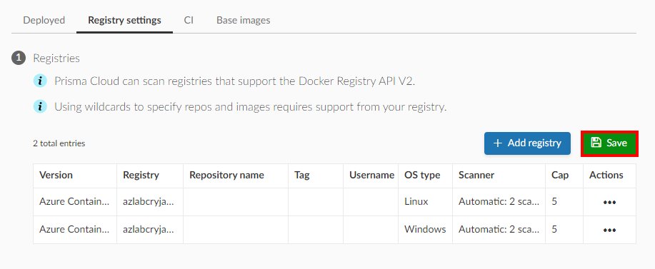
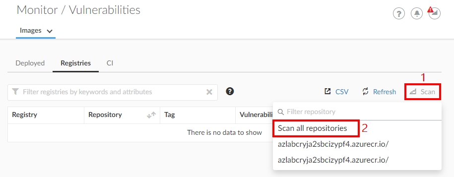
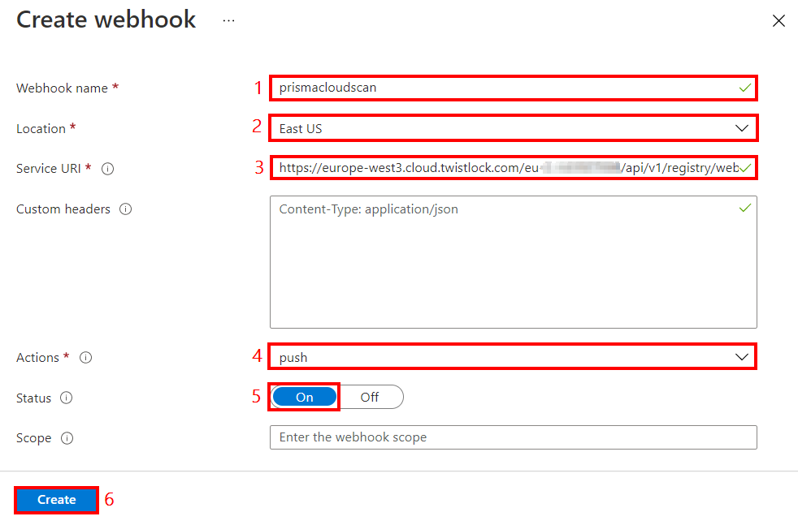
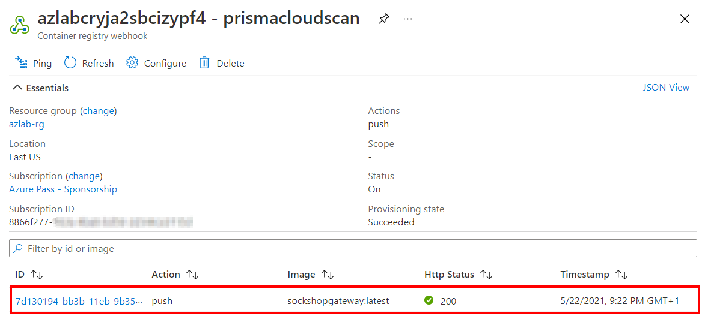
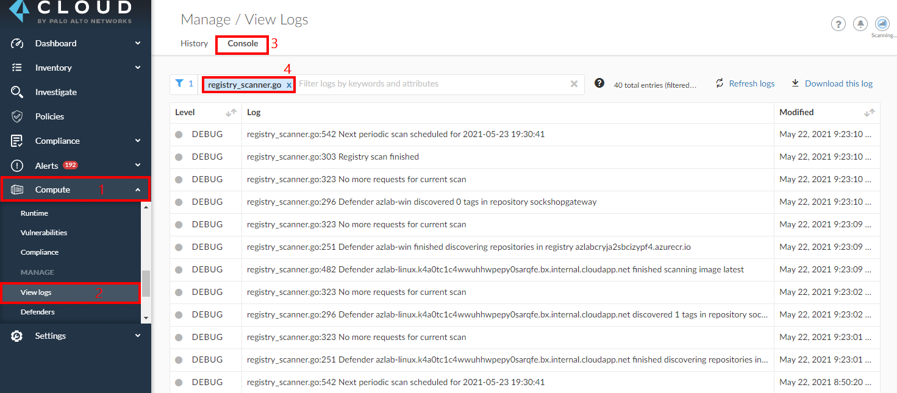

## Module 8 Introduction - Protect ACR Images
Prisma Cloud can scan both Linux and Windows container images in Azure Container Registries (ACR) for vulnerability, malware and compliance. Prisma Cloud can scan images in both private and public ACR instances.

> * Assess Linux and Windows images in the registry for vulnerabilities, malware (static and dymanic) and compliance
> * Assess images in ACR instances with access limited with a firewall, service endpoint, or private endpoints such as Azure Private Link
> * Prevent vulnerable, compromised or non-compliant images from being committed by scanning in your pipelines
> * [Prisma Cloud Windows Containers features](https://docs.paloaltonetworks.com/prisma/prisma-cloud/prisma-cloud-admin-compute/install/install_windows.html)

## Module 8 Exercises
In this module, we will begin to walk through some of the protection capabilities that Prisma Cloud supports for container registries in Azure. We will use the same credential that we configured in module 6 to implement this. Here are the exercises that we will complete:

> * Configure Prisma Cloud ACR integration
> * Test Prisma Cloud ACR images scan
> * Configure and teat ACR webhook integration
> * Troubleshooting ACR Integration

## Pre-Requisites
> * Module 6 has been completed
## Exercise 1: Configure Prisma Cloud ACR integration

1. Open the Prisma Cloud console and go to **`Compute`** → **`Defend`** → **`Vulnerabilities`** → **`Images`** → **`Registry settings`**

2. Click **`Add Registry`** to add the information to scan Windows images in the registry. Configure the following:
* **Version**: Azure Container Registry
* **Registry**: Enter the output value of **`container Registry FQDN`** from module 1.
* **Credential**: Azure - Prisma Cloud Compute Role
* **OS type**: Linux
* **Scanner**: Automatic
* Leave other settings at default values and click **Add**

3. Click **`Add Registry`** again to add the information to scan Windows images in the registry. Configure the following:
* **Version**: Azure Container Registry
* **Registry**: Enter the output value of **`container Registry FQDN`** from module 1.
* **Credential**: Azure - Prisma Cloud Compute Role
* **OS type**: Windows
* **Scanner**: Automatic
* Leave other settings at default values and click **Add**

4. Click **Save** 



## Exercise 4 - Test Prisma Cloud ACR images scan

In this exercise, we will push images into the container registry and observe the scan results

1. Open the [Azure Cloud Shell](https://shell.azure.com) in a web browser. Ensure that you are in the **`Bash`** terminal and run the following commands to import Linux and Windows images from docker hub into ACR. Replace **`<acr-name>`** with the registry name:

```
az acr import  -n <acr-name> --source docker.io/library/nginx:1.13.6
 --image nginx:1.13.6

az acr import  -n <acr-name> --source mcr.microsoft.com/windows/servercore/iis:20191008-windowsservercore-ltsc2019 --image iis:20191008-windowsservercore-ltsc2019
```

2. In the Prisma Cloud console, go to **`Compute`** → **`Monitor`** → **`Vulnerabilities`** → **`Images`** → **`Registries`**. Click on **`Scan`** to trigger a registry image scan.



3. Review the results of the scan.


## Exercise 5 - Configure and teat ACR webhook integration
1. In the Prisma Cloud console, go to **`Compute`** → **`Defend`** → **`Vulnerabilities`** → **`Images`** → **`Registry settings`**. Copy the webhook integration URL in **`section 2(b)`**.


2. Open the [Azure Portal](https://portal.azure.com) in a web browser. Browse to the container registry and go to **`Services`** → **`Webhooks`**. Click **`+ Add`** to add a new webhook and configure the following:
* **Webhook name**: prismacloudscan-webhook
* **Location**: This should default to the location of the registry 
* **Service URI**: Paste the value of the webhook URL that you copied earlier from the Prisma Cloud console
* **Custom headers**: Leave empty
* **Actions**: push
* **Status**: On
* **Scope**: Leave empty to include all repositories in the registry
* Click on **Create**



3. To test, we will push an image into the registry and this should trigger a scan in Prisma Cloud automatically. Open the [Azure Cloud Shell](https://shell.azure.com) in a web browser. Ensure that you are in the **`Bash`** terminal and run the following commands to import a Linux image from docker hub into ACR. Replace **`<acr-name>`** with the registry name:

```
az acr import  -n <acr-name> --source docker.io/sockshop4msa/gateway --image sockshopgateway:latest
```

4. Verify webhook event and Prisma Cloud scan.

* In the Prisma Cloud console, go to **`Compute`** → **`Monitor`** → **`Vulnerabilities`** → **`Images`** → **`Registries`**. 


* In the Azure Portal, go to **`ACR`** → **`Webhooks`** → **`Select Webhook`** → **`Review event section`**.



## Exercise 6 - Troubleshooting ACR Integration
1. In the Prisma Cloud console, go to **`Compute`** → **`Manage`** → **`View Logs`** → **`Console`** → Filter for **`registry_scanner.go`**



## Learn more
* [Scan images in Azure Container Registry](https://docs.paloaltonetworks.com/prisma/prisma-cloud/prisma-cloud-admin-compute/vulnerability_management/registry_scanning0/scan_acr.html)
* [Prisma Cloud Credentials](https://docs.paloaltonetworks.com/prisma/prisma-cloud/prisma-cloud-admin-compute/authentication/credentials_store.html#_credentials_store_azure)

## Next steps

In this lesson, you completed the following:
* Configured Prisma Cloud ACR integration
* Tested Prisma Cloud ACR images scan
* Configured and tested ACR webhook integration

In the next lesson, you will implement protection for Azure Kubernetes Service (AKS) workloads. Click here to proceed to the next lesson:
> [Protect AKS Workloads](10-protect-aks-workloads.md)
