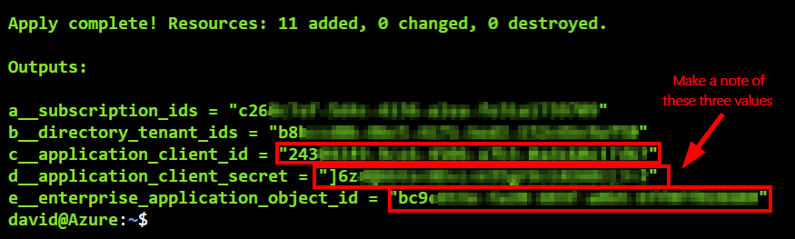

# Module 1: Onboard Azure Subscription to Prisma Cloud

In the previous module, you created the accounts that you need to complete the workshop. If you have not completed that lesson, you can refer to it [here](0-prerequisites.md). In this module, you will add your Azure subscription to Prisma Cloud. This is the first step to protecting your cloud environment, services and workloads with Prisma Cloud. Onboarding gives Prisma Cloud the permissions needed to ingest resource configuration metadata, activity logs and network flow logs from your Azure subscription. Here are the exercises that we will be completing:

> * Review the permissions needed to complete the onboarding process
> * Review the permissions that Prisma Cloud will need in your environment
> * Prepare your Azure subscription for onboarding
> * Add Azure Subscription in Prisma Cloud

## Exercise 1 - Review the permissions needed to complete the onboarding process
>* To successfully onboard and monitor the resources within your Azure subscription, you need to have the right level of permission in the subscription and at the tenant level.
>* This is referring to the permissions that the onboarding user needs to have (NOT the permissions that Prisma Cloud needs to your environment)

* **`Owner`** role assignment on the subscription
* **`Application Administrator OR Global Administrator`** at the tenant level

## Exercise 2 - Review the permissions that Prisma Cloud will need in your environment
>* The permissions needed by Prisma Cloud depends on the mode that you want to configure. You can either select the option to **`Monitor Only`** which grants Prisma Cloud the permissions to ingest the needed information but not to remediate issues. The other option is **`Monitor and Protect`** which requires permissions to not only ingest the needed information but also to automatically remediate them.

1. **Monitor only**

|    | Purpose                   | Permission       |
|----|--------------------------|--------------|
| a | Ingestion of resource configuration metadata and activity logs | **`Reader`** role assignment at the subscription level |
| b | Read flow log **settings** for network security groups (NSGs) along with the details on the storage account to which the flow logs are written | **`Network Contributor`** role assignment on the subscription level **OR** a custom role that allows this action: **`Microsoft.Network/networkWatchers/queryFlowLogStatus/action`** |
| c | Fetch flow logs from storage accounts and storage account attributes | **`Reader and Data Access`** at the subscription level **OR** to all storage accounts where flow logs are stored |
| d | To ingest data from Azure Container Registry webhooks that are triggered when a container image or Helm chart is pushed to or deleted from a registry | **`Microsoft.ContainerRegistry/registries/webhooks/getCallbackConfig/action`** |
| e | To ingest Authentication/Authorization data from Azure App Service that hosts websites and web applications | **`Microsoft.Web/sites/config/list/action`** |
----

2. **Monitor and Protect**
   * Same permissions as above and the following:

|    | Purpose                   | Permission       |
|----|--------------------------|--------------|
| 1 | Auto-remediation of storage account policy violations | **`Storage Account Contributor`** role assignment at the subscription level |
----

>* For a full reference of the permissions, refer to [this document](https://docs.paloaltonetworks.com/prisma/prisma-cloud/prisma-cloud-admin/connect-your-cloud-platform-to-prisma-cloud/onboard-your-azure-account/azure-onboarding-checklist.html#id04489406-4377-448f-8d6c-d1623dcce1e7)


## Exercise 3 - Prepare your Azure subscription for onboarding
>* In order for Prisma Cloud to ingest the network flow logs from an Azure subscription, the following steps needs to be completed:
   * Register the Microsoft Insights resource provider
   * Enable Network Watcher in the Azure regions that you have resources
   * Create a storage account in each region where you have Azure resources
   * Enable flow logs for your network security groups (configure the logs to be stored in the storage accounts created earlier)

1. Open a web browser tab and go to the [Azure Cloud Shell](https://shell.azure.com). Sign in with your Azure credentials. Ensure that you are in the **`Bash`** terminal.

2. Obtain your Azure Tenant ID and your Subscription ID by running the following command:
    ```
    az account show --query '{TenantID:tenantId, SubscriptionID:id}'
    ```
    >* Make a note of the tenant ID and the subscription ID. They will be used in the next section.

3. Run the following commands to register the Microsoft Insights resource provider:
    ```
    # register the provider
    az provider register -n Microsoft.insights 

    # verify registration status
    az provider show -n Microsoft.insights --query registrationState 
    ```

4. Run the following command to enable Network Watcher
   >* Change the location to the region that you will be using for your lab
   ```
   # set the location variable
   location=uksouth 
   
   # enable network watcher for the location
   az network watcher configure -g NetworkWatcherRG  -l $location --enabled true 

   ```
5. Create a storage account and blob container that will be used to store the flow logs
   >* Change the location to the region that you will be using for your lab
   ```
   # configure resource group name variable
   group=prismacloud-rg 

   # configure storage account name variable
   storagename=prismaflow$RANDOM 

   # configure blob container name variable
   container=flowlogs 

   # configure resource location variable
   location=uksouth 

   # create resource group
   az group create --name $group --location $location 

   # create storage account
   az storage account create --name $storagename --resource-group $group --location $location --sku Standard_LRS 
   
   # create blob container
   az storage container create --account-name $storagename --name $container 
   ```
6. Enable flow log for your network security groups
   * Go to the [Azure Portal](https://portal.azure.com) → All Services → Network Watcher → NSG flow logs → Select a NSG from the displayed list → Configure the following:
      * **Status**: On
      * **Flow Logs Version**: Version 2
      * **Storage Account**: Select the storage account that was created earlier and click **`OK`**
      * **Retention Days**: 5
      * **Traffic Analysis Status**: Off
      * Click **`Save`** (top left corner)


7. Repeat Step 6 for other NSGs.


## Exercise 4 - Add Azure Subscription in Prisma Cloud
1. Open a web browser and go to your Prisma Cloud console 
2. Go to **`Settings`** → **`Cloud Accounts`** → **`Add New`** → Select **`Azure`** 
   * **Cloud Account Name**: Enter the name of your Azure subscription
   * **Onboard**: Azure Subscription
   * **Azure Cloud Type**: Commercial
   * **Select Mode**: **`Monitor & Protect`**
   * Click **`Next`**
>* The mode cannot be changed after an account has been onboarded. You will need to remove the account and re-onboard it to change the mode.


3. In the **Configure Account** window, configure the following:
   * **Directory (Tenant) ID**: Enter the tenant ID that you made a note of in the previous exercise
   * **Subscription ID**: Enter the subscription ID that you made a note of in the previous exercise
   * Click **`Next`**


4. In the **Account Details** window, download the terraform script


5. In the **`Azure Cloud Shell`**, upload the terraform script that you just downloaded


6. In **`Azure Cloud Shell`**, run the following commands:
   ```
   terraform init
   terraform apply
   ```
>* When prompted to **`Enter a value`**, type **`yes`** and press **`Enter`**
>* This will register an Azure AD application and grant it the permissions described in Exercise 2 of this module

7. Make a note of the following values from the output of the script:
   * **`application_client_id`**
   * **`application_client_secret`**
   * **`enterprise_application_object_id`**


8. Back in the Prisma Cloud console, in the **Account Details** window, enter the following:
   * **Application (Client) ID**: Enter the output value of **`application_client_id`** from Step 7
   * **Application Client Secret**: Enter the output value of **`application_client_secret`** from Step 7
   * **Enterprise Application Object ID**: Enter the output value of **`enterprise_application_object_id`** from Step 7
   * **Ingest and Monitor Network Security Group Flow Logs**: Selected
   * Click **`Next`**


9. In the **Accounts Groups** window, select **`Default Account Group`** and click **`Next`**


10. In the **Status** window, verify the status and click **`Done`**


11. Click **`Close`**

12. Your Azure subscription should now be onboarded in Prisma Cloud

## Learn more
* [Azure Cloud Account Onboarding Checklist](https://docs.paloaltonetworks.com/prisma/prisma-cloud/prisma-cloud-admin/connect-your-cloud-platform-to-prisma-cloud/onboard-your-azure-account/azure-onboarding-checklist.html)
* [Add an Azure Subscription on Prisma Cloud](https://docs.paloaltonetworks.com/prisma/prisma-cloud/prisma-cloud-admin/connect-your-cloud-platform-to-prisma-cloud/onboard-your-azure-account/add-azure-cloud-account-on-prisma-cloud.html)
* [Prisma Cloud Azure Permissions](https://docs.paloaltonetworks.com/prisma/prisma-cloud/prisma-cloud-admin/connect-your-cloud-platform-to-prisma-cloud/onboard-your-azure-account/azure-onboarding-checklist)
* [Azure APIs Ingested by Prisma Cloud](https://docs.paloaltonetworks.com/prisma/prisma-cloud/prisma-cloud-admin/connect-your-cloud-platform-to-prisma-cloud/onboard-your-azure-account/microsoft-azure-apis-ingested-by-prisma-cloud)
* [Troubleshoot Azure Account Onboarding](https://docs.paloaltonetworks.com/prisma/prisma-cloud/prisma-cloud-admin/connect-your-cloud-platform-to-prisma-cloud/onboard-your-azure-account/troubleshoot-azure-account-onboarding.html)

## Next steps

In this module, you completed the following:
> * Reviewed the permissions needed to complete the onboarding process
> * Reviewed the permissions that Prisma Cloud will need in your environment
> * Prepared your Azure subscription for onboarding
> * Added your Azure Subscription in Prisma Cloud

In the next module, you will onboard your Azure AD tenant to Prisma Cloud. Click here to proceed to the next lesson:
> [Onboard your Azure AD tenant to Prisma Cloud](2-onboard-azure-ad.md)
