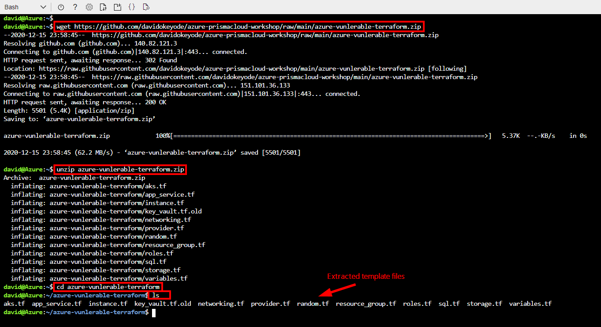

# Module 4: Deploy vulnerable services using terraform

## Exercise 1 - Deploy vulnerable services to Azure using terraform
>* In order to simulate security and compliance violation detections by Prisma Cloud, we will deploy some sample templates that implements services that are badly configured into our Azure subscription. DO NOT deploy these templates into a production environment!

1. Open a web browser tab and go to the [Azure Cloud Shell](https://shell.azure.com). Sign-in with your Azure credentials. Ensure that you are in the **`Bash`** terminal.

2. In **`Azure Cloud Shell`**, run the following commands to download and extract the vulnerable templates:
   ```
      # Download the templates from GitHub
      wget https://github.com/davidokeyode/azure-prismacloud-workshop/raw/main/azure-vunlerable-terraform.zip
      
      # Extract the templates
      unzip azure-vunlerable-terraform.zip

      # Change directory to the extracted folder
      cd azure-vunlerable-terraform

      # List the extracted template files
      ls
   ```




3. Still in the **`Azure Cloud Shell`**, run the following commands to initialize terraform and deploy the services:
   ```
   # Initialize terraform
   terraform init

   # Deploy the templates
   terraform apply
   ```
>* When prompted to **`Enter a value`**, type **`yes`** and press **`Enter`**

4. Wait for the resources to deploy. You can verify that were created using the command below:
   ```
      az resource list -g vulnerable-by-design-test --query '[].{Name:name, Type:type}' -o table
   ```

5. Within a few minutes after deployment, you should see alerts raised in your JIRA project!
## Next steps

In this lesson, you completed the following:
* Deployed vulnerable services to Azure using terraform

In the next lesson, you will remediate security risks and and compliance violations with Prisma Cloud. Click here to proceed to the next lesson:
> [Remediate Security Risks and Compliance Violations with Prisma Cloud](5-respond-and-remediate.md)
