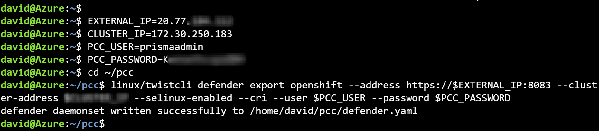
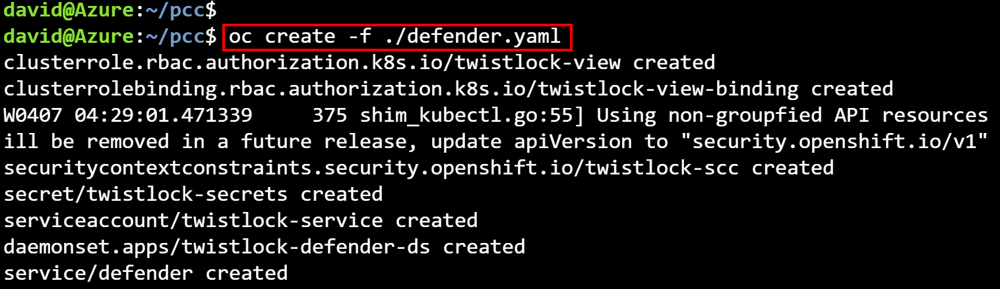
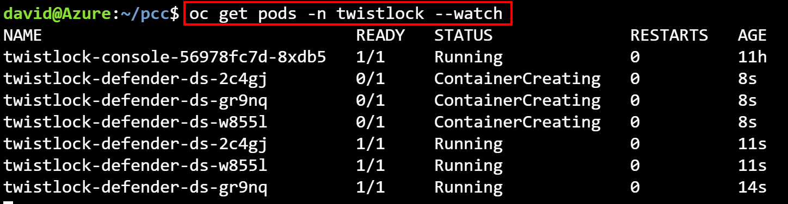

# Lesson: Deploy the Self-Hosted Prisma Cloud Compute Solution (Formerly Twistlock) on Azure RedHat OpenShift (ARO)

In this workshop lesson, you will deploy the Prisma Cloud Compute Security Solution on an Azure RedHat OpenShift (ARO) cluster. Here are the tasks that we will be completing in this lesson:

> * Obtain the Prisma Cloud Compute download URL from the Palo Alto Networks Customer Support portal 
> * Deploy the Prisma Cloud Compute Console
> * Deploy Prisma Cloud Defenders
### Obtain the Prisma Cloud Compute download URL from the Palo Alto Networks Customer Support portal
1. Open a web browser and go to [https://support.paloaltonetworks.com](https://support.paloaltonetworks.com). Sign in with your Palo Alto credentials.

2. In the Support portal, go to click on **`Software`** → **`Updates`** → From the drop down list, select **`Prisma Cloud Compute Edition`**  → Open the **`Releases notes PDF`** for the latest version.


3. In the opened **`Releases notes PDF`** document, scroll down to the release information and copy the link information from there. You will need this information later in this exercise.


4. Open a browser tab and go the Azure Cloud Shell [https://shell.azure.com](https://shell.azure.com). Sign in with your Azure credentials

5. If you have multiple Azure subscriptions, specify the relevant subscription ID:
    ```
    az account set --subscription <SUBSCRIPTION ID>
    ```
### Deploy the Prisma Cloud Compute Console

1. **Set the following variables in the cloud shell environment**. This will set variables for the cluster name, resource group, location, kubeadmin password, api server URL.
```
LOCATION=uksouth
RESOURCEGROUP=aro-workshop-rg
CLUSTER=arocluster

kubeadminpass=$(az aro list-credentials \
   --name $CLUSTER \
   --resource-group $RESOURCEGROUP \
   --query kubeadminPassword -o tsv)
   
apiServer=$(az aro show -g $RESOURCEGROUP -n $CLUSTER --query apiserverProfile.url -o tsv)

```

2. **Login to the OpenShift cluster's API server using the kubeadmin credentials**
```
oc login $apiServer -u kubeadmin -p $kubeadminpass
```
You should receive a **Login successful** response after running the command

3. Create the twistlock project on the cluster using the following `oc` command:
```
oc new-project twistlock
```

4. Download the Prisma Cloud Compute solution using the command below. Replace the **`<DOWNLOAD_LINK>`** placeholder with the link that you copied earlier. This could take a few minutes to download.
```
curl <DOWNLOAD_LINK> -o pcc.tar.gz 
```

5. Create a directory and unpack the release tarball to it. The tarball is bundled with different versions of the **`twistcli`** tool (Linux, macOS, and Windows). The twistcli tool is used later to generate YAML files or a Helm chart for deploying Prisma Cloud Compute Console.
```   
mkdir pcc
tar xvzf pcc.tar.gz -C pcc
```

6. Generate the YAML manifest for deploying Prisma Cloud Compute Console. To pull the images from the Prisma Cloud cloud registry, we will specify our access token which is provided as part of our license (Replace the **`<Prisma_Cloud_Access_Token>** placeholder with the actual value). We are also specifying the **`LoadBalancer`** service type for external access.
```   
PRISMACLOUD_ACCESS=<Prisma_Cloud_Access_Token>
   
cd pcc/

linux/twistcli console export openshift --registry-token "$PRISMACLOUD_ACCESS" --service-type LoadBalancer
``` 
This step results in a YAML file called **`twistlock_console.yaml`** in the current working directory which will be used to deploy the console on ARO.

7. Deploy the console using the command below:
``` 
oc create -f ./twistlock_console.yaml

oc get project twistlock -w

oc get svc -n twistlock
``` 

8. Obtain the external IP of the Prisma Cloud compute service using the command below. Make a note of it. The external IP will be needed in the next step when we access the console and later when we deploy the defenders.
``` 
oc get svc -n twistlock
``` 


9. Connect to the external IP on port 8083
``` 
https://<external_ip>:8083
``` 

10. Create admin username and password. Make a note of these values as they will be needed later.


11. In the **`Manage/System`** window, enter your Prisma Cloud license and click on **`Register`**.


### Deploy Prisma Cloud Compute Defenders

1. Review the command options to generate the deployment manifest file
```  
~/pcc/linux/twistcli defender export openshift -h
```  

2. **Generate the YAML file for deploying the defenders by running the commands below**. Replace the following placeholders with the values that you made a note of earlier:
> * **`<external_ip>`**: the external IP address value of the console service
> * **`<username>`**: the prisma cloud console username that you created earlier
> * **`<password>`**: the prisma cloud console password that you specified earlier

```   
EXTERNAL_IP=<external_ip>
PCC_USER=<username>
PCC_PASSWORD=<password>
   
cd ~/pcc

linux/twistcli defender export openshift --address https://$EXTERNAL_IP:8083 --cluster-address twistlock-console --selinux-enabled --cri --user $PCC_USER --password $PCC_PASSWORD

``` 


3. Deploy the defender daemonset using the command below
``` 
oc create -f ./defender.yaml
``` 



This will deploy the new defender pods into the twistlock project. You can verify that all pods in the project are in the Running state, or wait until they are:
``` 
oc get pods -n twistlock --watch
``` 



## Learn more
* [Prisma Cloud Console and Defenders Overview](https://docs.twistlock.com/docs/compute_edition/install/getting_started.html)
* [Prisma Cloud OpenShift 4 Overview](https://docs.twistlock.com/docs/compute_edition/install/install_openshift_4.html)

## Next steps

In this lesson, you completed the following:
> * Deployed the Prisma Cloud Compute Console using twistcli
> * Deployed Prisma Cloud Defender Daemonset using twistcli

Proceed to the next lesson:
> * [Deploy OpenShift Registry](7a-registry-aro-cluster.md)
> * [Deploy JFrog Registry](7b-deploy-jfrog-aro-cluster.md)
