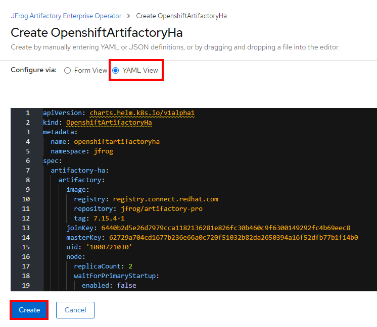

# Lesson 7b: Deploy the JFrog Artifactory Solution on Azure RedHat OpenShift (ARO)

In this workshop lesson, you will deploy the JFrog Artifactory Solution on an Azure RedHat OpenShift (ARO) cluster. Here are the tasks that we will be completing in this lesson:

> * Obtain the Prisma Cloud Compute download URL from the Palo Alto Networks Customer Support portal 
> * Deploy the Prisma Cloud Compute Console
> * Deploy Prisma Cloud Defenders

### Pre-Requisite: Deploy a PostGreSQL database
> * To use the JFrog Artifactory OpenShift Operator in an ARO cluster, we first need to install an external relational database service such as MySQL, PSQL, Oracle, or MSSQL. PSQL is recommended as it can also be used for the X-Ray service.

> * We need to specify the configuration values to connect to this database during the deployment of JFrog Artifactory.

1. Deploy PostGres into a namespace
```
oc new-project jfrog

oc create -n jfrog -f https://raw.githubusercontent.com/openshift/library/master/arch/x86_64/official/postgresql/templates/postgresql-persistent.json

oc process jfrog//postgresql-persistent \
    -p POSTGRESQL_USER=artifactory \
    -p POSTGRESQL_PASSWORD=password \
    -p POSTGRESQL_DATABASE=artifactory | oc create -f -
```

2. Verify the database using the commands below
```
oc get pods
oc get all
oc rsh <pod>

PGPASSWORD=password psql -h postgresql artifactory artifactory -c "SELECT * FROM (SELECT current_database()) cdb CROSS JOIN (SELECT current_user) cu"
```

### Pre-Requisite: Create a Kubernetes secret for TLS
> * To use TLS, we need to first create a k8s tls secret to store the .crt and .key file into. We will supply the k8s secret when deploying artifactory using the operator.

1. Deploy the 
```
openssl req -x509 -sha256 -nodes -days 365 -newkey rsa:2048 -keyout tls.key -out tls.crt

oc create secret tls tls-ingress --cert=tls.crt --key=tls.key -n jfrog
```
> * We can also use a publicly trusted certificate
    > * Add DNS record in your public DNZ zone like GoDaddy (E.g. artifactory.cloudsecnews.com)
    > * Generate publicly trusted certificate from a site like https://app.zerossl.com/
    > * Download NGINX cert (with .crt and .key)
    > * Upload to cloudshell and use as secret
    > * oc create secret tls tls-ingress --cert=certificate.crt --key=private.key -n jfrog


2. Verify
```
oc get secrets -n jfrog
```

### Pre-Requisite: Create master and join keys
> * These keys will be needed during deployment

1. Deploy the 
```
export JOIN_KEY=$(openssl rand -hex 32)
echo ${JOIN_KEY}

export MASTER_KEY=$(openssl rand -hex 32)
echo ${MASTER_KEY}
```

Make a note of the both the Join Key and the Master Key.


### Pre-Requisite: Jfrog Artifact License
> * To deploy JFrog Artifactory, we need to specify a license. You can get a trial license from here: [https://jfrog.com/artifactory/](https://jfrog.com/artifactory/)


### Deploy JFrog Artifactory from the OpenShift Operator hub

1. To deploy this helm chart our account needs to be a cluster admin with access to the anyuid scc and add the operator service account to the anyuid scc.
```
oc adm policy add-scc-to-user anyuid -z artifactory-ha-operator -n jfrog
```

2. Open a web browser and go to the OpenShift console URL

> * You can obtain the Console URL using the command below:
```
LOCATION=uksouth
RESOURCEGROUP=aro-workshop-rg
CLUSTER=arocluster

consoleURL=$(az aro show \
    --name $CLUSTER \
    --resource-group $RESOURCEGROUP \
    --query "consoleProfile.url" -o tsv)

echo $consoleURL
```

2. In the console, go to **`Console`** → **`Operators`** → **`Operator Hub`** → Select **`JFrog Artifactory Enterprise Operator`** → Click **`Install`**


3. In the **`Install Operator`** window, Select the option to install the operator to **`a specific namespace on the cluster`**, select the **`jfrog`** namespace and click on **`Install`**.


4. Click on **`View Operator`**, then click on **`Create Instance`**


5. In the **`Create OpenshiftArtifactoryHa`** window, select **`YAML View`**. Replace the values that are labelled as **`OVERRIDE`** with the actual values that you made note of earlier (Lines 13, 14, 22-26, 44). Then click **`Create`**

```
joinKey: <join_key_value>
masterKey: <master_key_value>

database:
    driver: org.postgresql.Driver
    password: password
    type: postgresql
    url: jdbc:postgresql://postgresql:5432/artifactory
    user: artifactory

tlsSecretName: tls-ingress
```




## Next steps

In this lesson, you completed the following:
> * 
