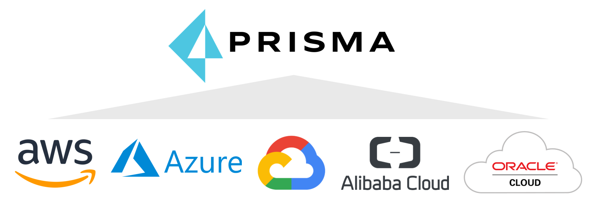

## Welcome

Welcome to the Prisma Cloud Azure shift left workshop! Prisma™ Cloud is the most comprehensive cloud security solution availableon the market today with capabilities ranging from Cloud Security Posture Management (CSPM); Cloud Workload Protection (CWP);  Cloud Infrastructure Entitlement Management (CIEM) and Cloud Network Security (CNS). It provides comprehensive visibility and threat detection across your organization’s hybrid, multi-cloud environment (Azure, AWS, GCP, Alibaba, Oracle Cloud, Kubernetes). 

This workshop was created as a walkthrough for Prisma Cloud shift-left capabilities for Azure.

### Pre-requisites

* An Azure Subscription
  * This can be any Azure subscription where you have the owner role assignment.
* A Prisma Cloud Compute Edition License
  * Prisma Cloud will be used to protect your Azure environment and services
* Bridgecrew License
* An Azure DevOps Organization
* A GitHub Account
* A JIRA Account

>* The [first module](modules/0-prerequisites.md) contains instructions on setting up the required accounts but you can also use existing accounts that you may have.
### Agenda

The workshop is designed to take approximately 5-6 hours to complete. It can be spread out over a 1 day or 2 days workshop.

|    | Module                   | Format       |
|----|--------------------------|--------------|
| 00 | [Setup Pre-Requisites](modules/0-prerequisites.md)                         | Hands on Lab |
| 01 | [Prepare Your Azure Environment](modules/1-prepare-the-environment.md) | Hands on Lab |
| 02 | [Deploy Prisma Cloud Compute Edition (PCCE) on AKS](modules/2-pcce-aks-deploy.md) | Hands on Lab |
| 03 | [Development Stage Shift Left](modules/pcce-development-stage-shift-left.md)                | Hands on Lab |
| 04a | [Configure JIRA integration in Prisma Cloud (CSPM)](modules/4a-jira-integration-cspm.md) | Hands on Lab |
| 04b | [Configure JIRA integration in Prisma Cloud (CWPP)](modules/4b-jira-integration-cwpp.md) | Hands on Lab |
| 05 | [Remediate Security Risks and Compliance Violations with Prisma Cloud](modules/5-respond-and-remediate.md)  | Hands on Lab |
| 06 | [Protect Linux Hosts and Containers in Azure](modules/6-protect-linux-hosts-and-containers.md) | Hands on Lab |
| 07 | [Protect Windows Hosts and Containers in Azure](modules/6-protect-linux-host-and-containers.md) | Hands on Lab |
| 08 | [Protect Azure Container Registry (ACR) Images](modules/8-protect-acr-images.md)    | Hands on Lab |
| 09 | [Protect Azure Kubernetes Service (AKS) Workloads](modules/9-protect-aks-workloads.md) | Hands on Lab |
| 10 | [Protect Serverless Container Workloads](modules/10-protect-serverless-workloads.md)    | Hands on Lab |
| 11 | Implement Shift Left Security for Azure    | Hands on Lab |
| 12 | Wrap / Clean Up     | Hands on Lab |
----

[Next](modules/0-prerequisites.md)