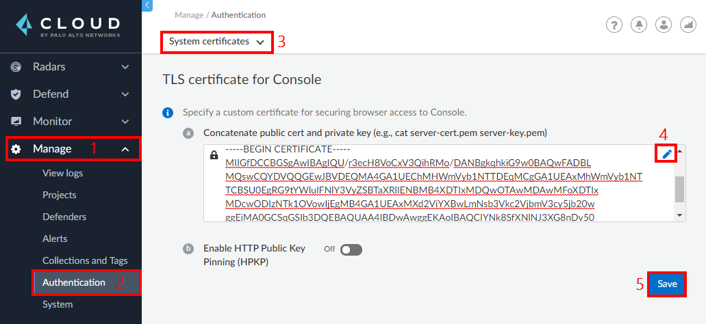
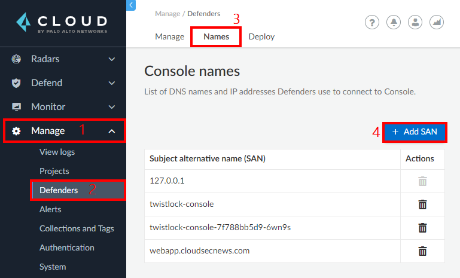

# Module 2: Prisma Cloud - Configure Custom Domain for Prisma Cloud Compute Edition (PCCE)

In this workshop module, we will be configure a custom domain name for PCCE. Here are the exercises that we will complete in this lesson:

> * Register a domain name with a DNS registrar
> * Generate a trusted certificate for the DNS name
> * Upload PEM certificate to the Prisma cloud console

## Exercise 1: Register a domain name with a DNS registrar
1. If you are exposing the console publicly. You could use providers like [Name Cheap](https://www.namecheap.com/) or [GoDaddy](https://uk.godaddy.com/)

> * Top level domains like **`.xyz`** are a lot cheaper 

2. Create a DNS A record to point to the Load balancer's IP address

## Exercise 2: Generate a trusted certificate for the DNS name
1. You can register with a provider like [Zero SSL](https://zerossl.com/) to obtain a free SSL certificate for three months

## Upload PEM certificate to the Prisma cloud console

1. In the Prisma Cloud console, go to **`Manage`** → **`Authentication`** → **`System certificates`**. Edit the **`TLS certificate for console section`** to add a concatenated public certificate and private key in PEM format. Click **`Save`**.

2. In the Prisma Cloud console, go to **`Manage`** → **`Defenders`** → **`Names`** → **`Add SAN`**. Enter the DNS name that you are using for the console, then click **`Add`**.

## Learn More

> * [Custom certs for Console access](https://docs.paloaltonetworks.com/prisma/prisma-cloud/21-04/prisma-cloud-compute-edition-admin/configure/subject_alternative_names.html)

> * [Prisma Cloud Subject Alternative Names](https://docs.paloaltonetworks.com/prisma/prisma-cloud/21-04/prisma-cloud-compute-edition-admin/configure/subject_alternative_names.html)

## Proceed to the next lesson:
> [Prepare Azure DevOps Services](3-pcce-prepare-azdevops-services.md) 
