# Module 4: Prisma Cloud - Development Stage Shift Left

In this workshop lesson, you will be setting up accounts that you need to follow the lessons in this workshop. Here are the exercises that we will complete in this lesson:

> * Install and configure the Checkov Visual Studio code extension 
> * Clone a Git repository. Verify Prisma Cloud infrastructure code scan and inline fix


Prepare Azure DevOps and Services

## Exercise 1 - Create credential for Azure DevOps to use
1. Open a web browser tab and go to the [Azure Cloud Shell](https://shell.azure.com). Sign in with your Azure credentials. Ensure that you are in the **`Bash`** terminal.

2. In the cloud shell environment, run the following commands to create the service principal that Azure DevOps will use to access your Azure subscription. Make a note of the following values from the output - **`appID`**, **`password`** and **`tenant`**.

```
az ad sp create-for-rbac --name ado-serviceconn-cred --role contributor
```

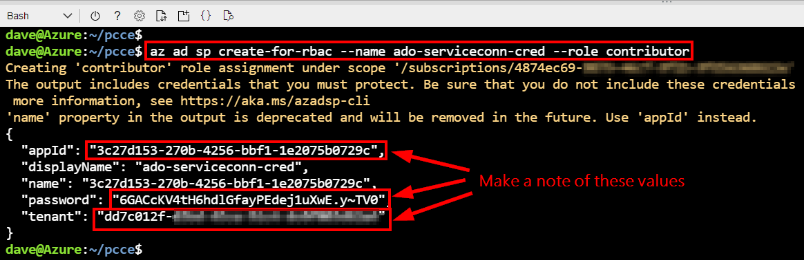

3. In the cloud shell environment, run the following commands to obtain the subscription ID. Make a note of the value from the output.

```
az account show --query id
```

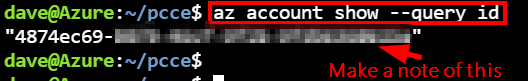


## Exercise 2 - Create Azure DevOps project
1. In the Azure DevOps organization, create a new project called **`prismacloud-shiftleft`** with the visibility set to **`Private`**.

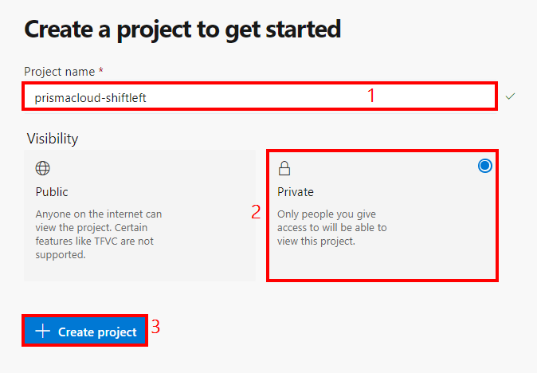

## Exercise 3 - Configure Azure Service Connection
> * In the Azure DevOps organization, create a service connection for Azure called **`pc-shiftleft-azure-connection`**

1. In Azure DevOps, in the **`prismacloud-shiftleft`** project, go to **`Project Settings`** → **`Service connections`** → **`New service connection`**. 

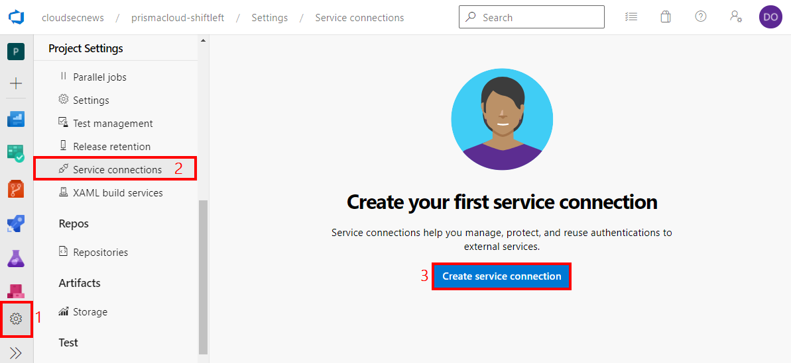

2. In the **`New service connection`** blade, select **`Azure Resource Manager`** and click on **`Next`**.

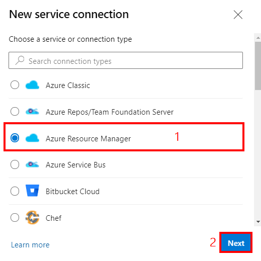

3. In the **`New Azure service connection`** blade, select **`Service principal (manual)`** and click on **`Next`**.

4. In the **`New Azure service connection`** blade, configure the following:
	* **Environment**: Azure Cloud
	* **Scope Level**: Subscription
	* **Subscription Id**: Enter the **`id`** output value from **`Exercise 1 - Step 3`** of this module
	* **Subscription Name**: Azure Subscription 
	* **Service Principal Id**: Enter the **`appId`** output value from **`Exercise 1 - Step 2`** of this module
	* **Credential**: Service principal key
	* **Service principal key**: Enter the **`password`** output value from Exercise 1 - Step 2 of this module
	* **Tenant ID**: Enter the **`tenant`** output value from **`Exercise 1 - Step 2`** of this module
	* Click on **`Verify`**. This should be successful.

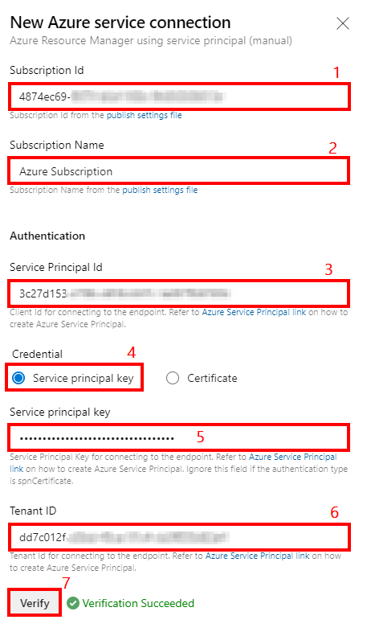

5. Still in the **`New Azure service connection`** blade, configure the following in the **`Details`** section:
	* **Service connection name**: pc-shiftleft-azure-connection
	* **Description**: Service connection to Azure
	* **Grant access permission to all pipelines**: Selected. This option allows pipelines defined in YAML (which is the case in this workshop), which are not automatically authorized for service connections, to use this service connection.
	*  Click on **`Verify and save`**.

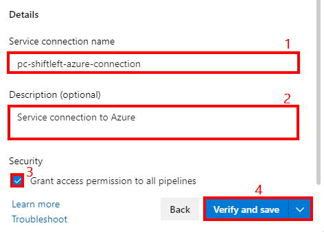

## Exercise 4 - Import code and pipelines into your Azure DevOps project
1. In the Azure DevOps organization, create a new project called **`prismacloud-shiftleft`**

2. 

 - **`https://dev.azure.com/<ORGANIZATION_NAME>`**. Replace **`<ORGANIZATION_NAME>`** with the name of your Azure DevOps organization. 

2. Install the following extensions from the Visual Studio marketplace
* **`Prisma Cloud extension`**: https://marketplace.visualstudio.com/items?itemName=Palo-Alto-Networks.build-release-task


## Exercise 1 - Configure secrets in Key Vault 

1. In the Azure Portal, open the Key Vault resource that was created. Click 


## Exercise 2 - Configure secrets in Key Vault 

1. In the Azure Portal, open the Key Vault resource that was created. Click 


Install extensions in Azure DevOps
1. Open a web browser and go to your Azure DevOps organization - **`https://dev.azure.com/<ORGANIZATION_NAME>`**. Replace **`<ORGANIZATION_NAME>`** with the name of your Azure DevOps organization. 

2. Install the following extensions from the Visual Studio marketplace
* **`Prisma Cloud extension`**: https://marketplace.visualstudio.com/items?itemName=Palo-Alto-Networks.build-release-task

* **`Terraform Build & Release Tasks extension`**: https://marketplace.visualstudio.com/items?itemName=charleszipp.azure-pipelines-tasks-terraform


Obtain the **`windows VM Hostname`** from the output of the template deployment in **`Module 1`** and connect to it using RDP

2. When prompted, authenticate with the username value obtained from the output of the template - **`windows VM Username`**. Enter the password that you used for the template deployment and press **`Enter`**.

3. When prompted with a certificate warning, select the option **`Don't ask me again for connections to this computer`** and click **`Yes`**. 

4. On the Desktop, double click the **`Visual Studio Code`** icon to open it.

5. In Visual Studio Code, click on **`Extensions`** and search for **`Checkov`**. Click on **`Install`** to download and install the extension. The extension requires Python 3.7 which is already installed as part of the environment setup. It will also install the latest version of Checkov.

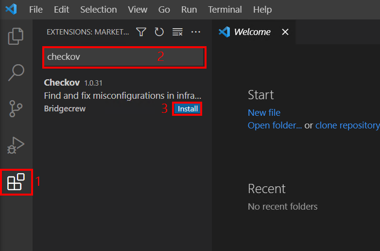

6. Once the extension has finished installing, click on the **`Manage`** option, then click on **`Extension Settings`**.

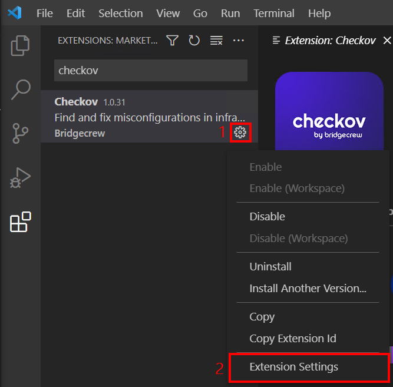

7. In the **`Checkov: Token`** window, enter the value of the Bridgecrew API token that you made a note of from **`Module 1 - Exercise 4b`**. When prompted to add the token, click to add it.

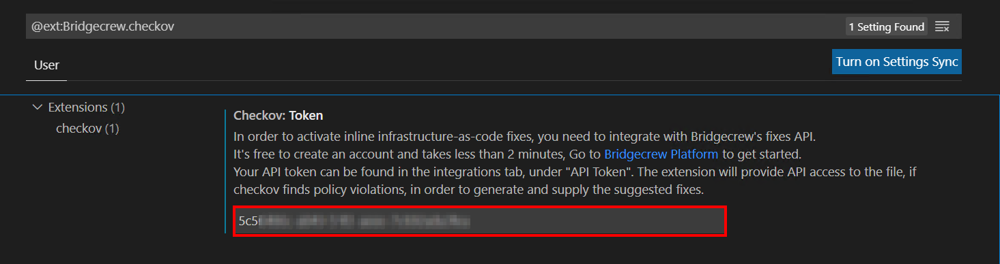

## Exercise 2 - Clone a Git repository. Verify Prisma Cloud infrastructure code scan and inline fix.  

1. In Visual Studio Code, press **`F1`** to display the command pallette, type **`Git: Clone`** and press **`Enter`**. Paste the following URL: **`https://github.com/davidokeyode/prismacloud-shiftleft`** and press **`Enter`**.

2. When prompted to Select Folder, create a new folder called **`GitHub-Repos`**, select it and click on **`Select Repository Location`**. When prompted if you would like to open the cloned repository, click on **`Open`**.


3. In the opened repository in VS code, expand **`templates`** → **`arm`** and click on **`azuredeploy.json`**. Checkov will perform a scan of the template. In the lower left corner, click on the **`issues`** icon to reveal the detected issues.

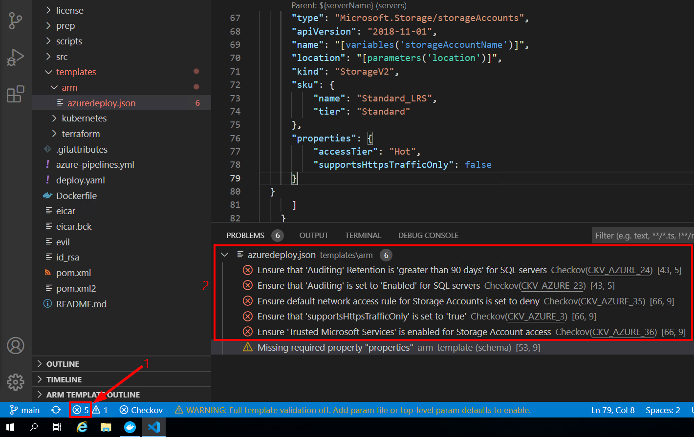

4. On the list of displayed issues, you can click on the icon on **`error`** icon to review **`Quick Fix`** options.


5. Repeat steps 3 and 4 of this exercise for the following files:
* **`templates`** → **`terraform`** → **`storage.tf`**
* **`templates`** → **`kubernetes`** → **`deploy.yml`**

## Summary

In this lesson, you completed the following:
> * Installed and configured the Checkov VS Code extension 
> * Cloned a Git repository for testing
> * Verified Prisma Cloud infrastructure code scan and inline fix

## Learn More

> * [Bridgecrew announces automated cloud security in VS Code](https://www.helpnetsecurity.com/2021/03/03/bridgecrew-vs-code/) 
> * [Obtain a Bridgecrew API token](https://docs.bridgecrew.io/docs/get-api-token)
> * [Inline IaC scanning and fixes with the Checkov Visual Studio Code extension](https://bridgecrew.io/blog/vs-code-extension-inline-iac-scanning-fixes/)


## Proceed to the next lesson:
> 
