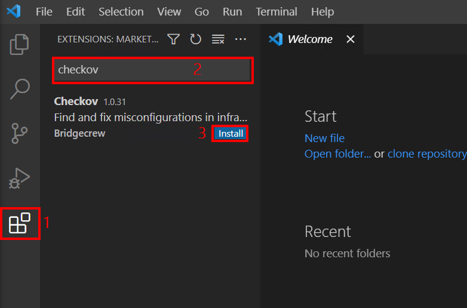
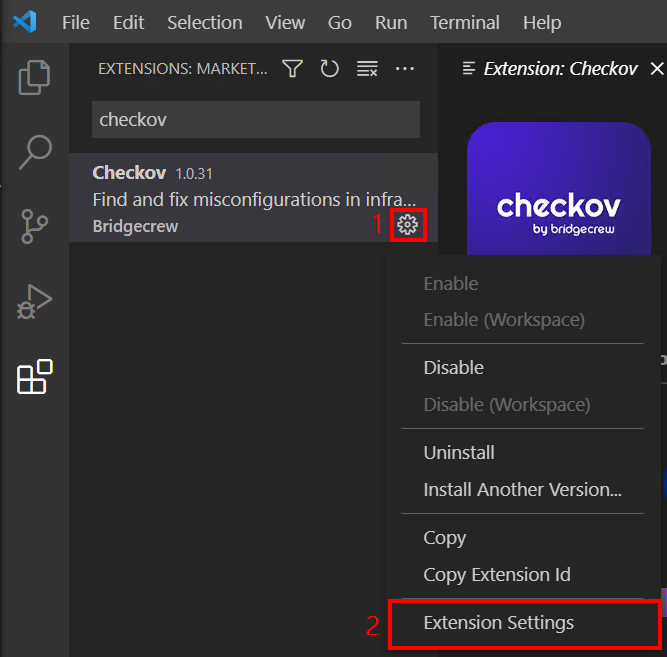
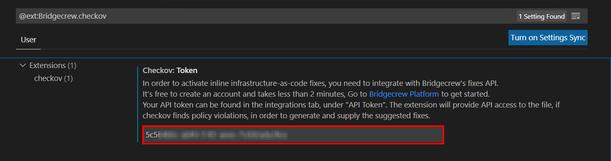
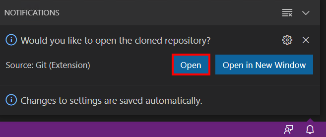
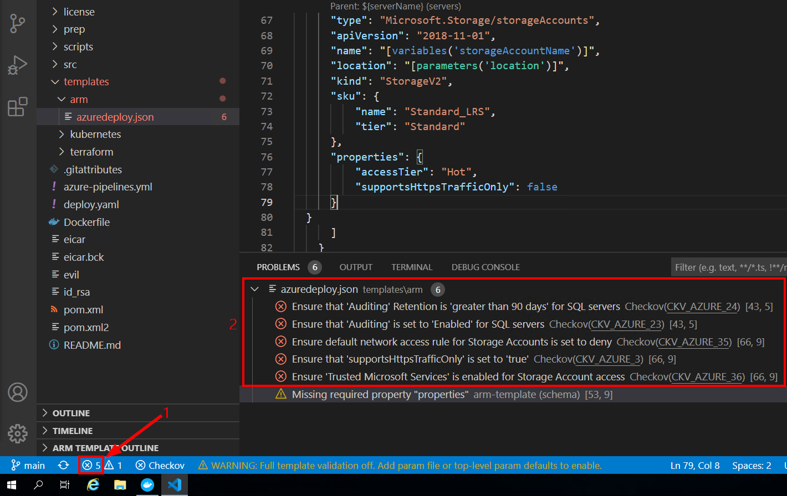
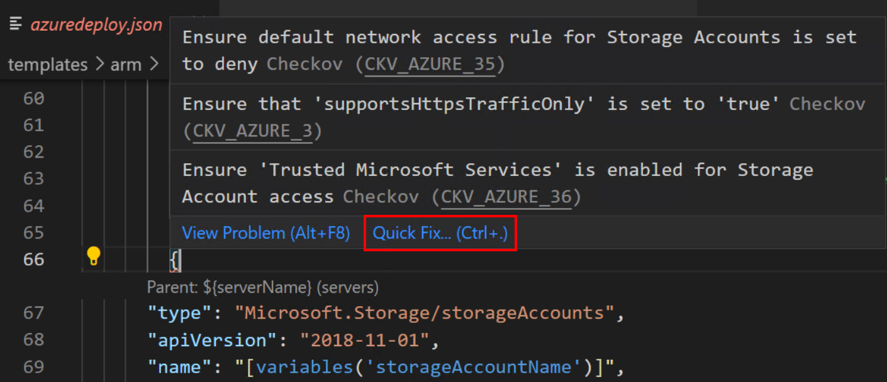

# Module 3: Prisma Cloud - Development Stage Shift Left

In this workshop lesson, you will be setting up accounts that you need to follow the lessons in this workshop. Here are the exercises that we will complete in this lesson:

> * Install and configure the Checkov Visual Studio code extension 
> * Clone a Git repository. Verify Prisma Cloud infrastructure code scan and inline fix

## Exercise 1 - Install and configure the Checkov Visual Studio code extension 

1. Obtain the **`windows VM Hostname`** from the output of the template deployment in **`Module 1`** and connect to it using RDP

2. When prompted, authenticate with the username value obtained from the output of the template - **`windows VM Username`**. Enter the password that you used for the template deployment and press **`Enter`**.

3. When prompted with a certificate warning, select the option **`Don't ask me again for connections to this computer`** and click **`Yes`**. 

4. On the Desktop, double click the **`Visual Studio Code`** icon to open it.

5. In Visual Studio Code, click on **`Extensions`** and search for **`Checkov`**. Click on **`Install`** to download and install the extension. The extension requires Python 3.7 which is already installed as part of the environment setup. It will also install the latest version of Checkov.

6. Once the extension has finished installing, click on the **`Manage`** option, then click on **`Extension Settings`**.

7. In the **`Checkov: Token`** window, enter the value of the Bridgecrew API token **`Bridgecrew Console → Integrations → API Token`**. When prompted to add the token, click to add it.

## Exercise 2 - Clone a Git repository. Verify Prisma Cloud infrastructure code scan and inline fix.  

1. In Visual Studio Code, press **`F1`** to display the command pallette, type **`Git: Clone`** and press **`Enter`**. Paste the following URL: **`https://github.com/davidokeyode/prismacloud-shiftleft`** and press **`Enter`**.

2. When prompted to Select Folder, create a new folder called **`GitHub-Repos`**, select it and click on **`Select Repository Location`**. When prompted if you would like to open the cloned repository, click on **`Open`**.

3. In the opened repository in VS code, expand **`templates`** → **`arm`** and click on **`azuredeploy.json`**. Checkov will perform a scan of the template. In the lower left corner, click on the **`issues`** icon to reveal the detected issues.

4. On the list of displayed issues, you can click on the icon on **`error`** icon to review **`Quick Fix`** options.

5. Repeat steps 3 and 4 of this exercise for the following files:
* **`templates`** → **`terraform`** → **`storage.tf`**
* **`templates`** → **`kubernetes`** → **`deploy.yml`**

## Summary

In this lesson, you completed the following:
> * Installed and configured the Checkov VS Code extension 
> * Cloned a Git repository for testing
> * Verified Prisma Cloud infrastructure code scan and inline fix

## Learn More

> * [Bridgecrew announces automated cloud security in VS Code](https://www.helpnetsecurity.com/2021/03/03/bridgecrew-vs-code/) 
> * [Obtain a Bridgecrew API token](https://docs.bridgecrew.io/docs/get-api-token)
> * [Inline IaC scanning and fixes with the Checkov Visual Studio Code extension](https://bridgecrew.io/blog/vs-code-extension-inline-iac-scanning-fixes/)

## Proceed to the next lesson:
> 
